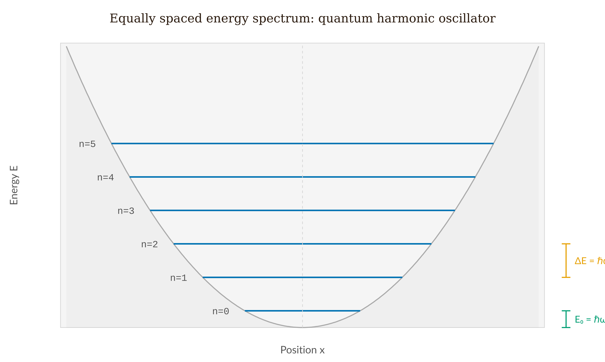
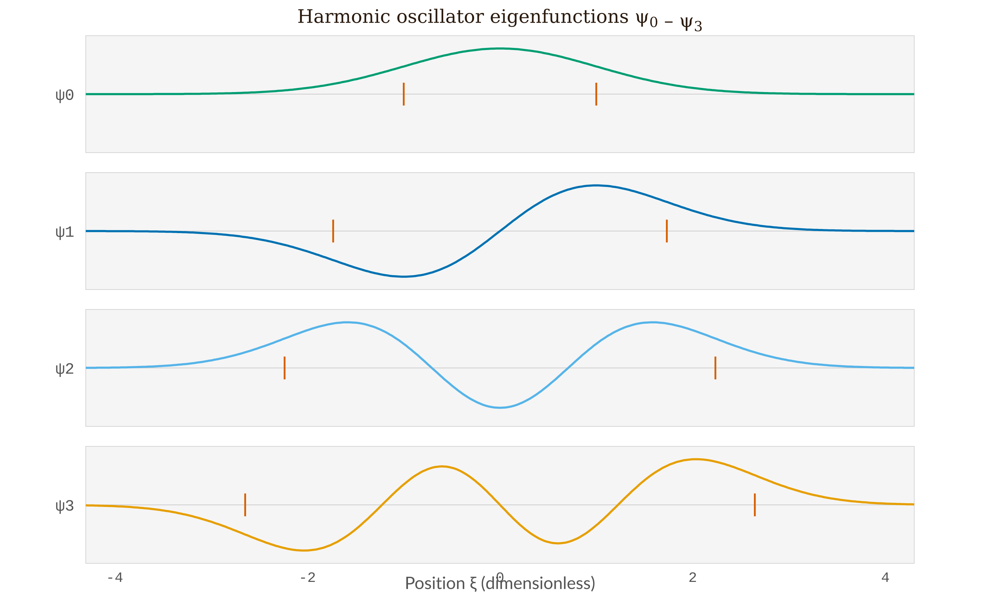
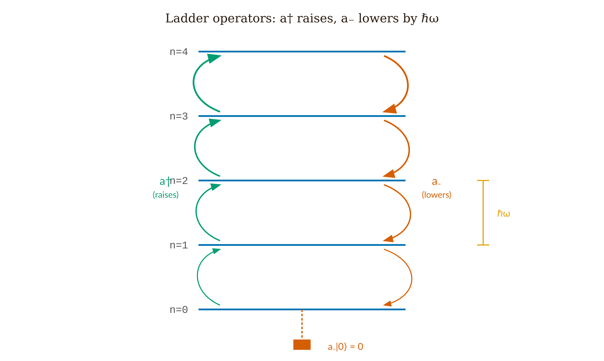
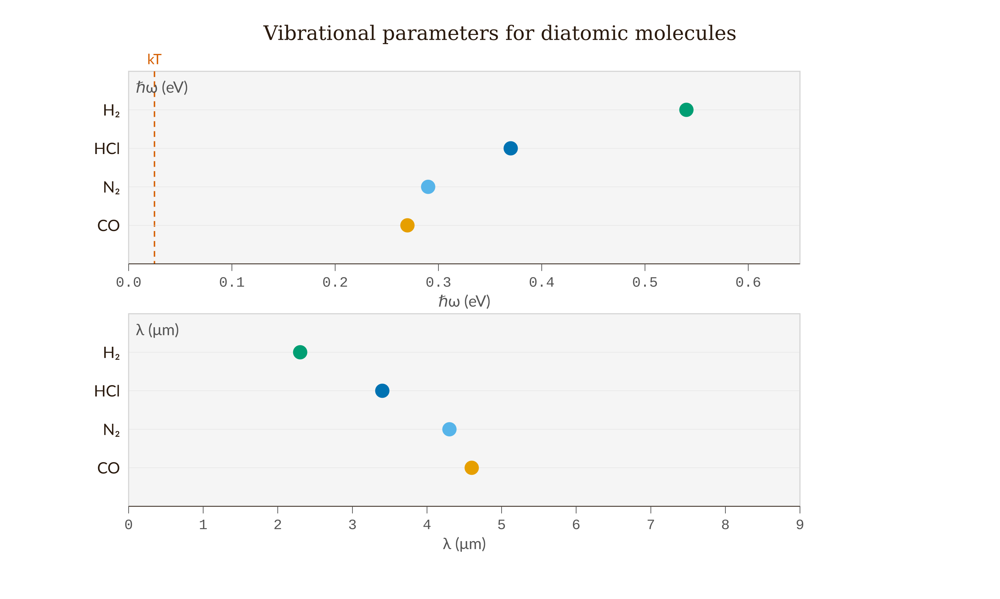

# Chapter 7 — The Quantum Harmonic Oscillator

Imagine pulling a guitar string sideways by a small amount and letting go. The restoring force grows in proportion to the displacement, which is Hooke's law, and Hooke's law gives simple harmonic motion. The same structure appears far more generally. Take any smooth potential with a minimum and expand it in a Taylor series about that minimum. The first derivative vanishes, because that is what a minimum means, and the constant term only shifts where we place the energy zero. What survives at leading order is a quadratic:

$$V(x) \approx \frac{1}{2}V''(x_0)\,(x-x_0)^2 = \frac{1}{2}m\omega^2(x-x_0)^2,$$

where $\omega = \sqrt{V''(x_0)/m}$ is fixed by the curvature of the potential at its minimum. For small enough displacements, every stable equilibrium in every physical system behaves as a harmonic oscillator. A guitar string, a diatomic molecule, an electromagnetic mode in a laser cavity, the vibrations of a crystal lattice, the quantized field of the vacuum — all of them reduce to the same Hamiltonian:

$$\hat{H} = \frac{\hat{p}^2}{2m} + \frac{1}{2}m\omega^2\hat{x}^2. \tag{7.1}$$

This is not a narrow special case. It is the generic situation for any quantum system near equilibrium. Solving it once solves every system in the whole class, so the only real question is how to solve it.

---

## The Trick

The most direct method is to write $\hat{p} = -i\hbar\,\partial_x$, substitute it into (7.1), and solve a second-order differential equation. That route works, it produces the Hermite polynomials, and we describe it below. But there is a more elegant method, one that delivers the entire spectrum without our solving any differential equation at all.

Define two operators:

$$\hat{a}_\pm = \frac{1}{\sqrt{2\hbar m\omega}}\!\left(\mp i\hat{p} + m\omega\hat{x}\right). \tag{7.2}$$

These are the **raising** ($\hat{a}_+$) and **lowering** ($\hat{a}_-$) operators, also called ladder operators. We compute the product $\hat{a}_-\hat{a}_+$ by expanding:

$$\hat{a}_-\hat{a}_+ = \frac{1}{2\hbar m\omega}\!\left(i\hat{p} + m\omega\hat{x}\right)\!\left(-i\hat{p} + m\omega\hat{x}\right).$$

The $\hat{p}^2$ and $m^2\omega^2\hat{x}^2$ terms reassemble into $\hat{H}/(\hbar\omega)$. The cross terms give $im\omega(\hat{p}\hat{x} - \hat{x}\hat{p}) = im\omega(-i\hbar) = m\omega\hbar$, contributing $1/2$. So:

$$\hat{a}_-\hat{a}_+ = \frac{\hat{H}}{\hbar\omega} + \frac{1}{2}, \qquad \hat{a}_+\hat{a}_- = \frac{\hat{H}}{\hbar\omega} - \frac{1}{2}.$$

Subtract:

$$\boxed{[\hat{a}_-, \hat{a}_+] = 1.} \tag{7.3}$$

This single commutator contains the entire algebraic content of the problem. Every energy level, every relation between eigenstates, every expectation value follows from it. In quantum field theory, this same relation — now with $\hat{a}_-$ as the annihilation operator and $\hat{a}_+$ as the creation operator — is the opening line of quantum electrodynamics. Here we meet it in the simplest possible setting.

---

## Climbing the Ladder

Suppose $|n\rangle$ is an energy eigenstate with $\hat{H}|n\rangle = E_n|n\rangle$. From the commutator (7.3) and $\hat{H} = \hbar\omega(\hat{a}_+\hat{a}_- + \tfrac{1}{2})$, we can derive:

$$[\hat{H}, \hat{a}_+] = \hbar\omega\,\hat{a}_+, \qquad [\hat{H}, \hat{a}_-] = -\hbar\omega\,\hat{a}_-.$$

Now we ask what energy $\hat{a}_+|n\rangle$ has:

$$\hat{H}(\hat{a}_+|n\rangle) = (\hat{a}_+\hat{H} + [\hat{H},\hat{a}_+])|n\rangle = (E_n + \hbar\omega)\,\hat{a}_+|n\rangle.$$

Applying $\hat{a}_+$ to an eigenstate produces a new eigenstate whose energy is $\hbar\omega$ higher. Applying $\hat{a}_-$ produces one whose energy is $\hbar\omega$ lower. Together the operators form a ladder: we can climb up one rung at a time or step down one rung at a time, and each rung sits exactly $\hbar\omega$ above the one below it.

The ladder cannot descend forever. The Hamiltonian (7.1) is a sum of squares of Hermitian operators, so $\langle\hat{H}\rangle \geq 0$ in every state. But $\hat{a}_-$ removes $\hbar\omega$ each time it is applied, and if we could keep applying it, we would eventually reach negative energies, which is impossible. The way out is that there exists a ground state $|0\rangle$ that the lowering operator annihilates:

$$\hat{a}_-|0\rangle = 0. \tag{7.4}$$

We apply $\hat{H} = \hbar\omega(\hat{a}_+\hat{a}_- + \tfrac{1}{2})$ to this state:

$$\hat{H}|0\rangle = \hbar\omega\!\left(\hat{a}_+\underbrace{(\hat{a}_-|0\rangle)}_{=\,0} + \tfrac{1}{2}|0\rangle\right) = \tfrac{1}{2}\hbar\omega\,|0\rangle.$$

The ground-state energy is $E_0 = \hbar\omega/2$. Not zero, but $\hbar\omega/2$. Starting from $|0\rangle$ and applying $\hat{a}_+$ repeatedly:

$$\boxed{E_n = \left(n + \frac{1}{2}\right)\hbar\omega, \quad n = 0, 1, 2, \ldots} \tag{7.5}$$

The spectrum consists of equally spaced levels with gap $\hbar\omega$, and the ground state sits $\hbar\omega/2$ above the classical minimum of the potential. We solved no differential equation. The whole spectrum followed from one commutator together with the requirement that the energy be non-negative.

*Figure 7.1 — Equally spaced energy spectrum of the quantum harmonic oscillator: six levels E_n = (n+½)ℏω drawn inside the parabola V(x) = ½mω²x², with the zero-point energy bracket showing E₀ = ℏω/2 above the classical minimum and the uniform spacing bracket showing ΔE = ℏω.*

---

## Zero-Point Energy Is Real

The ground-state energy $E_0 = \hbar\omega/2 \neq 0$ is not a bookkeeping technicality. Classically, a harmonic oscillator can have zero energy — the particle simply rests at the bottom of the well. Quantum mechanically, the uncertainty principle rules this out. A particle pinned to $x = 0$ with $\sigma_x \to 0$ would require $\sigma_p \to \infty$ by the Kennard inequality $\sigma_x\sigma_p \geq \hbar/2$. The zero-point energy is the minimum kinetic energy that confinement itself imposes.

This energy has measurable consequences. Liquid helium does not solidify under atmospheric pressure at any temperature, because the zero-point kinetic energy of helium atoms, confined to the spacing between neighbors, exceeds the interatomic binding energy. The atoms cannot settle into a fixed lattice. Helium remains a liquid down to absolute zero precisely because of zero-point motion, not in spite of it.

A still more direct example is the Casimir force between two conducting plates, which arises from the difference in zero-point energies of the electromagnetic modes with and without the plates present. Lamoreaux measured this force in 1997 and found agreement with the theoretical prediction to within five percent. Zero-point energy is not an artifact of the formalism. It comes with a measurable bill, and we can read that bill in the laboratory.

---

## The Normalized Ladder

The normalized eigenstates satisfy:

$$\hat{a}_+|n\rangle = \sqrt{n+1}\,|n+1\rangle, \qquad \hat{a}_-|n\rangle = \sqrt{n}\,|n-1\rangle. \tag{7.6}$$

The prefactors $\sqrt{n+1}$ and $\sqrt{n}$ are essential, not optional. Omit them and every expectation value you compute comes out wrong. They arise because $\hat{a}_+|n\rangle$ has norm $\sqrt{n+1}$ (from $\langle n|\hat{a}_-\hat{a}_+|n\rangle = n+1$), so dividing by that norm gives the unit-normalized $|n+1\rangle$.

We can express $\hat{x}$ and $\hat{p}$ directly in terms of the ladder operators:

$$\hat{x} = \sqrt{\frac{\hbar}{2m\omega}}\!\left(\hat{a}_+ + \hat{a}_-\right), \qquad \hat{p} = i\sqrt{\frac{m\hbar\omega}{2}}\!\left(\hat{a}_+ - \hat{a}_-\right). \tag{7.7}$$

With these, the expectation values in any energy eigenstate $|n\rangle$ become straightforward. Since $\hat{a}_\pm|n\rangle$ is orthogonal to $|n\rangle$:

$$\langle n|\hat{x}|n\rangle = 0, \qquad \langle n|\hat{p}|n\rangle = 0.$$

For $\hat{x}^2$, we write $\hat{x}^2 = (\hbar/2m\omega)(\hat{a}_+ + \hat{a}_-)^2$. The terms $\hat{a}_+^2$ and $\hat{a}_-^2$ connect $|n\rangle$ to $|n\pm 2\rangle$ and contribute nothing. The surviving terms give:

$$\langle n|\hat{x}^2|n\rangle = \frac{\hbar}{2m\omega}\!\left(n + n + 1\right) = \frac{\hbar(2n+1)}{2m\omega}. \tag{7.8}$$

The uncertainty product:

$$\sigma_x\sigma_p = \left(n + \frac{1}{2}\right)\hbar. \tag{7.9}$$

At $n = 0$: $\sigma_x\sigma_p = \hbar/2$, the smallest value the Kennard inequality allows, saturated exactly. The ground state of the harmonic oscillator is the unique minimum-uncertainty state.

For the off-diagonal matrix element, $\langle m|\hat{x}|n\rangle \propto \delta_{m,n\pm 1}$. Position connects only states that differ by a single quantum. This is the selection rule for dipole transitions: only $\Delta n = \pm 1$ transitions are allowed. That rule is why the infrared vibrational spectrum of a diatomic molecule looks like a ruler — a set of evenly spaced absorption lines at frequency $\omega$.

---

## What the Eigenstates Look Like

The algebra hands us the spectrum. The wave functions follow from the condition $\hat{a}_-|0\rangle = 0$, which in position space reads:

$$\left(\hbar\frac{\partial}{\partial x} + m\omega x\right)\psi_0(x) = 0.$$

We solve by separation and normalize:

$$\psi_0(x) = \left(\frac{m\omega}{\pi\hbar}\right)^{1/4}\exp\!\left(-\frac{m\omega x^2}{2\hbar}\right). \tag{7.10}$$

A Gaussian — the same minimum-uncertainty shape we met in Chapter 3, but now appearing as an energy eigenstate of the oscillator rather than as a free-particle wave packet. The distinction matters. The free-particle Gaussian spreads over time, because it is not an eigenstate of the free Hamiltonian. The harmonic-oscillator ground state stays Gaussian forever, because the potential supplies a restoring force that exactly counteracts the tendency to spread.

Higher states are built by applying $\hat{a}_+$ to $\psi_0$. Each application multiplies the Gaussian by a polynomial one degree higher in $x$. Those polynomials are the Hermite polynomials $H_n(\xi)$, with $\xi = \sqrt{m\omega/\hbar}\,x$:

$$\psi_n(x) = \left(\frac{m\omega}{\pi\hbar}\right)^{1/4}\frac{1}{\sqrt{2^n n!}}\,H_n(\xi)\,e^{-\xi^2/2}, \tag{7.11}$$

with recursion $H_{n+1}(\xi) = 2\xi H_n(\xi) - 2n H_{n-1}(\xi)$, starting from $H_0 = 1$, $H_1 = 2\xi$.

Two features are worth highlighting. First, $\psi_n$ has exactly $n$ nodes: the ground state has none, the first excited state has one, and so on — the same node-counting rule we found for the infinite square well. Second, roughly 16% of the ground-state probability density lies outside the classical turning points $x = \pm\sqrt{\hbar/m\omega}$. Penetration into the classically forbidden region is not some exotic high-energy phenomenon. It is already present in the very first eigenstate, a standard feature of the quantum ground state.

*Figure 7.2 — Harmite-Gauss eigenfunctions ψ₀ through ψ₃ as stacked comparison panels: node count increases by one per level, the classical turning points (marked) widen with n, and the evanescent tails extend visibly beyond those turning points in each panel.*

---

## Eigenstates Do Not Oscillate

There is a misconception we should clear up before turning to the simulation.

A harmonic oscillator is, classically, an oscillator, so it is natural to expect the quantum version to oscillate as well. But consider the time-dependent eigenstate:

$$\Psi_n(x,t) = \psi_n(x)\,e^{-iE_n t/\hbar}.$$

The probability density:

$$|\Psi_n(x,t)|^2 = |\psi_n(x)|^2 \cdot |e^{-iE_n t/\hbar}|^2 = |\psi_n(x)|^2.$$

It is static. The phase rotates in the complex plane at frequency $E_n/\hbar$, but $|\Psi|^2$ — everything a position detector could ever register — does not change at all. Energy eigenstates are stationary states. If quantum mechanics contained nothing but eigenstates, classical oscillation would never appear.

Classical oscillation lives in superpositions. Take the equal mixture $|\Psi\rangle = (|0\rangle + |1\rangle)/\sqrt{2}$:

$$|\Psi(x,t)|^2 = \tfrac{1}{2}(|\psi_0|^2 + |\psi_1|^2) + \psi_0\psi_1\cos\!\left(\frac{(E_1-E_0)t}{\hbar}\right).$$

The cross term beats at frequency $(E_1 - E_0)/\hbar = \omega$, exactly the classical oscillation frequency. The packet sloshes, but it also deforms: rather than a rigid shape sliding back and forth, it is a superposition whose interference pattern shifts continuously.

The simulation shows both cases side by side. The eigenstate panel stays still; the superposition panel sloshes. If the eigenstate panel ever animates, the phase is not canceling correctly.

---

## The State That Sloshes Cleanly

A **coherent state** $|\alpha\rangle$ is the eigenstate of the lowering operator:

$$\hat{a}_-|\alpha\rangle = \alpha\,|\alpha\rangle \tag{7.12}$$

for any complex number $\alpha$. In the energy basis:

$$|\alpha\rangle = e^{-|\alpha|^2/2}\sum_{n=0}^\infty \frac{\alpha^n}{\sqrt{n!}}\,|n\rangle. \tag{7.13}$$

Coherent states are not energy eigenstates. They are superpositions of all the $|n\rangle$ with Poisson-distributed weights $P(n) = e^{-|\alpha|^2}|\alpha|^{2n}/n!$ and mean quantum number $\langle n\rangle = |\alpha|^2$.

Under time evolution, a coherent state stays a coherent state, with its amplitude simply rotating:

$$\langle\hat{x}(t)\rangle = \sqrt{\frac{2\hbar}{m\omega}}\,|\alpha|\cos(\omega t - \arg\alpha), \qquad \langle\hat{p}(t)\rangle = -\sqrt{2m\hbar\omega}\,|\alpha|\sin(\omega t - \arg\alpha). \tag{7.14}$$

Position and momentum oscillate sinusoidally at frequency $\omega$, just as they do for a classical oscillator. And the wave packet keeps its shape throughout — $\sigma_x\sigma_p = \hbar/2$ at all times. The coherent state is the minimum-uncertainty Gaussian riding its classical orbit forever without spreading.

Roy Glauber introduced coherent states in 1963 to describe the quantum state of laser light. An ideal laser produces field modes in coherent states. The photon-counting statistics of ideal laser light follow a Poisson distribution, not because lasers are classical, but because Poisson is the photon-number distribution of a coherent state. The harmonic-oscillator algebra is not a loose analogy for laser physics; it is the physics of lasers. Glauber received the Nobel Prize in 2005 for making this connection.

---

## Worked Example — Ladder Algebra for HCl

The HCl molecule vibrates near the bottom of its internuclear potential with $\omega \approx 5.63 \times 10^{14}$ rad/s and reduced mass $\mu \approx 1.63 \times 10^{-27}$ kg.

**Zero-point energy:**

$$E_0 = \tfrac{1}{2}\hbar\omega = \tfrac{1}{2}(1.055\times10^{-34})(5.63\times10^{14}) \approx 2.97\times10^{-20}\ \text{J} \approx 0.185\ \text{eV}.$$

**Level spacing:** $\hbar\omega \approx 0.37$ eV. Thermal energy at 300 K: $k_BT \approx 0.025$ eV. Since $k_BT \ll \hbar\omega$, essentially all HCl molecules are in the vibrational ground state at room temperature. The infrared spectrum shows a single absorption line at $\lambda = hc/(\hbar\omega) \approx 3.4\ \mu\text{m}$ — precisely what is observed.

**Selection rule from ladder algebra.** The dipole transition matrix element is $\langle m|\hat{x}|n\rangle$. Write $\hat{x} = \ell(\hat{a}_+ + \hat{a}_-)$ with $\ell = \sqrt{\hbar/2\mu\omega}$. Then $\hat{a}_+|n\rangle \propto |n+1\rangle$ and $\hat{a}_-|n\rangle \propto |n-1\rangle$, both orthogonal to any $|m\rangle$ unless $m = n\pm 1$. The matrix element is zero for all other transitions:

$$\langle m|\hat{x}|n\rangle = \ell\!\left(\sqrt{n+1}\,\delta_{m,n+1} + \sqrt{n}\,\delta_{m,n-1}\right).$$

Only $\Delta n = \pm 1$ transitions are allowed. The vibrational spectrum is a single frequency, not a forest of lines — a ruler in frequency space, confirmed by the HCl absorption spectrum.

**Expectation value** $\langle\hat{x}^2\rangle$ **for** $n = 0$, **no integrals.** From equation (7.8):

$$\langle 0|\hat{x}^2|0\rangle = \frac{\hbar}{2\mu\omega} = \ell^2.$$

The root-mean-square displacement of HCl in its ground state is $\ell = \sqrt{\hbar/2\mu\omega} \approx 6.7$ pm — about 5% of the bond length (0.13 nm). Small, but not zero, and not obtainable by setting $E = 0$.

---

## Where the Ladder Leads

It all came from one commutator: $[\hat{a}_-,\hat{a}_+] = 1$. From it we obtained a complete, equally spaced spectrum, the selection rules, the zero-point energy, the coherent states, and the minimum-uncertainty states. The method itself — factor the Hamiltonian into operators whose commutator is a scalar, then derive everything algebraically — is not tied to this one problem.

*Figure 7.3 — Ladder operator action on the harmonic oscillator spectrum: ↠(green arcs, left) raises by ℏω per step; â₋ (red arcs, right) lowers by ℏω per step; the floor termination at n=0 shows â₋|0⟩ = 0 with a blocking symbol, preventing descent below the ground state.*

In Chapter 10, the angular momentum operators $\hat{L}_\pm$ obey a different algebra, but the reasoning runs along the same lines: a commutator with $\hat{L}_z$ fixes the rung spacing, a non-negativity argument terminates the ladder, and the spectrum follows without our solving any differential equation. In quantum field theory, $\hat{a}_+$ becomes the creation operator that adds one particle to the vacuum. The state with $n$ photons is $(\hat{a}_+)^n/\sqrt{n!}$ applied to the vacuum, where the vacuum $|0\rangle$ is exactly the ground state annihilated by $\hat{a}_-$. The commutator $[\hat{a},\hat{a}^\dagger] = 1$ is the foundation of quantum electrodynamics. This chapter is the template for all of it.

<!-- → [TABLE: Harmonic oscillator parameters for selected diatomic molecules — HCl ω≈5.63e14 rad/s ℏω≈0.37 eV λ≈3.4 μm; N₂ ω≈4.45e14 rad/s ℏω≈0.29 eV; CO ω≈4.09e14 rad/s ℏω≈0.27 eV; H₂ ω≈8.28e14 rad/s ℏω≈0.54 eV] -->

*Figure 7.4 — Vibrational parameters of four diatomic molecules: upper panel shows ℏω in eV with a reference line at the room-temperature thermal energy kT ≈ 0.025 eV (all four molecules are far into the quantum regime); lower panel shows the corresponding infrared absorption wavelength in μm.*

---

## References

- Griffiths, D.J., *Introduction to Quantum Mechanics*, 3rd ed., §2.3–2.4.
- Sakurai, J.J. and Napolitano, J., *Modern Quantum Mechanics*, 3rd ed., §2.3.
- Glauber, R.J., "The Quantum Theory of Optical Coherence," *Physical Review* **130**, 2529 (1963); "Coherent and Incoherent States of the Radiation Field," *Physical Review* **131**, 2766 (1963).
- Lamoreaux, S.K., "Demonstration of the Casimir Force in the 0.6 to 6 μm Range," *Physical Review Letters* **78**, 5 (1997).
- DLMF §18, National Institute of Standards and Technology. Hermite polynomials. https://dlmf.nist.gov/18

---

*Chapter 8 follows: the hydrogen atom. The Coulomb potential is not quadratic, so the harmonic oscillator algebra does not apply directly — but the method does. Angular momentum ladder operators will provide the quantum numbers* $\ell$ *and* $m_\ell$; *the radial equation provides the principal quantum number* $n$. *The spectrum* $E_n = -13.6\ \text{eV}/n^2$ *is the goal.*

