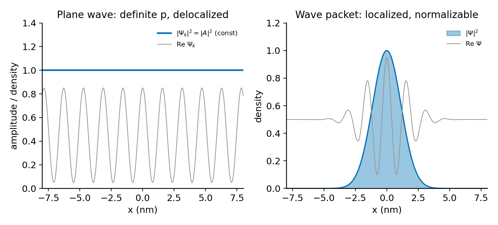
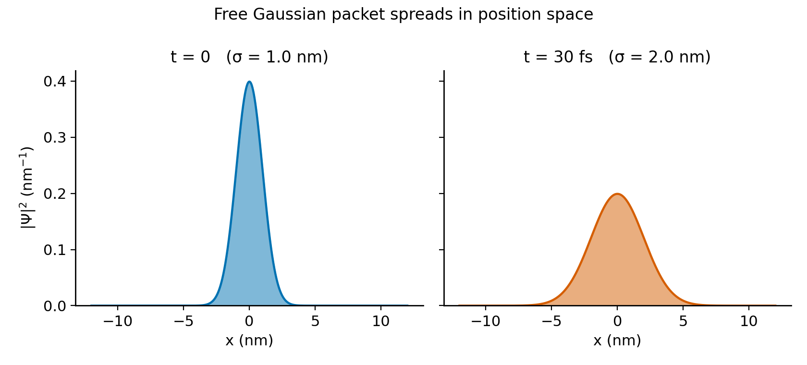
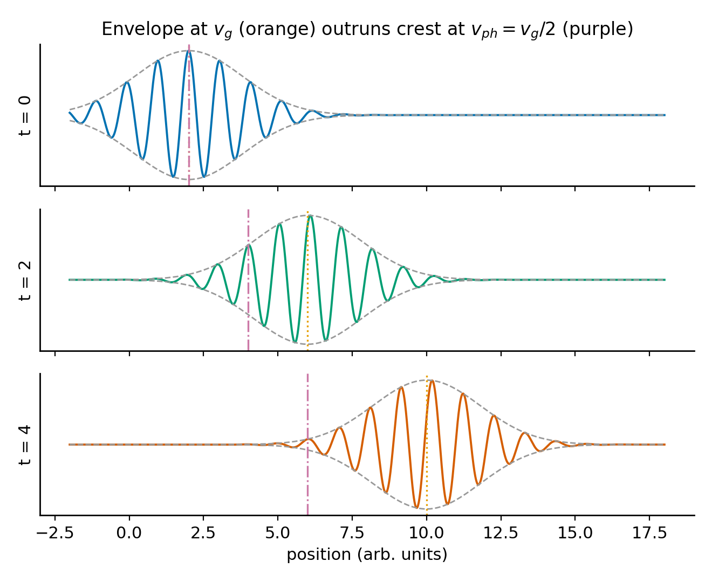
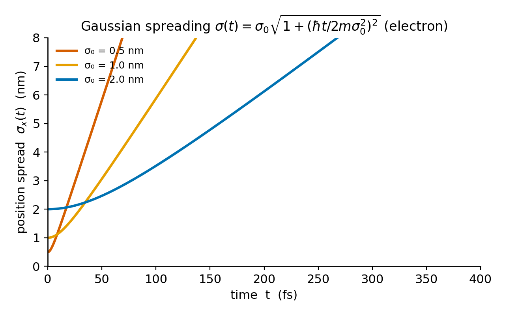

# Chapter 8 — The Free Particle and Wave Packets
*Why a particle with perfectly sharp momentum has no location at all.*

Start with the simplest possible quantum mechanics problem. No potential anywhere. A particle moving freely through empty space. You already know how to set up the Schrödinger equation and you have every reason to expect a clean answer.

The time-independent equation inside a region where $V = 0$ is

$$-\frac{\hbar^2}{2m}\frac{d^2\psi}{dx^2} = E\psi,$$

and the solutions come immediately: $\psi_k(x) = Ae^{ikx}$ with $k = \sqrt{2mE}/\hbar$. Every positive real $k$ works. Every momentum $p = \hbar k$ is a valid eigenstate. The time-dependent version is

$$\Psi_k(x,t) = Ae^{i(kx-\omega t)}, \qquad \omega = \frac{\hbar k^2}{2m}.$$

Now try to normalize it. Compute $|\Psi_k|^2$:

$$|\Psi_k|^2 = |A|^2.$$

Constant. Everywhere. The probability density is the same at $x = 0$ and at $x = 10^{26}$ meters. Integrate over all space: $\int_{-\infty}^\infty |A|^2\,dx = \infty$. The plane wave cannot be normalized on the whole real line for any nonzero $A$. A free particle with perfectly sharp momentum $p = \hbar k$ is literally everywhere at once — uniformly spread across all of space with no preference for any location.

This is not a mathematical glitch to be patched. It is a direct consequence of the uncertainty principle. If the momentum is perfectly sharp, $\sigma_p = 0$, then the Kennard inequality $\sigma_x\sigma_p \geq \hbar/2$ forces $\sigma_x = \infty$. Non-normalizability is just infinite position uncertainty wearing a different hat.

So what do we do with a free particle? We build something physically realizable: a **wave packet**, constructed by superposing plane waves with nearby momenta, so that they interfere constructively in one region and cancel everywhere else. The result is a localized, normalizable object that moves and spreads in a way that makes exact contact with classical mechanics — in the right limit.

<!-- → [FIGURE: two panels side by side — (left) a single plane wave e^{ikx}, showing constant |ψ|² = 1 extending over the entire x-axis; (right) a Gaussian wave packet, showing the localized |ψ|² envelope with visible oscillations of Re(ψ) inside; the visual contrast between "delocalized eigenstate" and "normalizable physical state" is the conceptual hinge of the chapter] -->


*Figure 8.1 — two panels side by side — (left) a single plane wave e^{ikx}, showing constant |ψ|² = 1 extending over the entire x-axis*

---

## Building the Wave Packet

The most general solution to the free-particle Schrödinger equation is a superposition of all plane waves:

$$\Psi(x,t) = \frac{1}{\sqrt{2\pi}}\int_{-\infty}^{\infty}\phi(k)\,e^{i(kx-\omega(k)t)}\,dk, \qquad \omega(k) = \frac{\hbar k^2}{2m}.$$

The function $\phi(k)$ is the **momentum-space wave function** — or equivalently, the Fourier amplitude. It encodes how much of each plane wave goes into the superposition. At $t = 0$, this is the Fourier transform pair:

$$\Psi(x,0) = \frac{1}{\sqrt{2\pi}}\int_{-\infty}^{\infty}\phi(k)\,e^{ikx}\,dk, \qquad \phi(k) = \frac{1}{\sqrt{2\pi}}\int_{-\infty}^{\infty}\Psi(x,0)\,e^{-ikx}\,dx.$$

Given any initial wave function, you compute $\phi(k)$ by Fourier transform, attach the phase factor $e^{-i\omega(k)t}$ to each component, and transform back. Free-particle time evolution is exact and complete in this form.

Why is the packet normalizable when none of its ingredients are? If $\phi(k)$ is concentrated near $k_0$ with spread $\Delta k$, the Fourier theorem guarantees that $\Psi(x,0)$ is localized with spatial spread $\Delta x \sim 1/\Delta k$. A localized function is normalizable. The plane waves cancel each other everywhere except near the packet's center — destructive interference does the work that the individual waves cannot do alone.

The physical interpretation of $\phi(k)$: by the Born rule applied in momentum space, $|\phi(k)|^2\,dk$ is the probability of measuring momentum between $\hbar k$ and $\hbar(k+dk)$. Critically, $|\phi(k)|^2$ is **time-independent** — the momentum distribution never changes during free propagation. The phase of $\phi(k)$ evolves as $e^{-i\omega(k)t}$, but its modulus does not. Whatever momentum distribution you start with, you keep it forever. The packet spreads in position; it does not spread in momentum.

<!-- → [CHART: two side-by-side panels showing a Gaussian wave packet at t = 0 and t = T — (left) |Ψ(x,t)|² in position space, showing the spreading envelope and shifted center; (right) |φ(k)|² in momentum space, showing an identical Gaussian at both times; the visual point is that position spreads while momentum is frozen] -->


*Figure 8.2 — two side-by-side panels showing a Gaussian wave packet at t = 0 and t = T — (left) |Ψ(x,t)|² in position space, showing the spreading…*

---

## Phase Velocity and Group Velocity

A single plane wave $e^{i(kx-\omega t)}$ has a crest — a surface of constant phase — at $kx - \omega t = \text{const}$. That crest moves at

$$v_{ph} = \frac{\omega}{k}.$$

For a free non-relativistic particle, $\omega = \hbar k^2/2m$, so

$$v_{ph} = \frac{\hbar k}{2m} = \frac{p}{2m}.$$

The classical velocity is $v_{cl} = p/m$. The phase velocity is exactly half the classical velocity. The wave crests travel at half the speed you would classically assign to the particle. Something is wrong — or rather, the phase velocity is the wrong thing to be looking at.

The particle is not a single crest. The particle is the *envelope* of the packet — the blob of probability. To find how that envelope moves, consider a packet sharply peaked at $k_0$. Taylor-expand the dispersion relation around $k_0$:

$$\omega(k) = \omega_0 + \omega_0'(k-k_0) + \tfrac{1}{2}\omega_0''(k-k_0)^2 + \cdots$$

Substitute into the superposition integral. The factor $e^{i(k_0 x - \omega_0 t)}$ pulls out as a carrier wave, and the remaining integral over the envelope becomes a function of the combination $x - \omega_0' t$. The envelope is centered where this combination is zero: at $x = \omega_0' t$. The **group velocity** is

$$v_g = \frac{d\omega}{dk}\bigg|_{k_0}.$$

For the free particle, $d\omega/dk = \hbar k/m$, so

$$v_g = \frac{\hbar k_0}{m} = \frac{p_0}{m}.$$

This is the classical velocity. The packet's center of mass moves exactly as Newton's first law predicts. The free-particle quantum wave packet is classical, in the sense of expectation values of position.

Now compare the two speeds. For the free particle:

$$\frac{v_g}{v_{ph}} = \frac{\hbar k_0/m}{\hbar k_0/2m} = 2.$$

The group velocity is exactly twice the phase velocity. This means: if you watch the simulation, the envelope (the $|\Psi|^2$ blob) moves at speed $v_g$, while the individual wave crests inside it — the wiggles of Re $\Psi$ — move at $v_{ph} = v_g/2$. The envelope outruns its own internal oscillations. Individual crests continuously enter the packet from behind and emerge at the front. You can watch this happen. It is not an artifact; it is what the mathematics predicts, and it is confirmed in experiment.

The phase velocity has no direct physical meaning for particle motion. It is not where the particle is, not how fast the particle moves, not a speed you would measure if you put a detector in the path. The group velocity is the physically meaningful speed. The phase velocity is an internal property of the wave structure.

<!-- → [FIGURE: schematic time-sequence of a wave packet at three moments — showing the |ψ|² envelope advancing at v_g and a labeled crest advancing at v_ph = v_g/2; arrows and labels should make the two speeds visually distinguishable; this is the single most important figure for the phase vs. group velocity concept] -->


*Figure 8.3 — schematic time-sequence of a wave packet at three moments — showing the |ψ|² envelope advancing at v_g and a labeled crest advancing at…*

---

## Dispersion and the Spreading of the Gaussian Packet

The second derivative of the dispersion relation is

$$\frac{d^2\omega}{dk^2} = \frac{\hbar}{m}.$$

This is nonzero. Different Fourier components travel at slightly different group velocities — higher-$k$ components move faster than lower-$k$ ones. Over time, the components drift apart and the packet spreads.

For a Gaussian initial state — the natural choice, because it saturates the uncertainty bound and yields an exactly solvable integral — the spreading can be computed in closed form. Take

$$\Psi(x,0) = \left(\frac{1}{\pi\sigma_0^2}\right)^{1/4}\exp\!\left(-\frac{x^2}{2\sigma_0^2}\right)e^{ik_0 x},$$

a Gaussian of position-space width $\sigma_0$, centered at the origin, with mean wavenumber $k_0$. Its Fourier transform is also Gaussian:

$$\phi(k) = \left(\frac{\sigma_0^2}{\pi}\right)^{1/4}\exp\!\left(-\frac{\sigma_0^2(k-k_0)^2}{2}\right),$$

with momentum-space width $\Delta k = 1/(2\sigma_0)$, giving $\sigma_x(0)\,\sigma_p = \sigma_0 \cdot \hbar/(2\sigma_0) = \hbar/2$. The Gaussian starts exactly at the uncertainty bound — minimum uncertainty, as tight as quantum mechanics allows.

Attach $e^{-i\omega(k)t}$ and perform the Gaussian integral by completing the square. The result is:

$$|\Psi(x,t)|^2 = \frac{1}{\sigma(t)\sqrt{\pi}}\exp\!\left(-\frac{(x - v_g t)^2}{\sigma(t)^2}\right),$$

where

$$\boxed{\sigma(t) = \sigma_0\sqrt{1 + \left(\frac{\hbar t}{2m\sigma_0^2}\right)^2}.}$$

The packet remains Gaussian for all time, but its width grows. A few things to read off immediately.

The center is at $x = v_g t = (\hbar k_0/m)t$ — classical motion, exactly. The momentum distribution $|\phi(k)|^2$ does not appear in this expression at all, because it has not changed. Only the position distribution has spread.

At $t = 0$, $\sigma_x\sigma_p = (\sigma_0/\sqrt{2}) \cdot (\hbar\Delta k\sqrt{2}) = \hbar/2$. For $t > 0$, $\sigma_x$ grows while $\sigma_p$ stays fixed, so $\sigma_x\sigma_p > \hbar/2$. The packet moves away from the minimum-uncertainty condition as it spreads.

The spreading is caused by **dispersion** — $d^2\omega/dk^2 \neq 0$ — not by the uncertainty principle. The uncertainty principle is a constraint on the state at each instant; it says nothing about dynamics. A light pulse in vacuum has $\omega = ck$, so $d^2\omega/dk^2 = 0$, and it propagates without spreading at all. A coherent state of the harmonic oscillator (Chapter 7) also fails to spread, despite living in a dispersive system — the restoring potential cancels the dispersion exactly. For the free particle there is no potential, no restoring force, and the spreading is unavoidable.

Define the **doubling time** — the time for $\sigma_x$ to grow by a factor of $\sqrt{2}$ — by setting $\sigma(t)^2 = 2\sigma_0^2$:

$$t_{2x} = \frac{2m\sigma_0^2}{\hbar}.$$

This scales as $\sigma_0^2$: a packet twice as wide takes four times as long to double. It is also independent of $k_0$ — the mean momentum determines where the packet goes, not how fast it spreads. A fast packet and a slow packet of the same initial width spread at identical rates.

<!-- → [CHART: three curves on the same axes — σ_x(t) vs. t for three initial widths σ₀ = 0.5, 1, 2 nm (electron mass) — showing the σ₀² scaling of the doubling time; x-axis in femtoseconds; the visual point is that tighter confinement means faster spreading] -->


*Figure 8.4 — three curves on the same axes — σ_x(t) vs. t for three initial widths σ₀ = 0.5, 1, 2 nm (electron mass) — showing the σ₀² scaling of the…*

---

## A Worked Calculation: How Long Before the Packet Doubles?

An electron is released from a quantum dot of diameter 10 nm, initially localized to $\sigma_x(0) = 2$ nm. The confining potential is switched off. How long before the packet's width doubles?

Apply the doubling-time formula directly:

$$t_{2x} = \frac{2m_e\,\sigma_x(0)^2}{\hbar} = \frac{2 \times (9.109\times10^{-31}\,\text{kg}) \times (2\times10^{-9}\,\text{m})^2}{1.055\times10^{-34}\,\text{J\,s}}.$$

Numerator: $2 \times 9.109 \times 4 = 72.9$, so the numerator is $72.9\times10^{-49}$ J·m²·s/m² $= 7.29\times10^{-48}$ kg·m². Divide by $1.055\times10^{-34}$:

$$t_{2x} \approx 6.9\times10^{-14}\,\text{s} \approx 69\,\text{fs.}$$

About 70 femtoseconds. An ultrafast pump-probe experiment can resolve timescales of 10–100 fs, so this spreading is physically observable. The electron does not drift gently outward over microseconds; it smears across the quantum dot in less time than it takes light to cross a human hair.

Now check the limiting cases. If the dot is twice as narrow — $\sigma_x(0) = 1$ nm — the doubling time drops to about 17 fs: four times shorter, because $t_{2x} \propto \sigma_0^2$. If the dot is twice as wide — 4 nm — the doubling time grows to about 280 fs. The tighter the initial confinement, the broader the momentum distribution, and the faster the Fourier components disperse.

One more check: the mean momentum $k_0$ does not appear in $t_{2x}$ at all. An electron ejected from the dot at 1 eV and an electron ejected at 100 eV, both with the same initial width, double their spatial width at the same time. The packet's translation speed is set by $k_0$; the spreading rate is set entirely by $\sigma_0$ and $m$.

---

## The Scales That Make Quantum Mechanics Invisible

Plug a 1 mg grain of sand into the same formula, localized to $\sigma_x(0) = 1\,\mu\text{m}$:

$$t_{2x} = \frac{2\times10^{-6}\,\text{kg}\times(10^{-6}\,\text{m})^2}{10^{-34}\,\text{J\,s}} \approx 2\times10^{22}\,\text{s.}$$

This is roughly $7\times10^{14}$ years — more than fifty thousand times the current age of the universe. The quantum spreading is present in principle and observationally indistinguishable from zero. Quantum mechanics does not have a special rule for large objects; it has the same formula, and the formula gives an absurdly long timescale. The classical limit is not a philosophical decision; it is a number.

The dividing line is the ratio of the doubling time to any physically relevant timescale. For an electron in an atom, $t_{2x}$ is on the order of femtoseconds to attoseconds — quantum effects dominate completely. For a marble, $t_{2x}$ exceeds the age of the universe — classical mechanics is exact for every practical purpose. The transition between the two regimes is smooth and computable, not mysterious.

<!-- → [TABLE: doubling times for five systems — columns: object, mass, σ₀, t_{2x}; rows: hydrogen 1s orbital (~0.5 Å), electron in 1 nm quantum dot (~1 nm), C₆₀ at 900 K (~250 pm), dust grain (1 μg, σ₀ = 100 nm), marble (1 g, σ₀ = 1 μm); the goal is to make the twenty-order-of-magnitude range visceral] -->

---

## What the Free Particle Teaches About the Wave Function

The free particle is the purest test case for the Fourier structure of quantum mechanics, and it teaches three things that carry forward into every more complicated problem.

First: energy eigenstates are not always normalizable. The infinite square well's eigenstates were localized by the walls; the free particle's eigenstates are not. Physical states are always normalizable, but they are not always energy eigenstates. A physical free particle is a superposition — a wave packet — not a plane wave.

Second: time evolution is a phase rotation in Fourier space. Each $\phi(k)$ component acquires the factor $e^{-i\omega(k)t}$. The modulus $|\phi(k)|^2$ is untouched. This means the momentum distribution is a conserved quantity for the free particle — it cannot change if there is no force to change it. The corresponding classical statement is that momentum is conserved in the absence of a force. The quantum statement is the same, expressed as the constancy of $|\phi(k)|^2$.

Third: the relationship between localization and momentum spread is exact and quantitative. To localize a particle within $\Delta x$, you must superpose momenta over a range $\Delta p \sim \hbar/\Delta x$. Tight localization requires broad momentum content. Broad momentum content means the Fourier components travel at a range of speeds and separate quickly. There is no way to localize a particle and also prevent it from spreading, because the two requirements are in direct tension. The uncertainty principle is not a limitation of measurement technology; it is a structural feature of waves.

The Fourier relationship $\Delta x \cdot \Delta k \sim 1$ is a theorem of harmonic analysis, proved in the nineteenth century for completely classical reasons. Quantum mechanics did not invent it. What quantum mechanics did was identify $p = \hbar k$ and interpret $|\phi(k)|^2$ as a probability distribution. The mathematics of wave packets was already there; the physical interpretation of what was waving was new.

---

## Exercises

**Warm-up**

1. *Difficulty: Warm-up — tests the connection between non-normalizability and the uncertainty principle.*
   The plane wave $\psi_k(x) = Ae^{ikx}$ has $|\psi_k|^2 = |A|^2$ everywhere. (a) Normalize $\psi_k$ on a finite interval $[-L, L]$ by finding $A$. (b) Take $L \to \infty$. What happens to $A$? (c) Using $\sigma_p = 0$ for a momentum eigenstate and the Kennard inequality, explain why the position uncertainty must be infinite. Connect this directly to the non-normalizability result.
   *Tests: whether the student understands non-normalizability as a physical statement, not a mathematical inconvenience.*

2. *Difficulty: Warm-up — tests Fourier transform calculation for a given packet.*
   A wave packet at $t = 0$ has the form $\Psi(x,0) = Ne^{-|x|/a}e^{ik_0 x}$ for real constants $a, k_0$. (a) Find $N$ such that $\int_{-\infty}^\infty|\Psi|^2\,dx = 1$. (b) Compute $\phi(k) = (1/\sqrt{2\pi})\int_{-\infty}^\infty\Psi(x,0)e^{-ikx}\,dx$. (c) Sketch $|\phi(k)|^2$ and identify the peak and approximate width in terms of $a$ and $k_0$.
   *Tests: ability to compute the Fourier transform that sets up the time-evolved packet.*

3. *Difficulty: Warm-up — tests numerical command of phase and group velocity.*
   For a free electron with $k_0 = 5\,\text{nm}^{-1}$: (a) Compute $v_{ph}$ and $v_g$ in m/s. (b) Verify $v_g = 2v_{ph}$. (c) Compute the classical kinetic energy $K = m_ev_g^2/2$ and verify it equals $\hbar\omega(k_0) = \hbar^2k_0^2/2m_e$.
   *Tests: numerical command of the two velocities and the energy consistency check.*

**Application**

4. *Difficulty: Application — uses the spreading formula for a semiconductor system.*
   A conduction electron in GaAs has effective mass $m^* = 0.067\,m_e$ and is initially localized to $\sigma_x(0) = 5$ nm. (a) Compute the doubling time $t_{2x}$. (b) Compute $\sigma_x(t)$ at $t = 1$ ps. (c) The thermal de Broglie wavelength at $T = 300$ K is approximately 30 nm. Is the packet still smaller than this at $t = 1$ ps?
   *Tests: application of the spreading formula to a physically realistic semiconductor system.*

5. *Difficulty: Application — connects group velocity to a neutron time-of-flight measurement.*
   A cold neutron ($m_n = 1.675\times10^{-27}$ kg) has de Broglie wavelength $\lambda = 1.8$ Å. (a) Compute $k_0$, $v_g$, and $v_{ph}$. (b) The neutron travels 1 m from source to detector. Compute the transit time using $v_g$, and the incorrect prediction using $v_{ph}$. By how many nanoseconds do they differ? (c) If the momentum spread is $\Delta k = 10^6$ m$^{-1}$, estimate the coherence length $\ell_c \sim 1/\Delta k$ and find the time for the packet to spread by $\ell_c$.
   *Tests: ability to translate between de Broglie wavelength, wave vector, and both velocities, with a concrete experimental consequence.*

6. *Difficulty: Application — finds the optimal initial width for minimum final width.*
   For a given propagation time $t$ and mass $m$, there is an initial width $\sigma_{\text{opt}}$ that minimizes $\sigma_x(t)$. (a) Write $\sigma_x(t)^2 = \sigma_0^2 + (\hbar t/2m\sigma_0)^2$ as a function of $\sigma_0$ and minimize over $\sigma_0$. (b) Show that $\sigma_{\text{opt}} = \sqrt{\hbar t/2m}$. (c) Compute $\sigma_{\text{opt}}$ for an electron at $t = 1$ fs. What does this suggest about natural length scales in atomic physics?
   *Tests: variational reasoning about the spreading formula and its connection to atomic length scales.*

**Synthesis**

7. *Difficulty: Synthesis — requires careful reasoning about the role of the potential.*
   In Chapter 7, a coherent state of the harmonic oscillator propagates without spreading. In this chapter, the free-particle Gaussian spreads. In both cases, $\sigma_p$ is constant in time. Write two careful paragraphs explaining why the harmonic oscillator coherent state does not spread while the free-particle packet does. Your explanation should invoke the dispersion relation and the role of the potential without simply quoting $d^2\omega/dk^2$ as a magic number — explain what it means physically.
   *Tests: whether the student can distinguish the roles of dispersion and the potential in determining packet dynamics.*

8. *Difficulty: Synthesis — works with a non-Gaussian packet and the uncertainty product.*
   Let $\phi(k) = 1/\sqrt{2\Delta k}$ for $|k - k_0| \leq \Delta k$ and zero otherwise (a rectangular window in momentum space). (a) Compute $\Psi(x,0)$ analytically and express the result using $\text{sinc}(\Delta k \cdot x) = \sin(\Delta k\cdot x)/(\Delta k\cdot x)$. (b) Compute $\sigma_x\sigma_p$ for the sinc packet and compare to the Gaussian with the same $\Delta k$. Which is larger? (c) The sinc packet has oscillatory sidelobes extending to large $|x|$. Explain physically why they exist — what property of the rectangular $\phi(k)$ forces them?
   *Tests: Fourier transform calculation for a non-Gaussian packet and physical interpretation of sidelobe structure.*

**Challenge**

9. *Difficulty: Challenge — derives the spreading formula from the quadratic phase in the Fourier integral.*
   Keep the second-order term $\frac{1}{2}\omega_0''(k-k_0)^2 t$ in the Taylor expansion of $\omega(k)$. (a) Show that with this term included, the Gaussian integral for $\Psi(x,t)$ produces a complex effective width $\Delta(t) = \sigma_0^2 + i\hbar t/2m$. (b) Show that $|\Psi(x,t)|^2$ is a Gaussian with width $|\Delta(t)|$, and derive $\sigma_x(t) = \sigma_0\sqrt{1 + (\hbar t/2m\sigma_0^2)^2}$, reproducing the formula quoted in the chapter. (c) The imaginary part of $\Delta(t)$ produces a **chirp** in the packet: the local wavenumber varies across the packet as $k(x,t) = k_0 + (x - v_g t)\cdot\hbar t/(2m|\Delta(t)|^2)$. Explain qualitatively what chirp means — why the front of the packet has a different local wavelength than the back — and connect it to the fact that faster-moving components ($k > k_0$) have outrun slower ones ($k < k_0$).
   *Tests: ability to carry out the Gaussian integral with complex exponent and extract physical meaning from the imaginary part of the width.*

---

## LLM Exercises

The following exercises are designed to be worked with a large language model as a thinking partner — not to obtain answers, but to test reasoning, expose failure modes, and push at the edges of what the chapter established.

1. Ask an LLM to explain why the free-particle plane wave cannot be normalized, and to connect this to the uncertainty principle. Ask it specifically: is non-normalizability a practical limitation, or is it a fundamental physical statement? Evaluate whether its answer distinguishes between the mathematical fact (integral diverges) and the physical content (infinite position uncertainty).

2. The chapter states that $|\phi(k)|^2$ is time-independent during free propagation. Ask an LLM to prove this from the time-evolution formula $\phi(k,t) = \phi(k,0)e^{-i\omega(k)t}$. Then ask it: does this mean momentum is conserved? In what sense? Is $\langle p\rangle$ constant? Is $\sigma_p$ constant? Are these the same statement?

3. Ask an LLM to derive the group velocity for a general dispersion relation $\omega(k)$, using the stationary-phase argument. Then ask it: for what dispersion relation does $v_g = v_{ph}$? What does a packet look like in that case — does it spread? Give a physical example. Evaluate whether its example is physically accurate.

4. A student claims: "The Gaussian wave packet at $t = 0$ has $\sigma_x\sigma_p = \hbar/2$, so it is a minimum-uncertainty state. But after it spreads, $\sigma_x$ is larger. So either $\sigma_p$ must increase to keep the product at $\hbar/2$, or the uncertainty principle is violated." Ask an LLM to identify the error in this reasoning. Evaluate whether its response correctly distinguishes between the uncertainty principle as a constraint on each instant versus a statement about time evolution.

5. Ask an LLM to explain what "dispersion" means in the context of wave packets, and to give three physical examples of dispersive media (where $d^2\omega/dk^2 \neq 0$) and one non-dispersive example. For each dispersive case, ask whether packets spread faster or slower than the free quantum particle. Evaluate the accuracy of its examples.

---

## References

Griffiths, D. J., & Schroeter, D. F. (2018). *Introduction to Quantum Mechanics* (3rd ed.). Cambridge University Press. §2.4.

Darwin, C. G. (1927). Free motion in the wave mechanics. *Proceedings of the Royal Society A*, 117(776), 258–293. (Original calculation of Gaussian wave packet spreading.)

Likharev, K. K. (2012). *Essential Graduate Physics — Quantum Mechanics*. Stony Brook University. §2.2.

Fitzpatrick, R. (2015). *Introductory Quantum Mechanics*. University of Texas at Austin. §2.11.

Pramana Editorial (2010). Understanding the spreading of a Gaussian wave packet. *Pramana — Journal of Physics*, 74(6), 867–874.

---

## Running Project — Build the 1D Quantum Sandbox

**This chapter adds:** the time-evolution mode — a *unitary* numerical stepper (split-step Fourier, with the FFT $k$-grid sign flip) that propagates an arbitrary wave packet under any $V(x)$ — validated against the exact free-particle spreading $\sigma(t) = \sigma_0\sqrt{1 + (\hbar t/2m\sigma_0^2)^2}$ and the constant momentum distribution $|\phi(k)|^2$.

### Exercise R1 — When to Use AI
**The judgment:** In this chapter's project work, AI assistance is appropriate for:
- Coding the split-step loop (half potential phase → FFT → kinetic phase → IFFT → half potential phase) — *Why AI works here:* it is a fixed five-step recipe, and the analytic Gaussian spreading gives an exact check on centroid and width.
- Drafting the normalization-indicator monitor that flags any drift during evolution — *Why AI works here:* a per-frame reduction with an exact target (1.000 for a unitary stepper).
**The tell:** You are using AI well when you have an independent way to check the output — here, the centroid at $x_0 + v_g t$ and the width matching $\sigma(t)$ to 1%.

### Exercise R2 — When NOT to Use AI
**The judgment:** These tasks require your judgment; AI output here can't be trusted without redoing the work:
- The FFT $k$-grid mapping — the second half of the output ($m \geq N/2$) must map to *negative* $k_m = (2\pi/Nh)(m - N)$ — *Why AI fails here:* using the raw index $m$ gives the wrong kinetic energy to every negative-momentum component; the simulation looks correct for ten steps then corrupts at the grid scale, so it passes an early glance.
- Rejecting explicit Euler — *Why AI fails here:* Euler is unconditionally unstable for the Schrödinger equation (norm grows every step), but it is the "obvious" first stepper an AI may reach for; the bug only shows in the normalization indicator climbing past 1.
**The tell:** If you could not explain the result without the AI — if the AI is your *reason* rather than your *tool* — it did work that should have been yours.
**Physics-judgment connection:** This trains checking a time-stepper against unitarity (normalization fixed at 1.000), against energy conservation, and against the exact analytic spreading law — the checks that distinguish a correct propagator from numerical theater.

### Exercise R3 — LLM Exercise
**What you're building this chapter:** the split-step Fourier propagator and its validation against analytic free-particle spreading.
**Tool:** Claude Project — the unitary stepper is reused by every time-evolution scenario (tunneling, scattering), so it belongs in persistent context.
**The Prompt:**
```
Using the Chapter 0 CLAUDE.md (complex as re/im arrays; unitary steppers only,
never explicit Euler), constants.js, grid.js, observables.js as binding
context, build 08-wavepacket-evolution.html plus a reusable stepper.js.

stepper.js exports splitStep(re, im, V, h, m, dt) doing ONE unitary step:
  1. half potential phase: ψ_j *= exp(−i V_j dt /(2ℏ));
  2. FFT to k-space;
  3. kinetic phase: ψ̂_m *= exp(−i ℏ k_m² dt /(2m)), where
       k_m = (2π/(N h)) · (m < N/2 ? m : m − N)   ← SIGN FLIP for m ≥ N/2;
  4. IFFT back to x-space;
  5. half potential phase again.
Each phase has modulus 1 → exactly unitary.

08-...html: initialize a Gaussian (center x_0, width σ_0, mean k_0), V = 0,
animate |Ψ(x,t)|². Pin a normalization indicator (must stay 1.000 ± 0.001).
Overlay the analytic centroid x_0 + (ℏk_0/m)t and analytic width
σ(t) = σ_0√(1 + (ℏt/(2mσ_0²))²); show live numerical centroid and width.
Also plot |φ(k)|² and confirm it is constant in time (momentum conserved).

VERIFY: centroid and width agree with analytic to < 1% over several spreading
times; normalization never drifts. If it drifts up, you used explicit Euler or
a non-unitary step — switch to split-step. If |Ψ|² develops grid-scale
oscillations after ~10 steps, the k_m sign flip is missing.
```
**What this produces:** `stepper.js` (the unitary propagator) and `08-wavepacket-evolution.html` validating it against the exact spreading law.
**How to adapt:** *Your system:* for hard-wall problems swap split-step for Crank-Nicolson (Thomas solve); both are unitary. *ChatGPT/Gemini:* paste the dependency files and the $k_m$ rule explicitly. *Claude Project:* keep `stepper.js` in Project knowledge.
**Builds on:** the ψ array and observables from Chapter 3; arbitrary $V(x)$ from Chapter 6.  **Next:** Chapter 9 reads $\langle x\rangle,\langle p\rangle,\Delta x\Delta p$ off the evolving state.

### Exercise R4 — CLI Exercise
**What you're building this chapter:** the unitary stepper with automated unitarity and spreading-law checks.
**Tool:** Claude Code — it can step a packet forward, assert the norm holds and the width matches $\sigma(t)$.
**Skill level:** Advanced
**Setup — confirm:**
- [ ] `stepper.js`, `grid.js`, `constants.js`, `observables.js`
- [ ] An FFT available (a small radix-2 FFT in JS, or a vetted dependency)
- [ ] The CLAUDE.md rule forbidding explicit Euler
**The Task:**
```
Read stepper.js. Write a Node script check-stepper.js that:
  (1) evolves a free Gaussian (σ_0 = 2 nm, k_0 = 5 nm⁻¹, electron) for 200
      steps and asserts ∫|Ψ|²dx stays 1.000 ± 1e-3 at EVERY step (unitarity);
  (2) asserts the numerical width matches σ(t) = σ_0√(1+(ℏt/2mσ_0²)²) to < 1%
      at t = the doubling time t_2x = 2mσ_0²/ℏ;
  (3) asserts |φ(k)|² is unchanged (momentum distribution constant);
  (4) asserts ⟨H⟩ drift < 0.1% over the run.
Do NOT loosen tolerances. If norm climbs, the stepper is non-unitary — report
it. Append to PROJECT.md under "Verified": "Ch8 stepper: unitary ✓,
width matches σ(t) ✓, ⟨H⟩ drift = <v>%".
```
**Expected output:** `check-stepper.js`, confirmation of unitarity and spreading-law agreement, and a `PROJECT.md` line.
**What to inspect:** the norm pinned at 1.000 across all steps, the width tracking $\sigma(t)$, and $|\phi(k)|^2$ frozen — the three independent signatures of a correct free-particle propagator.
**If it goes wrong:** if the norm climbs above 1 within ~50 steps, it is explicit Euler or a non-unitary scheme — replace it. If $|\Psi|^2$ grows grid-scale wiggles, the $k_m$ sign flip for $m \geq N/2$ is missing — that is the single most common split-step bug.
**CLAUDE.md / AGENTS.md note:** add: "The time-evolution stepper must be unitary: norm fixed at 1.000 and $\langle\hat H\rangle$ flat. Any upward norm drift means explicit Euler crept in — reject it."

### Exercise R5 — AI Validation Exercise
**What you're validating:** the split-step unitary propagator from R3/R4.
**Validation type:** Code + Numerical result
**Risk level:** High — a non-unitary stepper or a wrong $k$-grid silently corrupts every time-evolution result the sandbox produces.
**Setup:** use your own R3/R4 artifacts; ground truth is the analytic $\sigma(t)$ and constant $|\phi(k)|^2$.
**The Validation Task:** Evaluate against this checklist; mark Pass / Fail / Cannot determine with reasoning.
```
Validation Checklist — Unitary time-evolution stepper
□ Correctness: are all three split-step phases applied (½V, T, ½V) with modulus 1?
□ Completeness: does it monitor norm AND ⟨H⟩ AND |φ(k)|² during evolution?
□ Scope: did it use a unitary scheme (split-step / Crank-Nicolson), not Euler?
□ Physics criterion 1: ∫|Ψ|²dx stays 1.000 ± 1e-3 at every step?
□ Physics criterion 2: numerical width matches σ(t) = σ_0√(1+(ℏt/2mσ_0²)²) to <1%?
□ Failure-mode check: any of —
  - explicit Euler (norm climbs above 1 within ~50 steps)
  - FFT k-grid sign flip missing (grid-scale corruption after ~10 steps)
  - |φ(k)|² changing in time (momentum not conserved → kinetic phase wrong)
  - centroid moving at v_g/2 instead of v_g (phase vs group velocity confusion)
```
**What to do with findings:** pass → use it as the time-evolution engine; one fail → fix the $k_m$ mapping or replace the stepper, then re-run the unitarity sweep; multiple fails / cannot-determine → step the packet by hand for a few steps and compare the norm and centroid against the analytic values.
**AI Use Disclosure (mandatory, two sentences):**
> *1:* The AI implemented the split-step Fourier propagator and the spreading-law overlay.
> *2:* The AI could not determine whether the FFT $k$-grid sign flip and unitarity were correct from the code alone — I verified the norm stayed 1.000 and the width matched $\sigma(t)$ against the analytic law myself.
**Physics-judgment connection:** trains checking a time-stepper against unitarity, energy conservation, and an exact analytic spreading law — the discipline that separates a real propagator from one that merely animates plausibly.
