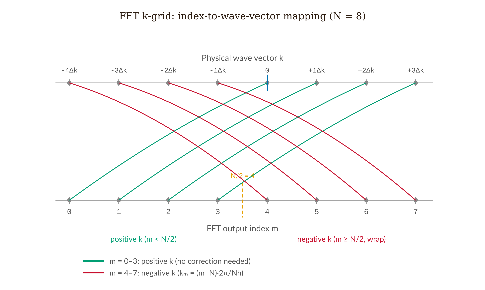

# Chapter 11 — Capstone: A 1D Quantum Sandbox

In this chapter we bring together the methods developed throughout the book by building a configurable one-dimensional Schrödinger solver. Given any potential $V(x)$ specified on a grid, it will find the bound-state energies and eigenfunctions, or time-evolve an initial wave packet forward in time. When it runs, we will have a machine that makes the Schrödinger equation computable for any problem in one dimension.

Building the machine, though, is only half the work. The other half is making sure the machine is right. A program that produces visually plausible output is not the same as a program that computes correct physics. The discipline of checking — of running the solver on a problem whose answer we already know and demanding numerical agreement — is what separates real physical simulation from numerical theater. This chapter teaches that discipline as explicitly as it teaches the algorithms.

By the end, we will have a sandbox that can reproduce every bound-state spectrum in this book, and we will have verified it against the one result that checks everything at once: the infinite square well, whose energies satisfy $E_n = n^2\pi^2\hbar^2/2mL^2$ with no fitting parameters, no adjustable constants, and no excuses.

<!-- → [IMAGE: screenshot or schematic of the finished sandbox UI — showing the potential plot with energy levels as horizontal lines, eigenfunctions offset vertically, the normalization indicator, and the mode selector; this is the deliverable and the reader should see what they are building toward] -->


*Figure 11.1 — screenshot or schematic of the finished sandbox UI — showing the potential plot with energy levels as horizontal lines, eigenfunctions…*

---

## What the Sandbox Does

The sandbox has two operational modes. Before we write a line of code, we need to understand what each one computes.

**Eigensolver mode.** Given a potential $V(x)$ on a spatial grid, find the discrete bound-state energies $E_n$ and the corresponding eigenfunctions $\psi_n(x)$. The output is a list of energy levels and wave-function shapes. These are the stationary states — the states whose probability distribution does not change over time. Every analytic result in Chapters 4 through 10 is a special case of this computation.

**Time-evolution mode.** Given an initial wave function $\Psi(x, 0)$ and a potential $V(x)$, propagate $\Psi(x,t)$ forward in time by solving the time-dependent Schrödinger equation $i\hbar\,\partial_t\Psi = \hat{H}\Psi$. The output is an animation showing the probability density drifting, spreading, bouncing off walls, or tunneling through barriers.

Both modes run on the same infrastructure: $N$ uniformly spaced grid points $x_j = x_\text{min} + j\,h$ with $h = (x_\text{max} - x_\text{min})/(N-1)$, a complex-valued array of length $N$ for the wave function, and a real-valued array of length $N$ for the potential. Everything that follows is about what to do with those arrays.

---

## The Eigensolver: TISE as a Matrix Problem

The time-independent Schrödinger equation is

$$-\frac{\hbar^2}{2m}\psi''(x) + V(x)\psi(x) = E\psi(x).$$

On the grid, the second derivative is approximated by the central-difference stencil:

$$\psi''(x_j) \approx \frac{\psi_{j+1} - 2\psi_j + \psi_{j-1}}{h^2}.$$

Substituting this at every interior grid point simultaneously, we get a matrix equation

$$\mathbf{H}\vec{\psi} = E\,\vec{\psi},$$

where $\mathbf{H}$ is real, symmetric, and tridiagonal:

$$H_{jj} = \frac{\hbar^2}{mh^2} + V_j, \qquad H_{j,j\pm1} = -\frac{\hbar^2}{2mh^2}.$$

Write the kinetic hopping coefficient as $t_k = \hbar^2/(2mh^2)$. Then the diagonal is $2t_k + V_j$ and the off-diagonals are $-t_k$. If $V_j = 0$ everywhere, the matrix represents pure kinetic energy — the coupling between adjacent grid points that lets the wave function propagate.

For a hard-wall problem, the boundary conditions are $\psi_0 = \psi_{N-1} = 0$, which we enforce by building only the $(N-2)\times(N-2)$ interior submatrix. The rows and columns corresponding to the boundary points are simply left out.

Diagonalizing this matrix gives $N-2$ eigenvalues and eigenvectors. The eigenvalues are the energies, and the eigenvectors, each normalized so that $\sum_j|\psi_j|^2 \cdot h = 1$, are the discretized wave functions. The central-difference approximation introduces an error in the $n$-th eigenvalue that scales as $(nh/L)^2$; for $N = 500$ points and the ground state, this is below $10^{-6}$ in fractional terms — more than accurate enough for any physical purpose here.

<!-- → [FIGURE: schematic of the tridiagonal Hamiltonian matrix — showing the diagonal entries 2t_k + V_j and the off-diagonal entries -t_k, with the boundary rows/columns greyed out to indicate Dirichlet conditions; this should make the structure of the discretization visually immediate] -->


*Figure 11.2 — schematic of the tridiagonal Hamiltonian matrix — showing the diagonal entries 2t_k + V_j and the off-diagonal entries -t_k, with the…*

The key number to keep in mind for debugging: the diagonal entry is $\hbar^2/(mh^2)$, which is $2t_k$, not $t_k$. The off-diagonal is $-t_k = -\hbar^2/(2mh^2)$. Confuse the two and the ground-state energy comes out wrong by a factor of two.

---

## Two Paths to Eigenvalues

The matrix eigensolver finds all eigenvalues at once and is the right choice when we want the full spectrum. But it requires a linear algebra library. There is an alternative that needs nothing beyond arithmetic.

**The Numerov shooting method** uses a more accurate approximation of $\psi''$ to achieve $O(h^6)$ errors — four orders better than the central difference — with only a three-point recursion. We rewrite the TISE as $\psi'' = f(x)\psi$ where $f_j = (2m/\hbar^2)(V_j - E)$. The Numerov recursion propagates the wave function one step at a time:

$$\psi_{j+1} = \frac{2\psi_j(1 - \frac{5}{12}h^2 f_j) - \psi_{j-1}(1 + \frac{1}{12}h^2 f_{j-1})}{1 + \frac{1}{12}h^2 f_{j+1}}.$$

Each step is a handful of multiplications and divisions. No matrix, no library.

The shooting strategy works like this. We guess an energy $E$, integrate from the left boundary with $\psi_0 = 0$, $\psi_1 = \epsilon$, and at the same time from the right with $\psi_{N-1} = 0$, $\psi_{N-2} = \epsilon$. At the midpoint, an eigenvalue exists precisely when the logarithmic derivatives of the left and right solutions agree — equivalently, when a certain Wronskian determinant changes sign. We sweep $E$ from low to high, locate the sign changes, and bisect to find each eigenvalue to whatever precision we want.

The trade-off is clear. Numerov finds eigenvalues one at a time, needs careful bracketing, and is slightly more code than calling `math.eigs()`. For three to five eigenstates it is faster to implement and more instructive, because we are integrating the Schrödinger equation directly rather than hiding behind a black-box routine. For twenty or more states, it pays to load the library.

For this capstone, start with Numerov. If you need all the eigenvalues at once, add math.js (loaded from CDN) and call `math.eigs()` on the tridiagonal matrix. Both approaches validate against the same benchmark.

---

## Time Evolution: Why the Stepper Choice Is Not Optional

The time-dependent Schrödinger equation is $i\hbar\,\partial_t\Psi = \hat{H}\Psi$. For a time-independent Hamiltonian, the exact solution is $\Psi(t) = e^{-i\hat{H}t/\hbar}\Psi(0)$. The operator $e^{-i\hat{H}t/\hbar}$ is unitary, so it preserves the norm of the wave function exactly, for all time. Any numerical scheme that is not unitary is fundamentally wrong, because a non-unitary stepper either creates or destroys probability.

**Why explicit Euler is forbidden.** The explicit Euler update is $\Psi^{n+1} = \Psi^n - (i\Delta t/\hbar)\mathbf{H}\Psi^n$. The update matrix is $\mathbf{I} - (i\Delta t/\hbar)\mathbf{H}$, whose eigenvalues are $1 - i\Delta t E_k/\hbar$ for each energy eigenvalue $E_k$. The modulus of each eigenvalue is $\sqrt{1 + (\Delta t E_k/\hbar)^2} > 1$, so every energy component grows exponentially at every step. The normalization indicator climbs above 1 within fifty steps and the simulation diverges. The normalization indicator in the sandbox corner detects this immediately — if it reads above 1.001 after ten steps, the time-stepper is wrong. Explicit Euler is unconditionally unstable for the Schrödinger equation and must never be used.

### Crank-Nicolson

The Crank-Nicolson scheme discretizes the TDSE as

$$\left(\mathbf{I} + \frac{i\Delta t}{2\hbar}\mathbf{H}\right)\Psi^{n+1} = \left(\mathbf{I} - \frac{i\Delta t}{2\hbar}\mathbf{H}\right)\Psi^n.$$

This is the Cayley approximation to the exact propagator. Because $\mathbf{H}$ is Hermitian, the left and right matrices are complex conjugates of each other, so the update is exactly unitary, and normalization is preserved at every step regardless of $\Delta t$. The scheme is second-order in both time and space, unconditionally stable, and a natural fit for hard-wall boundary conditions, because the tridiagonal structure of $\mathbf{H}$ carries straight into the linear system. Each step requires solving a tridiagonal system, which the Thomas algorithm handles in $O(N)$ operations.

### Split-Step Fourier

For free-space or slowly varying potentials on a large periodic domain, the split-step Fourier method is faster and spectrally accurate in space. The Hamiltonian splits as $\hat{H} = \hat{T} + \hat{V}$. Since $\hat{T}$ and $\hat{V}$ do not commute, the exact propagator $e^{-i\hat{H}\Delta t/\hbar}$ cannot be split exactly. The Trotter-Suzuki decomposition gives a second-order approximation:

$$e^{-i\hat{H}\Delta t/\hbar} \approx e^{-i\hat{V}\Delta t/2\hbar}\,e^{-i\hat{T}\Delta t/\hbar}\,e^{-i\hat{V}\Delta t/2\hbar}.$$

The algorithm per step: multiply $\psi_j$ pointwise by $e^{-iV_j\Delta t/2\hbar}$; Fourier transform; multiply $\hat{\psi}_m$ pointwise by $e^{-i\hbar k_m^2\Delta t/2m}$; inverse Fourier transform; multiply again by $e^{-iV_j\Delta t/2\hbar}$. Each of the three multiplication steps applies a phase of modulus exactly 1, so the method is exactly unitary, and normalization is machine-precision exact.

There is one mandatory detail about the FFT $k$-grid that breaks any implementation that ignores it. After we call FFT on an array of length $N$, the output index $m$ does not directly equal the physical wave vector. The correct mapping is:

$$k_m = \frac{2\pi}{Nh}\times\begin{cases} m & m < N/2 \\ m - N & m \geq N/2 \end{cases}$$

The second half of the FFT output (indices $N/2$ through $N-1$) corresponds to *negative* wave vectors. If we apply the kinetic phase using the raw index $m$ instead of the physical $k_m$, we give the wrong kinetic energy to every negative-momentum component. The simulation looks correct for the first few steps — the error lives in the high-frequency tails — and then gradually corrupts the entire wave function. The fix is five lines of code; the simulation supplement covers it explicitly.

<!-- → [FIGURE: diagram of the FFT output index mapping to physical wave vectors — showing indices 0 through N/2-1 mapping to positive k, and N/2 through N-1 mapping to negative k; the visual point is that the second half "wraps around" and must be corrected before applying the kinetic phase] -->


*Figure 11.3 — diagram of the FFT output index mapping to physical wave vectors — showing indices 0 through N/2-1 mapping to positive k, and N/2 through…*

---

## Defending the Physics

Building the sandbox is the lesser half of the project. The greater half is running the validation suite and confirming that the simulation computes correct physics. Here is what that means in concrete terms.

**Units.** Every displayed quantity must carry correct units. This is not decoration. A program that displays energy in the wrong units is computing the wrong physics. Commit to one system — SI with distances in nanometers and energies in electron-volts works well — label every axis, and use it consistently. Sanity check: for an infinite square well of width $L = 1$ nm and an electron, the ground-state energy is $E_1 = \pi^2\hbar^2/2m_eL^2 \approx 0.376$ eV. If the code reports 376 eV or 0.000376 eV, there is a units error.

**Normalization.** For every eigenstate the solver returns, verify:
$$\sum_{j=0}^{N-1}|\psi_j|^2 \cdot h = 1.000 \pm 0.001.$$

Note the $h$ weighting. Some eigensolvers return unit-norm vectors in the Euclidean sense ($\sum|\psi_j|^2 = 1$) rather than the physics sense ($\sum|\psi_j|^2 h = 1$). To convert, divide the returned eigenvector by $\sqrt{h}$. Forget the $h$ and the normalization integral reads $1/h$ instead of 1 — which for $h = 0.004$ nm gives a reading of 250 instead of 1. The normalization indicator in the corner catches this immediately.

During time evolution, the same indicator must stay within $\pm 0.001$ of $1.000$ at every animation frame. Drift above 1 means the time-stepper is creating probability; drift below 1 means it is destroying probability. Both are physically wrong.

**Orthogonality.** For any two eigenstates:
$$\left|\sum_j \psi_j^{(n)*}\psi_j^{(m)} \cdot h\right| < 10^{-8}, \quad m \neq n.$$

A violation means either the eigensolver has a bug or the eigenvectors were never normalized, letting floating-point overflow pollute the orthogonality.

**The infinite square well benchmark.** This is the primary test. Set $V(x) = 0$ for $x \in (0, L)$ with hard walls at both ends. Run the eigensolver with $L = 2$ nm, $m = m_e$, $N = 500$. The analytic spectrum is

$$E_n = \frac{n^2\pi^2\hbar^2}{2m_eL^2} \approx n^2 \times 0.094\ \text{eV.}$$

Report a comparison table: for $n = 1, 2, 3, 4, 5$, list the analytic and numerical energies and the fractional error. The error should be below $10^{-5}$ for $n = 1$ and below 1% for $n = 10$ with $N = 500$.

There is a dimensionless check that bypasses units entirely: the ratios $E_n/E_1$ should be exactly $n^2$. Check that $E_2/E_1 = 4.000$, $E_3/E_1 = 9.000$, $E_4/E_1 = 16.000$. If these ratios are correct to three decimal places, the eigenvalue algorithm is working, regardless of whether you have the right value for $\hbar$ in electron-volts. The ratios depend only on the numerics, not on any physical constants.

<!-- → [TABLE: validation table for the infinite square well — columns: n, E_n analytic (eV), E_n numerical (eV), E_n/E_1 analytic, E_n/E_1 numerical, fractional error; N = 500, L = 2 nm, m = m_e; populate with expected values: E_1 ≈ 0.094 eV, E_2 ≈ 0.376 eV, E_3 ≈ 0.846 eV, ratios 1, 4, 9, 16, 25; this is the definitive validation output the student should reproduce] -->


*Figure 11.4 — Validation of the eigensolver against the infinite square well: five numerical eigenvalue ratios E_n/E₁ (filled circles) lie on or indistinguishably close to the analytic n² parabola (solid curve), with a tolerance bracket at n = 5 indicating the 1% accuracy target.*

**Harmonic oscillator.** Set $V(x) = \frac{1}{2}m\omega^2 x^2$ on a grid wide enough to hold the first ten states. The analytic spectrum is $E_n = \hbar\omega(n + \frac{1}{2})$ — equally spaced levels, with the ground state at $\hbar\omega/2$. Verify: the level spacing is uniform to within 1%; the ground-state wave function is Gaussian; the ground-state uncertainty product $\sigma_x\sigma_p = \hbar/2$ (the harmonic oscillator ground state saturates the Kennard bound). This last check connects directly to Chapter 9 and closes a loop that has been open since Chapter 1.

**Free-particle time evolution.** Set $V = 0$. Initialize a Gaussian wave packet with center $x_0$, width $a$, and mean wavenumber $k_0$. The analytic evolution gives a centroid at $x_0 + (\hbar k_0/m)t$ and a width $\sigma(t)^2 = a^2/2 + \hbar^2t^2/(2m^2a^2)$. Run the simulation and compare. Both centroid and width should agree with the analytic formula to within 1% over several spreading times.

**Energy conservation.** Under time evolution with any time-independent $V(x)$, compute $\langle\hat{H}\rangle = \sum_j\Psi_j^*(t)(\mathbf{H}\vec{\Psi})_j \cdot h$ at each frame. It must not drift by more than 0.1% over the simulation window. If it grows, the time-stepper is not unitary.

---

## What Each Previous Chapter Built

The sandbox does no new physics. Every feature assembles a tool we already have.

The Born rule from Chapter 3 is why we display $|\Psi|^2$ rather than $\Psi$ itself, and why the normalization integral must equal 1. The TISE from Chapter 4 is what the matrix eigensolver solves. The argument that quantization falls out of boundary conditions — made for the infinite well in Chapter 5 — is reproduced automatically by the matrix formulation, since Dirichlet boundary conditions enforce $\psi_0 = \psi_{N-1} = 0$ and the only solutions are the discrete eigenvectors. The harmonic oscillator spectrum of Chapter 7 is recovered numerically by setting $V_j = \frac{1}{2}m\omega^2 x_j^2$. The Gaussian wave-packet dynamics of Chapter 8 — group velocity, spreading, the $1/\sigma_0^2$ spreading rate — can be watched in the time-evolution panel. The operators and expectation values of Chapter 9 give $\sigma_x$, $\sigma_p$, and $\langle\hat{H}\rangle$ from the numerical eigenstates. The tunneling of Chapter 6 appears when we time-evolve a wave packet against a finite barrier and watch the transmitted fraction emerge on the other side.

The synthesis is the point. We are not building something new. We are building a single machine that runs everything we already know, and then verifying that it agrees with what we already know.

---

## The Algorithm in One Place

Here is the eigensolver in enough detail to implement it without further reference.

**Input:** grid $(x_j)$, spacing $h$, potential array $(V_j)$, constants $\hbar$, $m$, number of desired eigenvalues.

**Construct** $\mathbf{H}$:

```
t_k = hbar^2 / (2 * m * h^2)       // kinetic hopping coefficient
For j = 1 to N-2:
  H[j, j]   = 2 * t_k + V[j]       // diagonal
  H[j, j+1] = -t_k                  // upper off-diagonal
  H[j-1, j] = -t_k                  // lower off-diagonal
// Build only the (N-2) x (N-2) interior block.
```

**Diagonalize:** call `math.eigs(H)`. Sort eigenvalues ascending. Take the first $n_\text{eig}$ pairs.

**Normalize:** for each eigenvector, compute `norm = sum_j |psi_j|^2 * h` and divide by `sqrt(norm)`.

**Display:** energy levels as horizontal lines on the potential plot at height $E_n$; eigenfunctions as $|\psi_n|^2$ filled curves offset vertically by $E_n$; numerical table with $E_n$, $E_n/E_1$, $\sigma_x$, $\sigma_p$, $\sigma_x\sigma_p/(\hbar/2)$.

And the split-step time-evolution algorithm per step:

```
// Half potential step
For j: psi[j] *= exp(-i * V[j] * dt / (2 * hbar))

// Full kinetic step in Fourier space
psi_hat = FFT(psi)
For m: k_m = (2*pi / (N*h)) * (m < N/2 ? m : m - N)
       psi_hat[m] *= exp(-i * hbar * k_m^2 * dt / (2 * m_particle))
psi = IFFT(psi_hat)

// Second half potential step
For j: psi[j] *= exp(-i * V[j] * dt / (2 * hbar))
```

Note the $k$-grid formula with the sign flip for $m \geq N/2$. This is the single most common implementation error.

---

## Common Failure Modes

Every failure mode below has a specific symptom in the normalization indicator or the validation table. Learn to read the indicator before debugging anything else.

$h$ **vs.** $h^2$ **in the kinetic coefficient.** If you write `h` instead of `h*h` in the denominator of $t_k$, the kinetic energy is wrong by a factor of $1/h$. The ground-state energy scales as $1/N$ instead of $1/N^2$. The ratio $E_2/E_1$ is still 4 (because the error is uniform across modes), but $E_1$ itself is completely wrong. The validation table catches this in the first line.

**Unnormalized eigenvectors.** math.js returns eigenvectors normalized in the Euclidean sense: $\sum_j|\psi_j|^2 = 1$. The physics normalization is $\sum_j|\psi_j|^2 h = 1$. For $h = 0.004$ nm, the Euclidean-normalized vector has a physics-norm of $1/h = 250$. Multiply the eigenvector by $1/\sqrt{h}$ to correct. Symptom: normalization indicator reads $250$ or $0.004$ instead of $1$.

**Wrong FFT** $k$-**ordering.** The second half of the FFT output wraps to negative wave vectors. Applying kinetic phase using the raw index $m$ gives the wrong energy to every negative-momentum component. Symptom: time evolution looks correct for the first ten steps and then develops a growing oscillation at the grid scale. Fix: use the $k_m$ formula above.

**Explicit Euler.** Normalization climbs above 1 within fifty steps. The indicator catches it at step ten. Fix: use Crank-Nicolson or split-step. There is no scenario in which explicit Euler is acceptable for the Schrödinger equation.

**Grid too narrow.** For the harmonic oscillator, if the grid does not extend to at least $\pm 5 x_0$ (where $x_0 = \sqrt{\hbar/m\omega}$ is the characteristic length), the wave functions are truncated at the boundary and the eigenvalues are wrong. Symptom: the eigenvalues are slightly too high and the wave functions visibly hit the edge. Fix: widen the grid.

**Spurious reflections in time evolution.** The wave packet reaches the edge of the grid and reflects, creating interference that has nothing to do with the physics. Fix: make the grid five to ten packet-widths wider than necessary, so the packet never reaches the boundary in the simulation time window. Alternatively, add a complex absorbing potential $-i\gamma(|x| - x_\text{abs})^2$ near both edges — but understand that the normalization indicator will then decrease over time, which is correct physics (probability is flowing out of the domain), not a bug.

---

## What Comes After

The sandbox as built is one-dimensional and non-relativistic. The physics it cannot handle points directly to what comes next.

For periodic potentials — an array of identical wells, a crystal lattice — the eigenstates are not bound states localized in one well. They are Bloch waves that extend across the entire lattice, and the spectrum forms bands separated by gaps. The tridiagonal matrix still works, but now we need periodic boundary conditions (which make it a circulant matrix) and Bloch's theorem to interpret the results. That is the band structure problem, and it is the content of solid-state physics.

For two dimensions, the Hamiltonian matrix becomes $(N_x N_y) \times (N_x N_y)$. For $N_x = N_y = 500$, this is a $250000 \times 250000$ matrix that cannot be fully diagonalized by any method available to a browser. Iterative eigensolvers — Lanczos, Arnoldi — find the lowest few eigenvalues without ever building the full matrix. Time evolution in 2D via split-step works cleanly with two sequential FFT passes. This infrastructure is unchanged from the 1D version; the algorithms compose.

For relativistic particles, $\omega = \sqrt{(\hbar k)^2 c^2 + m^2c^4}/\hbar$ replaces the free-particle $\omega = \hbar k^2/2m$. The dispersion is no longer quadratic, the group and phase velocities are related differently, and for fermions the wave function has spinor components that the Dirac equation mixes. The split-step method still applies — the kinetic phase in step 3 uses the relativistic dispersion — but the physics of the output is richer.

The harder truth is that most quantum mechanics problems in research are neither one-dimensional nor exactly solvable. The hydrogen atom, the helium atom, the benzene molecule — none of them have clean analytic solutions to their many-body Hamiltonians. The tools in this sandbox — finite-difference discretization, matrix diagonalization, unitary time evolution — are the basis of every serious quantum simulation code in existence. Density functional theory, quantum Monte Carlo, tensor network methods: all of them solve discretized versions of the Schrödinger equation, all of them need unitary time steppers, and all of them validate against exactly the benchmarks in this chapter.

We have been doing quantum mechanics in one dimension with a single electron. The machines that design semiconductor devices, simulate drug-target binding, and model quantum computers are doing quantum mechanics in thousands of dimensions with millions of electrons. The logic is the same. The scale is the difference.

<!-- → [INFOGRAPHIC: "scaling ladder" showing the 1D sandbox at the bottom, then 2D quantum dots, then the hydrogen atom (3D spherically symmetric), then helium (two electrons, 6D configuration space), then DFT for solids — with annotations showing which numerical tools apply at each level and what new challenge each step introduces; the goal is to show that the sandbox is the base of a hierarchy, not a toy] -->

---

## Exercises

**Warm-up**

1. *Difficulty: Warm-up — tests the matrix construction.*
   Write out the full $5\times5$ Hamiltonian matrix for an infinite square well with $N = 7$ grid points (so $N - 2 = 5$ interior points), well width $L$, and $V_j = 0$. Express all entries in terms of $t_k = \hbar^2/(2mh^2)$ where $h = L/6$. Verify that the matrix is real, symmetric, and tridiagonal. What boundary conditions does the structure implicitly enforce?
   *Tests: ability to construct the discrete Hamiltonian from the central-difference stencil.*

2. *Difficulty: Warm-up — tests the units sanity check.*
   For an infinite square well with $L = 2$ nm and an electron, compute $E_1$, $E_2$, $E_3$ analytically in eV. Verify $E_2/E_1 = 4$ and $E_3/E_1 = 9$. If a solver returns $E_1 = 9.4$ eV for this system, identify the most likely units error (factor of 100 in energy implies what factor error in what quantity?).
   *Tests: dimensional analysis and the ratio test as a units-independent check.*

3. *Difficulty: Warm-up — tests understanding of why explicit Euler fails.*
   The explicit Euler update is $\Psi^{n+1} = \Psi^n - (i\Delta t/\hbar)\mathbf{H}\Psi^n$. (a) Write the update as $\Psi^{n+1} = \mathbf{M}\Psi^n$ and identify $\mathbf{M}$. (b) If $\Psi^n$ is an energy eigenstate with eigenvalue $E$, compute $|\Psi^{n+1}|^2/|\Psi^n|^2$. (c) Show this is greater than 1 for any $E \neq 0$ and any $\Delta t > 0$. Why does this make explicit Euler unsuitable for the Schrödinger equation regardless of how small $\Delta t$ is?
   *Tests: understanding of unitarity and why the instability is unconditional, not just a* $\text{small-}\Delta t$ *issue.*

**Application**

4. *Difficulty: Application — runs the primary validation benchmark.*
   Implement (on paper or in pseudocode) the infinite-square-well eigensolver with $N = 500$, $L = 2$ nm, $m = m_e$. (a) Compute the analytic values $E_1$ through $E_5$ in eV. (b) Estimate the fractional error from the central-difference approximation for $n = 1$ and $n = 5$, using the formula $\delta E_n/E_n \approx (n\pi h/L)^2/12$. (c) At what mode number $n$ does the fractional error first exceed 1% with $N = 500$?
   *Tests: command of the central-difference error formula and its* $n^2$ *scaling.*

5. *Difficulty: Application — tests the FFT k-grid correction.*
   An array of length $N = 8$ undergoes FFT. (a) List the raw output indices $m = 0, 1, \ldots, 7$. (b) Convert each to the physical wave vector $k_m$ using $h = 0.1$ nm and the sign-flip rule. (c) For which indices does the physical $k_m$ differ in sign from what you would get by using $m$ directly? (d) If the kinetic phase at index $m = 5$ is $e^{-i\hbar k_m^2\Delta t/2m}$ with $\Delta t = 0.01$ fs, compute the phase using the correct $k_5$ and the incorrect raw-index $k = 2\pi \times 5/(Nh)$. By how much do they differ?
   *Tests: the specific FFT k-grid error that is the most common split-step implementation bug.*

6. *Difficulty: Application — connects eigensolver output to uncertainty principle.*
   Run the harmonic oscillator eigensolver for $\omega = 10^{14}$ rad/s and $m = m_e$. From the numerical ground-state wave function, compute $\sigma_x$ and $\sigma_p$ using expectation values: $\sigma_x^2 = \langle x^2\rangle - \langle x\rangle^2$ and $\sigma_p^2 = \langle p^2\rangle - \langle p\rangle^2$ where $\langle p^2\rangle = -\hbar^2\sum_j\psi_j^*(d^2\psi/dx^2)_j h$. Verify $\sigma_x\sigma_p \approx \hbar/2$. What value do you get for the ratio $\sigma_x\sigma_p/(\hbar/2)$, and what does a value close to 1 mean physically?
   *Tests: ability to compute expectation values from a numerical eigenstate and connect to the Kennard bound.*

**Synthesis**

7. *Difficulty: Synthesis — connects the double-well tunnel splitting to quantum tunneling.*
   Consider a symmetric double well: $V(x) = 0$ for $|x - d/2| < w/2$ or $|x + d/2| < w/2$, and $V(x) = V_0$ otherwise, for well width $w = 0.5$ nm, well depth $V_0 = 1$ eV, and barrier width $d$ varying from 0.2 to 1.0 nm. The ground state is symmetric ($\psi_0$ even) and the first excited state is antisymmetric ($\psi_1$ odd); their energy difference $\Delta E = E_1 - E_0$ is the tunnel splitting. (a) Explain qualitatively why $\Delta E$ decreases as $d$ increases. (b) Using the WKB tunneling formula from Chapter 6, estimate how $\Delta E$ should scale with $d$ (exponentially or polynomially?). (c) Run the eigensolver for $d = 0.2$, $0.4$, $0.6$, $0.8$, $1.0$ nm and plot $\log(\Delta E)$ vs. $d$. Is the relationship approximately linear on the semilog plot?
   *Tests: synthesis of the eigensolver output with the tunneling physics of Chapter 6, including the exponential WKB scaling.*

8. *Difficulty: Synthesis — uses time evolution as a scattering experiment.*
   Initialize a Gaussian wave packet centered at $x_0 = -5$ nm with $k_0 = 5$ $\text{nm}^{-1}$ and width $a = 0.5$ nm, incident on a rectangular barrier of height $V_0 = 0.15$ eV and width $0.4$ nm. The kinetic energy is $E_k = \hbar^2k_0^2/2m_e$. (a) Is $E_k > V_0$ or $E_k < V_0$? (b) Evolve the wave packet until it has fully split into transmitted and reflected components. Estimate $R$ and $T$ from the integrated areas under $|\Psi|^2$ on each side of the barrier. (c) The analytic square-barrier transmission coefficient $T(E)$ from Chapter 6 is evaluated at a single energy. Explain why the numerical $T$ from the packet simulation will differ slightly from $T(E_k)$, even if the simulation is exact.
   *Tests: ability to use the time-evolution mode as a scattering experiment and to reason about the difference between a plane wave and a wave packet in a scattering context.*

**Challenge**

9. *Difficulty: Challenge — quantifies the accuracy improvement from Numerov vs. central difference.*
   For the infinite square well, the central-difference eigensolver has a fractional error $\delta E_n/E_n \approx (n\pi h/L)^2/12$ in the $n$-th eigenvalue. The Numerov method achieves $\delta E_n/E_n \approx (n\pi h/L)^6/240$. (a) For $N = 100$ and $n = 5$, compute the fractional error for both methods. (b) Find the minimum $N$ for each method such that $\delta E_5/E_5 < 10^{-6}$. (c) In a browser environment where $N = 1000$ is practical but $N = 10000$ is slow, which method achieves $10^{-6}$ accuracy for $n = 5$ within the practical grid size? (d) For very high modes ($n \gg 1$), both methods eventually fail. What sets the maximum reliable mode number for each method at fixed $N$?
   *Tests: quantitative comparison of numerical methods and understanding of the accuracy-vs-cost trade-off.*

---

## References

Feit, M. D., Fleck, J. A., Jr., & Steiger, A. (1982). Solution of the Schrödinger equation by a spectral method. *Journal of Computational Physics*, 47, 412–433. (The original split-step Fourier method for quantum wave-packet propagation.)

Koonin, S. E., & Meredith, D. C. (1990). *Computational Physics*. Addison-Wesley. (The finite-difference Schrödinger solver as an undergraduate project.)

Blatt, J. M. (1967). Practical points concerning the solution of the Schrödinger equation. *Journal of Computational Physics*, 1, 382–396. (The primary reference for the Numerov shooting method.)

Press, W. H., Teukolsky, S. A., Vetterling, W. T., & Flannery, B. P. (2007). *Numerical Recipes* (3rd ed.). Cambridge University Press. Ch. 19–20. (Thomas algorithm; TISE as an eigenvalue problem.)

Trefethen, L. N., & Bau, D. (1997). *Numerical Linear Algebra*. SIAM. Ch. 29–31. (The QR algorithm and what math.js is doing internally.)

Pfahnl, A. W. (2022). Finite difference method for visualizing quantum mechanics. *Journal of Chemical Education*, 99, 3647–3655. doi:10.1021/acs.jchemed.2c00557.

Griffiths, D. J., & Schroeter, D. F. (2018). *Introduction to Quantum Mechanics* (3rd ed.). Cambridge University Press. Ch. 2. (The analytic benchmarks the sandbox validates against.)

