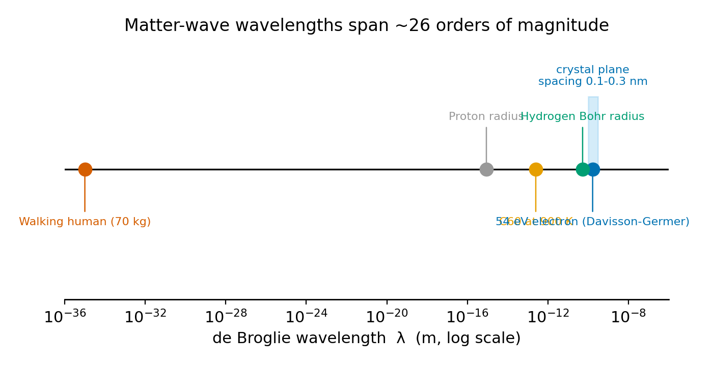
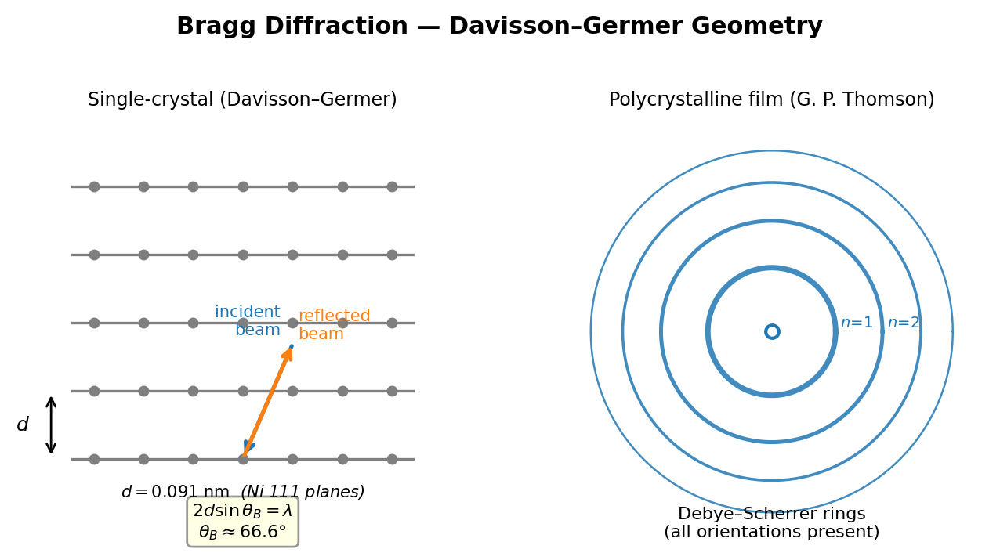
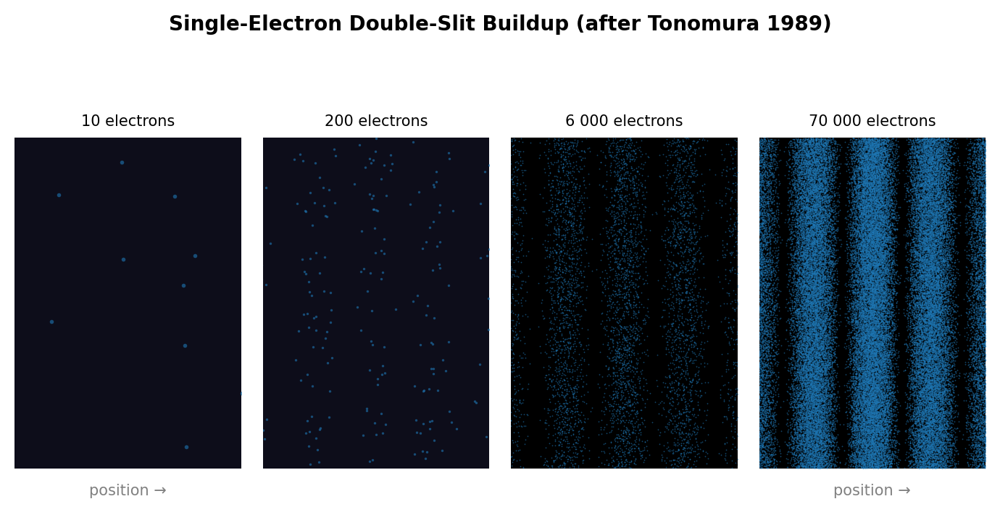

# Chapter 2 — Matter Waves: de Broglie, Davisson–Germer, and the Double Slit

In 1924, Louis-Victor de Broglie proposed, in a doctoral thesis that his committee nearly rejected, that if light waves can behave like particles — as Einstein had shown with the photoelectric effect — then matter particles ought to behave like waves. Einstein had established that electromagnetic waves carry momentum $p = h/\lambda$. De Broglie reversed the relation: a particle with momentum $p$ should have an associated wavelength

$$\lambda = \frac{h}{p}.$$

Einstein, consulted by the committee before the thesis was approved, called the idea brilliant. De Broglie received the Nobel Prize in 1929. Two years after the thesis appeared, a laboratory accident in New Jersey provided experimental confirmation. Clinton Davisson and Lester Germer had been firing electrons at a polycrystalline nickel surface, recording a featureless scatter pattern. A laboratory accident contaminated the sample, and when they annealed the nickel to clean it, the polycrystalline target converted into a single crystal with regular atomic planes. On resuming their measurements, the smooth scatter pattern was gone; sharp diffraction peaks had appeared at specific angles. The electrons were diffracting from the crystal lattice exactly as X-rays do — confirming de Broglie's prediction through an experiment that was not designed for that purpose.

<!-- → [IMAGE: photograph or schematic of the Davisson–Germer apparatus — showing the electron gun, rotatable detector, and nickel crystal target; caption should note the accidental annealing that converted the sample to a single crystal] -->


*Figure 2.1 — photograph or schematic of the Davisson–Germer apparatus — showing the electron gun, rotatable detector, and nickel crystal target*

---

## The Formula and What It Means

Let us begin with what de Broglie actually wrote. For a non-relativistic particle with kinetic energy $K$ and mass $m$, energy and momentum are related by $K = p^2/2m$, so $p = \sqrt{2mK}$. Substituting gives

$$\lambda = \frac{h}{\sqrt{2mK}}.$$

For a charged particle of charge $e$ accelerated from rest through a potential difference $V$, the kinetic energy is $K = eV$, which gives

$$\lambda = \frac{h}{\sqrt{2meV}}.$$

For electrons in particular — a calculation you will do often — the numbers collapse into a convenient shortcut:

$$\lambda_{\text{electron}} \approx \frac{1.226\text{ nm}}{\sqrt{V\text{ (in volts)}}}.$$

At 150 volts, $\lambda \approx 0.1$ nm — one tenth of a nanometer, one ångström. This is no accident. It is roughly the spacing between atoms in a solid. For a wave to diffract from a crystal, its wavelength must be comparable to the crystal's spacing, which is why X-rays, with wavelengths in the ångström range, can do it. The de Broglie formula tells us that electrons accelerated through a few hundred volts land in exactly the same range. That is why Davisson and Germer could see diffraction at all, and why Bragg's law — developed entirely for X-rays — worked without modification for electrons.

It is important to be clear about what the wavelength is not. It is not the physical size of the electron. The classical electron radius is roughly $2.8 \times 10^{-15}$ m, eight orders of magnitude smaller than the 0.167 nm de Broglie wavelength of a 54 eV electron. The wavelength is a property of the electron's state of motion, not its physical extent. This distinction matters a great deal when you first encounter the idea, because the intuitive picture — a small ball with ripples around it — is simply wrong. The wave and the particle are not separable components of one object. In the sense that it is the only thing that evolves deterministically between observations, the wave *is* the thing.

<!-- → [TABLE: de Broglie wavelengths for several particles — columns: particle, mass, speed or energy, λ; rows: electron at 54 eV (the Davisson–Germer case), proton at same kinetic energy, C₆₀ buckyball at 900 K, 70 kg person walking at 1 m/s; the last row makes the classical limit visceral] -->

De Broglie's idea was not purely abstract, and its logical structure is worth tracing. Einstein's special relativity required that energy and momentum transform together as a four-vector. De Broglie noticed that frequency and wave vector (the spatial frequency $1/\lambda$) transform as a four-vector too. For a photon, the relation $E = h\nu$ links these two four-vectors through the single constant $h$. De Broglie asserted that the same constant links them for any particle. This was a symmetry argument, not an empirical fit; the experiments came afterward.

---

## The Davisson–Germer Experiment

We can reconstruct the 1927 result from first principles. For electrons accelerated through 54 V, Davisson and Germer recorded a sharp diffraction peak at 50°. The de Broglie wavelength at 54 eV is:

$$p = \sqrt{2 \times (9.109 \times 10^{-31}) \times (54 \times 1.602 \times 10^{-19})} = 3.970 \times 10^{-24}\text{ kg m s}^{-1}$$

$$\lambda = \frac{6.626 \times 10^{-34}}{3.970 \times 10^{-24}} \approx 0.167\text{ nm.}$$

The crystal planes that matter here are nickel's (111) planes in the face-centered cubic lattice, separated by $d = 0.091$ nm. Bragg's law for first-order diffraction reads:

$$2d\sin\theta_{\text{Bragg}} = \lambda \implies \sin\theta_{\text{Bragg}} = \frac{0.167}{2 \times 0.091} = 0.918 \implies \theta_{\text{Bragg}} \approx 66.6°.$$

The scattering angle measured from the forward beam in the Davisson–Germer geometry converts to approximately 47° — close to the observed 50°. The small remaining discrepancy is not a failure of de Broglie. It arises because electrons entering a metal crystal experience an attractive inner potential, which slightly accelerates them and shortens their wavelength inside the crystal. Correcting for this inner potential brings the prediction into exact agreement.

This is what a successful quantitative test looks like: a parameter-free prediction built from quantities measured entirely independently ($h$, $m_e$, $d$), compared against an angle measured in an unrelated experiment that was not even designed to test the prediction. The agreement is not approximate. It is exact once the physics is fully accounted for.

Davisson and Germer did not at first fully understand what they had found. Davisson grasped it only after traveling to Europe and speaking with Max Born, James Franck, and others who had been absorbing de Broglie's and Schrödinger's new wave mechanics. Meanwhile George Paget Thomson was doing similar experiments independently in Aberdeen, firing electrons through thin metal films and observing rings — Debye–Scherrer diffraction, the same geometry used for polycrystalline X-ray diffraction. Thomson and Davisson shared the 1937 Nobel Prize. (Davisson–Germer, *Physical Review* **30**, 705–740 (1927). doi:10.1103/PhysRev.30.705)

<!-- → [FIGURE: diagram of Bragg diffraction geometry applied to the Davisson–Germer case — showing incident and reflected electron beams, crystal planes separated by d = 0.091 nm, path-length difference of 2d sin θ, and the condition for constructive interference; contrast with a polycrystalline diffraction ring geometry for Thomson's version] -->


*Figure 2.2 — diagram of Bragg diffraction geometry applied to the Davisson–Germer case — showing incident and reflected electron beams, crystal planes…*

One point of logic should be made explicit. The Davisson–Germer experiment does not prove that electrons *are* waves in any classical sense — that they are extended oscillations in a medium, the way sound is. What it proves is that electrons produce interference and diffraction that can only be calculated using wave mechanics. The distinction matters because the very same electron that contributes to a diffraction peak arrives at the detector as a localized event: a single click, a single dot.

---

## Single Electrons, One at a Time

Akira Tonomura and colleagues at Hitachi performed a particularly instructive version of the double-slit experiment in 1989. They used an electron biprism — a fine wire held at positive potential that splits an electron beam into two coherent paths, physically equivalent to two slits — and reduced the beam intensity until fewer than one electron was in the apparatus at any moment. Each electron was recorded as a single localized dot on a position-sensitive detector.

The accumulated pattern builds in a characteristic way. At ten electrons, the dots appear randomly distributed, with no evident order. By two hundred electrons, faint clustering appears. By six thousand, stripes begin to form. By seventy thousand, the result is a clear interference pattern of alternating bright and dark fringes — the pattern that wave mechanics predicts when a wave passes through both paths.

Each electron in this experiment arrived as a particle — a single localized dot — and was detected individually. Yet the distribution of those dots, after many electrons, matches the interference pattern $|\psi|^2$ computed from the wave function for a wave that passed through both paths. The electrons did not interfere with each other; there was only ever one in the apparatus at a time. Each electron's wave function explored both arms simultaneously and interfered with itself. The dot on the detector marks where the wave function collapsed upon measurement.

Tonomura's 1989 paper is the most famous experiment of this kind, but it was not the first. Pier Giorgio Merli, Giulio Missiroli, and Gianfranco Pozzi demonstrated single-electron buildup in Bologna in 1974 (published in 1976 in the *American Journal of Physics*), and a 2002 *Physics World* poll voted their experiment one of the most beautiful in physics. The first version to use genuine nano-fabricated double slits — real slits cut into a membrane rather than a biprism — came later, with Bach et al. in 2013. (Tonomura et al., *Am. J. Phys.* **57**, 117–120 (1989). doi:10.1119/1.16104; Bach et al., *New J. Phys.* **15**, 033018 (2013). doi:10.1088/1367-2630/15/3/033018)

<!-- → [CHART: sequence of detector images from the single-electron buildup — showing the pattern at approximately 10, 200, 6,000, and 70,000 electrons; this is the most important visual in the chapter and must show both the particle nature (individual dots) and wave nature (emerging fringes)] -->


*Figure 2.3 — sequence of detector images from the single-electron buildup — showing the pattern at approximately 10, 200, 6,000, and 70,000 electrons*

The experiment rules out any model in which the electron follows a definite trajectory through one slit or the other. If electrons had definite trajectories, reducing the beam to one electron at a time would not change the outcome — you would see two bright regions, one behind each slit, with no fringes between them. Instead, fringes appear well into the geometric shadow, and the pattern depends on the separation of both slits even though each electron can only be detected in one place.

One might propose that the electron goes through one slit but is disturbed by the act of not detecting it at the other. This is not supported by experiment. The slits can be made arbitrarily wide and the detection system arbitrarily gentle, and the interference persists as long as information about which slit the electron used is not acquired. What destroys interference is not physical disturbance — it is information.

---

## Why Human-Scale Objects Do Not Diffract

The de Broglie relation applies to all objects with momentum, not only to quantum particles. The relevant question is whether the associated wavelength is large enough to produce observable interference.

A proton accelerated through the same 54 V has 1836 times the electron's mass. At the same kinetic energy its momentum is $\sqrt{1836}$ times larger, so its wavelength is $\sqrt{1836} \approx 43$ times smaller: about 4 pm. That is still within reach of crystal diffraction — neutron and proton diffraction are real techniques used in materials science.

A $\text{C}_{60}$ buckyball — sixty carbon atoms, mass roughly 720 atomic mass units — was diffracted from a grating with 50 nm slits by Anton Zeilinger's group in Vienna in 1999. The de Broglie wavelength at the effusion temperature of 900 K works out to roughly 2.5 pm (picometers), smaller than the molecule itself. Yet fringes appeared. The 2019 experiments by Fein and colleagues pushed this to molecules of approximately 2,000 atoms. (Arndt et al., *Nature* **401**, 680–682 (1999). doi:10.1038/44348; Fein et al., *Nat. Phys.* **15**, 1242–1245 (2019). doi:10.1038/s41567-019-0663-9)

Now compute the wavelength of a 70 kg person walking at 1 m/s:

$$\lambda = \frac{6.626 \times 10^{-34}}{70 \times 1} \approx 10^{-35}\text{ m.}$$

That is approximately twenty orders of magnitude smaller than a proton radius. No physical slit, crystal lattice, or instrument could resolve a wavelength this small. Quantum interference is not absent for large objects — it is present but completely undetectable. Quantum mechanics is not wrong at human scales; the wavelengths are simply too small for any realizable grating or aperture to reveal the fringe structure. This is Bohr's correspondence principle made quantitative: quantum mechanics contains classical mechanics as the limit in which the system's action greatly exceeds $\hbar$. The de Broglie wavelength makes that limit concrete — computing $h/p$ is sufficient.

<!-- → [INFOGRAPHIC: scale comparison — showing λ for electron at 54 eV (0.167 nm), thermal neutron (~1 Å), C₆₀ at 900 K (~2.5 pm), and 70 kg person walking (10⁻³⁵ m), placed on a logarithmic scale alongside reference lengths: proton radius, hydrogen atom, visible light wavelength, human hair; the goal is to make viscerally clear why quantum wavelengths are measurable for small particles and invisible for large ones] -->

---

## What the Wave Function Is Not Yet

De Broglie established that there is a wave associated with a moving particle, but did not say what the wave represents. That question was answered by Max Born in 1926. Born proposed that the wave function $\psi(x,t)$ is not a physical wave in space, like a water wave or a sound wave. Its square modulus, $|\psi(x,t)|^2$, is a probability density: the probability per unit length of finding the particle at position $x$ at time $t$.

This interpretation is not derivable from the de Broglie relation. It is a separate postulate, and it is the one that makes quantum mechanics quantitatively predictive. The wave function is complex-valued and not directly observable, but it predicts observable interference phenomena.

The Tonomura experiment illustrates Born's rule. The interference pattern that accumulates, dot by dot, matches the pattern $|\psi|^2$ predicts from the wave equation. Individual dots appear at random positions — no single electron's landing point can be predicted. After many electrons, the distribution converges to $|\psi|^2$. This randomness is not, as far as we know, the result of ignorance about some underlying hidden variables. It is a fundamental feature of the theory.

The connection between the de Broglie wavelength and the wave function is exact, not merely analogical. A state of definite momentum $p$ corresponds to the plane wave $\psi(x) \propto e^{ipx/\hbar}$, which has spatial period $\lambda = h/p = 2\pi\hbar/p$ — precisely de Broglie's wavelength, now appearing as the spatial period of the quantum state. Chapter 3 develops what the wave function means precisely, how it is normalized, and why $|\psi|^2$ gives probabilities. Chapter 4 provides the equation of motion.

One consequence of this connection is worth noting before moving on. A state of definite momentum extends over all space — a plane wave $e^{ipx/\hbar}$ has no spatial localization at all. To build a localized particle, we must superpose plane waves over a range of momenta $\Delta p$, which produces spatial localization within a width $\Delta x \sim h/\Delta p$. This is a result from Fourier analysis, and it will become, in the next chapter, the Heisenberg uncertainty principle.

---

## Exercises

**Warm-up**

1. *Difficulty: Warm-up — tests command of the formula and unit conversions.*
   State de Broglie's hypothesis in one sentence. Then write $\lambda$ in terms of (a) momentum $p$, (b) kinetic energy $K$ for a particle of mass $m$, and (c) accelerating voltage $V$ for a particle of charge $e$ and mass $m$. Finally, use the electron shortcut $\lambda \approx 1.226/\sqrt{V}$ nm to compute $\lambda$ at $V = 54$ V, $V = 100$ V, and $V = 400$ V.
   *Tests: command of the three forms of the de Broglie relation and ability to apply the electron shortcut correctly.*

2. *Difficulty: Warm-up — tests understanding of what the wavelength is and is not.*
   A 54 eV electron has de Broglie wavelength $\lambda \approx 0.167$ nm. The classical electron radius is $r_e \approx 2.8 \times 10^{-15}$ m. By how many orders of magnitude does $\lambda$ exceed $r_e$? What does this tell you about the relationship between the electron's physical size and its wave behavior?
   *Tests: whether the student grasps that wavelength is a property of the state of motion, not the physical particle.*

3. *Difficulty: Warm-up — tests qualitative grasp of the classical limit.*
   Compute the de Broglie wavelength of a 70 kg person walking at 1 m/s and of a proton ($m_p = 1.673 \times 10^{-27}$ kg) moving at $10^5$ m/s. Express each in meters and then as a fraction of a proton radius ($\sim 10^{-15}$ m). Why is quantum interference unobservable for the person but not for the proton?
   *Tests: ability to apply $\lambda = h/p$ to macroscopic and nuclear-scale objects and to articulate the correspondence principle.*

**Application**

4. *Difficulty: Application — tests Bragg's law as used in Davisson–Germer.*
   Reconstruct the Davisson–Germer result quantitatively. Electrons are accelerated through 54 V and scatter from the (111) planes of nickel, with spacing $d = 0.091$ nm. (a) Compute $\lambda$ from the de Broglie relation. (b) Apply Bragg's law ($2d\sin\theta = n\lambda$, $n = 1$) to find the Bragg angle $\theta_{\text{Bragg}}$. (c) The observed peak in the Davisson–Germer geometry is near 50°. Identify one physical reason the calculated angle may differ slightly from the observed angle.
   *Tests: full quantitative execution of the Davisson–Germer argument, including awareness of the inner-potential correction.*

5. *Difficulty: Application — extends de Broglie to neutrons and materials science.*
   A thermal neutron has kinetic energy $K \approx k_B T$ at room temperature ($T = 293$ K, $k_B = 1.38 \times 10^{-23}$ J/K, $m_n = 1.675 \times 10^{-27}$ kg). (a) Compute $\lambda$ for a thermal neutron. (b) How does this compare to the Davisson–Germer electron wavelength and to typical crystal plane spacings (0.1–0.3 nm)? (c) Neutron diffraction can locate hydrogen atoms in protein crystals where X-ray diffraction struggles. Give a physical reason why neutrons are better suited to this task.
   *Tests: facility with the de Broglie formula for a different particle, and connection to real experimental technique.*

6. *Difficulty: Application — quantifies the molecular diffraction frontier.*
   The $\text{C}_{60}$ buckyball has mass $\approx 720$ amu ($1\text{ amu} = 1.66 \times 10^{-27}$ kg). Zeilinger's group effused buckyballs from an oven at $T \approx 900$ K. Estimate the most probable speed using $\frac{1}{2}mv^2 = \frac{3}{2}k_BT$ and compute $\lambda$. Compare $\lambda$ to the 50 nm slit spacing used in the experiment. Does the smallness of $\lambda$ relative to the slit surprise you? What does it tell you about the sensitivity of the detection technique required?
   *Tests: de Broglie calculation for a mesoscopic object, and intuition about why large-molecule diffraction is experimentally demanding.*

**Synthesis**

7. *Difficulty: Synthesis — connects Born's rule to the Tonomura buildup.*
   Tonomura's experiment records electrons one at a time, each as a single dot. (a) If electrons followed definite classical trajectories through one slit or the other, what pattern would accumulate on the detector? Draw or describe it. (b) The actual pattern is an interference fringe. What does this imply about each electron's wave function as it traverses the apparatus? (c) A student argues: "Maybe the electrons interact with the metal walls of the biprism and get deflected into fringes — no wave function needed." Design a modification of the experiment that would rule this out.
   *Tests: ability to reason from the experimental result back to wave function structure, and to construct falsifying arguments.*

8. *Difficulty: Synthesis — unifies de Broglie and Heisenberg via Fourier.*
   A particle with perfectly definite momentum $p$ has wave function $\psi(x) \propto e^{ipx/\hbar}$ — a plane wave extending over all space. (a) What is $\Delta x$ (the spatial uncertainty) for this state? What is $\Delta p$? (b) Now suppose you superpose plane waves over a momentum range $\Delta p$ centered on $p_0$. Argue qualitatively, using the Fourier relationship between a wave packet's width and its frequency content, that the resulting spatial width satisfies $\Delta x \sim h/\Delta p$. (c) Identify the chapter's statement that anticipates this result without yet calling it the uncertainty principle.
   *Tests: whether the student can connect the de Broglie wavelength to the uncertainty principle through the logic of wave superposition.*

**Challenge**

9. *Difficulty: Challenge — requires combining Bragg geometry with relativistic correction.*
   A modern 200 kV transmission electron microscope accelerates electrons through $2.0 \times 10^5$ V. (a) Compute $\lambda$ using the non-relativistic formula. (b) The relativistic momentum is $p = \sqrt{(K/c)^2 + 2m_eK}$ where $c = 3.0 \times 10^8$ m/s. Compute the relativistic $\lambda$. (c) By what percentage does the relativistic correction change $\lambda$? (d) In a TEM, the electron wavelength determines the minimum resolvable feature size (Rayleigh criterion). If the non-relativistic wavelength were used to set the microscope's resolution specification, how would the specification be in error?
   *Tests: ability to apply the relativistic formula, quantify its importance, and connect wavelength to instrument resolution.*

---

## LLM Exercises

The following exercises are designed to be worked with a large language model as a thinking partner — not to get the answer, but to check reasoning, generate counterexamples, and push on the boundaries of your understanding.

1. Ask an LLM to explain the Davisson–Germer experiment as if to someone who has never heard of wave-particle duality. Then ask it to identify the single most important conceptual step in the explanation. Do you agree with its choice?

2. The de Broglie relation $\lambda = h/p$ was proposed by analogy with photons. Ask an LLM: what would it mean for the analogy to *fail*? What experimental result would have shown that $\lambda = h/p$ does not apply to electrons? Use this to think about what the Davisson–Germer experiment actually proved.

3. Tonomura's experiment is often described as showing that a single electron "goes through both slits at once." Ask an LLM whether this phrase is accurate, misleading, or somewhere in between — and why. Compare its answer to what the Born rule actually says about the wave function before and after measurement.

4. Ask an LLM to work through the de Broglie wavelength calculation for a thermal neutron at room temperature ($k_BT$ at $T = 293$ K, neutron mass $1.675 \times 10^{-27}$ kg). Then ask it: why is neutron diffraction used to locate hydrogen atoms in protein crystals when X-ray diffraction struggles with this task? Evaluate whether its reasoning is physically correct.

5. The 2019 Fein et al. experiment showed diffraction for molecules of approximately 2,000 atoms. Ask an LLM: what physical mechanism limits how large an object can show quantum interference? What is "decoherence," and why does it become more severe for larger, warmer objects? Ask it to give a concrete numerical estimate for when decoherence becomes important.

---

## References

de Broglie, L. (1924). *Recherches sur la théorie des quanta*. Doctoral thesis, Université de Paris. Published as *Annales de Physique*, 3 (1925), 22–128.

Davisson, C., & Germer, L. H. (1927). Diffraction of electrons by a crystal of nickel. *Physical Review*, 30(6), 705–741. doi:10.1103/PhysRev.30.705

Tonomura, A., Endo, J., Matsuda, T., Kawasaki, T., & Ezawa, H. (1989). Demonstration of single-electron buildup of an interference pattern. *American Journal of Physics*, 57(2), 117–120. doi:10.1119/1.16104

Merli, P. G., Missiroli, G. F., & Pozzi, G. (1976). On the statistical aspect of electron interference phenomena. *American Journal of Physics*, 44(3), 306–307.

Bach, R., Pope, D., Liou, S.-H., & Batelaan, H. (2013). Controlled double-slit electron diffraction. *New Journal of Physics*, 15, 033018. doi:10.1088/1367-2630/15/3/033018

Arndt, M., Nairz, O., Vos-Andreae, J., Keller, C., van der Zouw, G., & Zeilinger, A. (1999). Wave–particle duality of C₆₀ molecules. *Nature*, 401, 680–682. doi:10.1038/44348

Fein, Y. Y., Geyer, P., Zwick, P., Kiałka, F., Pedalino, S., Mayor, M., Gerlich, S., & Arndt, M. (2019). Quantum superposition of molecules beyond 25 kDa. *Nature Physics*, 15, 1242–1245. doi:10.1038/s41567-019-0663-9

Townsend, J. S. (2012). *A Modern Approach to Quantum Mechanics* (2nd ed.). University Science Books.

Griffiths, D. J., & Schroeter, D. F. (2018). *Introduction to Quantum Mechanics* (3rd ed.). Cambridge University Press.

---

## Running Project — Build the 1D Quantum Sandbox

**This chapter adds:** the spatial grid the entire solver runs on — $N$ uniformly spaced points $x_j = x_\text{min} + j\,h$ with spacing $h = (x_\text{max} - x_\text{min})/(N-1)$ — sized so that the de Broglie wavelength $\lambda = h_\text{Planck}/p$ of the states you care about is resolved by enough grid points to avoid aliasing.

### Exercise R1 — When to Use AI
**The judgment:** In this chapter's project work, AI assistance is appropriate for:
- Writing a `makeGrid(xMin, xMax, N)` helper that returns the array $x_j$ and the spacing $h$ — *Why AI works here:* this is a one-line utility, and you can check it against $h = (x_\text{max}-x_\text{min})/(N-1)$ by hand.
- Drafting a "points per wavelength" diagnostic that reports $\lambda/h$ for a chosen $k$ — *Why AI works here:* it is arithmetic on the de Broglie relation you already command, easy to verify.
**The tell:** You are using AI well when you have an independent way to check the output — here, the resolution rule $\lambda = 2\pi/k$ and the requirement of roughly $\geq 8$–10 grid points per wavelength.

### Exercise R2 — When NOT to Use AI
**The judgment:** These tasks require your judgment; AI output here can't be trusted without redoing the work:
- Choosing $N$ and the grid bounds for a given physical problem — *Why AI fails here:* this is a physical-resolution call. The AI will pick round numbers, but whether $N$ resolves the shortest wavelength present ($\lambda_\text{min} = h_\text{Planck}/p_\text{max}$) is a judgment the AI has no way to verify, and an under-resolved grid produces a smooth, plausible, wrong spectrum.
- Deciding whether the grid is wide enough to contain the states without truncation — *Why AI fails here:* too narrow a box clips the wave function at the boundary and shifts the energies; the output looks fine until you compare against an analytic value.
**The tell:** If you could not explain the result without the AI — if the AI is your *reason* rather than your *tool* — it did work that should have been yours.
**Physics-judgment connection:** This trains checking a numerical grid against the de Broglie wavelength of the physics it must represent — a resolution check that prevents aliasing and boundary truncation before any energy is computed.

### Exercise R3 — LLM Exercise
**What you're building this chapter:** the grid-construction module plus a de Broglie resolution diagnostic that tells you whether a chosen $N$ resolves the states.
**Tool:** Claude chat — a small self-contained utility against the existing governing files; no persistent state beyond `constants.js`.
**The Prompt:**
```
Using the Chapter 0 CLAUDE.md and the Chapter 1 constants.js as binding
context, build grid.js and a small demo page 02-grid-resolution.html.

grid.js exports makeGrid(xMin, xMax, N) returning { x: Float64Array, h: number }
with x_j = xMin + j*h and h = (xMax − xMin)/(N − 1), plus a helper
pointsPerWavelength(k, h) = (2π/k)/h that reports how many grid points cover
one de Broglie wavelength λ = 2π/k (with p = ℏk).

02-grid-resolution.html: sliders for N (50–2000), x-range (±5 to ±50 nm), and
electron kinetic energy E (0.1–500 eV). From E compute p = √(2 m_e E),
k = p/ℏ, λ = h_Planck/p, and display λ in nm and pointsPerWavelength. Color
the readout green if ≥ 10 points/λ, yellow if 5–10, red if < 5. Plot a single
sample plane wave Re(e^{ikx}) on the grid so under-resolution is visible as a
jagged, aliased curve.

Do NOT solve any Schrödinger equation here — this page only sizes the grid.
After writing, list three checks I can run, including the 150 V electron case
where λ ≈ 0.1 nm.
```
**What this produces:** `grid.js` (used by every solver mode from Chapter 3 on) and a page that shows, visually, when a grid is too coarse for the physics.
**How to adapt:** *Your system:* if you work in atomic units elsewhere, keep `grid.js` in SI and convert at the display layer only. *ChatGPT/Gemini:* paste `constants.js` alongside the prompt. *Claude Project:* add `grid.js` to Project knowledge so Chapter 3's ψ array imports the same grid.
**Builds on:** the constants and units harness from Chapter 1.  **Next:** Chapter 3 puts a complex ψ array on this grid and applies the Born rule.

### Exercise R4 — CLI Exercise
**What you're building this chapter:** a grid module with an automated resolution assertion you can run before any later eigensolver trusts the grid.
**Tool:** Claude Code — it can add the module, run a resolution check across parameter values, and record the safe ranges in `PROJECT.md`.
**Skill level:** Beginner
**Setup — confirm:**
- [ ] `constants.js` from Chapter 1
- [ ] Node.js available
- [ ] The CLAUDE.md self-check rule from Chapter 1
**The Task:**
```
Read constants.js. Create grid.js with makeGrid(xMin, xMax, N) and
pointsPerWavelength(k, h) as specified. Write a Node script check-grid.js that,
for an electron at E = 150 eV (λ ≈ 0.1 nm) on x ∈ [−20 nm, +20 nm], finds the
smallest N (multiple of 100) giving ≥ 10 points per de Broglie wavelength, and
prints both N and the resulting points-per-λ. Do NOT change makeGrid's
spacing formula. Append to PROJECT.md under "Verified":
"Ch2 grid: 150 eV electron needs N ≥ <value> for 10 pts/λ on ±20 nm".
```
**Expected output:** `grid.js`, `check-grid.js`, a printed minimum $N$, and a `PROJECT.md` line.
**What to inspect:** that doubling $N$ roughly doubles points-per-$\lambda$ (linear in $N$), confirming the spacing formula is right; and that the reported $\lambda$ matches the hand value $h_\text{Planck}/\sqrt{2m_eE} \approx 0.1$ nm at 150 eV.
**If it goes wrong:** if points-per-$\lambda$ does not scale with $N$, the spacing used $(x_\text{max}-x_\text{min})/N$ instead of $/(N-1)$ — an off-by-one that silently mis-sizes the grid; fix the formula, not $N$.
**CLAUDE.md / AGENTS.md note:** add: "Before any eigensolve, assert the grid resolves the shortest expected wavelength to ≥ 8 points; otherwise widen N or narrow the energy range."

### Exercise R5 — AI Validation Exercise
**What you're validating:** the grid module and resolution diagnostic from R3/R4.
**Validation type:** Code + Numerical result
**Risk level:** Low — the de Broglie relation gives an exact target $\lambda$ to check against.
**Setup:** use your own R3/R4 artifacts.
**The Validation Task:** Evaluate against this checklist; mark Pass / Fail / Cannot determine with reasoning.
```
Validation Checklist — Spatial grid and de Broglie resolution
□ Correctness: is h = (xMax − xMin)/(N − 1), and x_0 = xMin, x_{N−1} = xMax?
□ Completeness: does the page report λ, points-per-λ, AND flag under-resolution?
□ Scope: did it sneak in a Schrödinger solve it was told to leave out?
□ Physics criterion 1: at 150 V (E = 150 eV → 150 eV here is non-rel.), λ ≈ 0.1 nm?
□ Physics criterion 2: does the aliased plane wave look jagged when pts/λ < 5?
□ Failure-mode check: any of —
  - fluent but wrong (off-by-one in h via /N instead of /(N−1))
  - λ computed from kinetic energy with a missing factor of 2 (p = √(2mE))
  - grid too narrow to contain the intended states (boundary truncation later)
  - silent unit slip (k in nm⁻¹ vs m⁻¹ mismatched against ℏ in SI)
```
**What to do with findings:** pass → use it; one fail → fix the spacing or the $p = \sqrt{2mE}$ factor and re-run; multiple fails / cannot-determine → recompute $\lambda$ and the needed $N$ by hand, since the grid sizes everything downstream.
**AI Use Disclosure (mandatory, two sentences):**
> *1:* The AI wrote the grid-construction module and the de Broglie resolution diagnostic page.
> *2:* The AI could not decide whether a given $N$ actually resolves the physics of interest — I made the resolution call against $\lambda = h/p$ myself, because an under-resolved grid yields a plausible but wrong spectrum.
**Physics-judgment connection:** trains the habit of sizing a numerical grid against the de Broglie wavelength it must represent, catching aliasing and truncation before they corrupt a spectrum.
