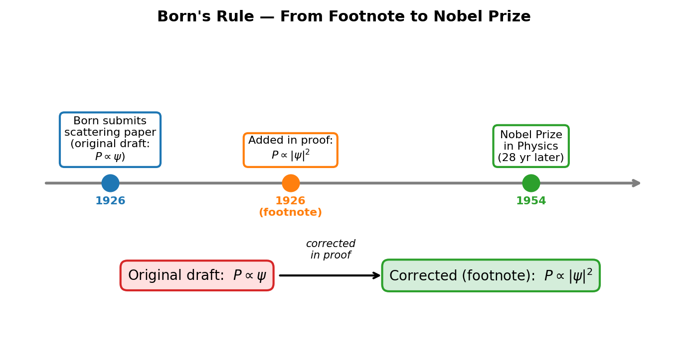
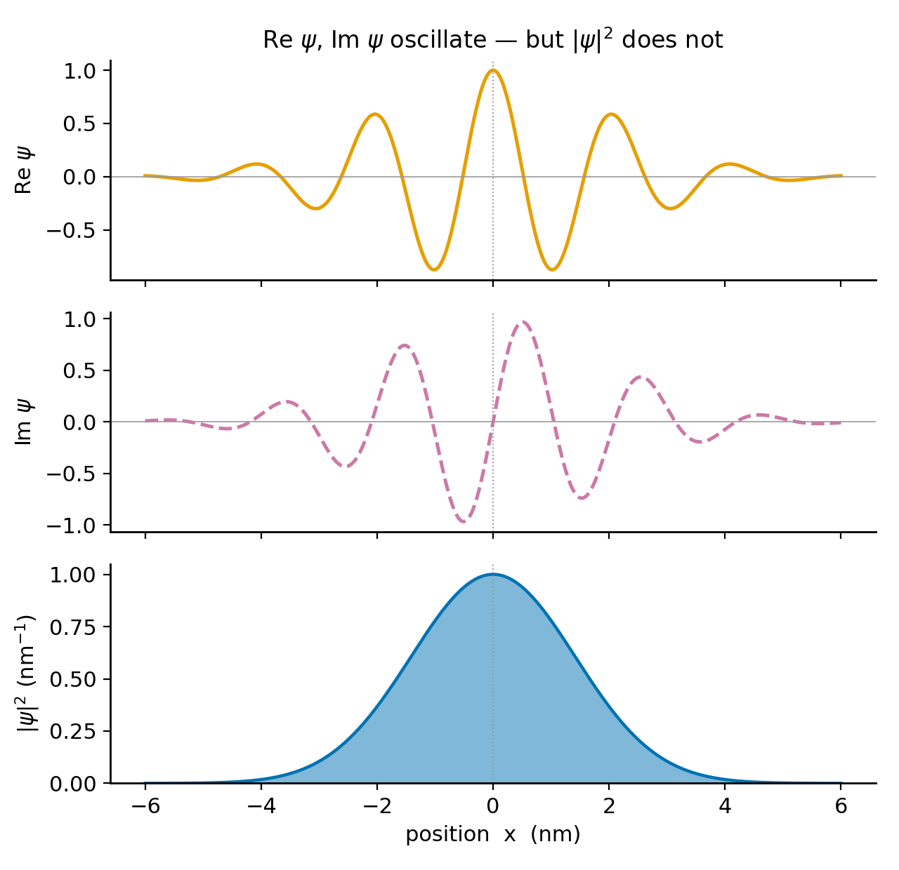
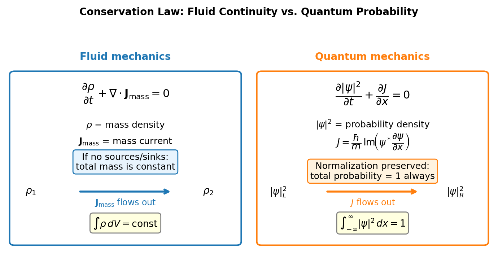
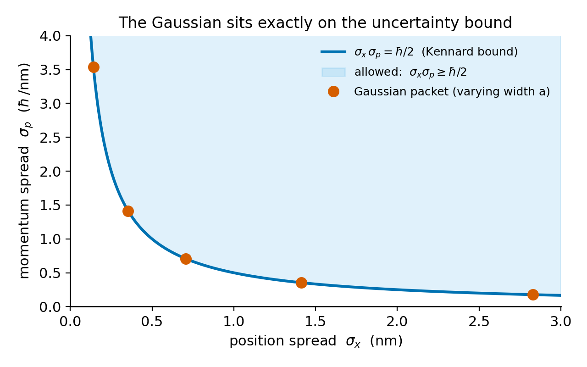

# Chapter 3 — The Wave Function and Born's Rule

In Chapter 0 we built a simulation that displayed a blue filled curve drifting across the screen, with an orange oscillating curve running through it. Those curves were plots of the wave function $\psi(x,t)$ — specifically, $|\psi|^2$ in blue and $\mathrm{Re}\,\psi$ in orange. This chapter gives the precise physical meaning of the wave function and establishes the rule that connects it to measurable quantities.

We begin with a question that forces us to be precise: what are the units of $|\psi|^2$?

The particle moves along a line measured in nanometers, and $|\psi|^2$ is plotted against that line, so it carries units. The key point is that $|\psi|^2$ is not a probability — it is a probability *per nanometer*, a density. The distinction matters. You cannot read "the particle is at position $x$" from the value of $|\psi|^2$ at a single point, any more than you can read a city's population from a density map at one address. To extract a probability — a dimensionless number between 0 and 1 — you must integrate over a region.

That integration defines the Born rule. Given a wave function $\psi(x,t)$, the probability of finding the particle in the interval $[a,b]$ at time $t$ is:

$$P\bigl(\text{particle in }[a,b]\bigr) = \int_a^b |\psi(x,t)|^2\,dx.$$

Max Born introduced this in 1926, in a paper on quantum scattering. His original draft wrote the probability as proportional to $\psi$ itself — not $|\psi|^2$. In a footnote added in proof, he corrected it. That footnote is one of the most consequential edits in the history of physics. Born received the Nobel Prize in 1954 for the statistical interpretation it introduced.

<!-- → [FIGURE: timeline showing Born's 1926 paper → footnote correction → Nobel 1954, with the two expressions ψ and |ψ|² side by side] -->


*Figure 3.1 — timeline showing Born's 1926 paper → footnote correction → Nobel 1954, with the two expressions ψ and |ψ|² side by side*

Because $|\psi|^2$ is a density measured per unit length, it can take values greater than 1. Treating the value of the density at a point as a probability is a unit error. The distinction between probability density and probability is fundamental and should be clear before proceeding.

---

A second important question is why $\psi$ must be complex. If what we observe is $|\psi|^2$, which is real and non-negative, why not use a real-valued function and discard the imaginary part?

The equation of motion rules this out. The time-dependent Schrödinger equation is:

$$i\hbar \frac{\partial \psi}{\partial t} = \hat{H}\psi.$$

The factor $i$ on the left side is structural. If $\psi$ were purely real, then $\partial\psi/\partial t$ would be real, and $i\hbar$ times a real number is purely imaginary. The left side would be imaginary while the right side is real (for real $\psi$ and real $V$), which is impossible unless both sides are zero. The Schrödinger equation itself requires $\psi$ to take complex values. A real wave function would have no consistent dynamics.

In the simulation from Chapter 0, the orange curve showed Re$\,\psi$ and the gray dashed curve showed Im$\,\psi$. Both parts were non-trivial, with the imaginary part leading the real part by a quarter cycle. If the imaginary part were set to zero and a single time step taken under the Schrödinger equation, the imaginary part would immediately regenerate. The two parts are inseparable.

<!-- → [FIGURE: three-panel SVG showing Re ψ (orange), Im ψ (gray dashed), and |ψ|² (blue filled) for a Gaussian wave packet with k₀ ≠ 0, making the quarter-cycle phase relationship visible] -->


*Figure 3.2 — three-panel SVG showing Re ψ (orange), Im ψ (gray dashed), and |ψ|² (blue filled) for a Gaussian wave packet with k₀ ≠ 0, making the…*

To see what information the imaginary part carries, consider the Gaussian wave packet with central momentum $\hbar k_0$:

$$\psi(x) = A\,e^{-x^2/(2a^2)}\,e^{ik_0 x}.$$

Separate the real and imaginary parts:

$$\text{Re}\,\psi = A\,e^{-x^2/(2a^2)}\cos(k_0 x), \qquad \text{Im}\,\psi = A\,e^{-x^2/(2a^2)}\sin(k_0 x).$$

Both oscillate, and both carry the information encoded in $k_0$. Now compute the density:

$$|\psi|^2 = A^2\,e^{-x^2/a^2}.$$

The oscillations vanish. The density is a smooth Gaussian with no trace of $k_0$ anywhere. The momentum — the direction of travel, the central velocity — is invisible in $|\psi|^2$. It lives entirely in the phase, in the relationship between Re$\,\psi$ and Im$\,\psi$. Discard the imaginary part and you can no longer tell a wave packet moving right from one moving left. Both would have the same $|\psi|^2$, and both would look identical in every experimental histogram of position measurements.

This is not a mathematical subtlety. The physical content of the imaginary part is that it carries information about the direction of motion. Without it, $\psi$ cannot represent a moving particle.

---

A common misconception about the wave function concerns what the spreading of $|\psi|^2$ over time means. When the blue probability density in the simulation spreads wider, it is tempting to read this as the particle physically expanding. That reading is incorrect. When the particle is detected, it is found at one definite location. What spreads is the *probability distribution* of where that location might be. If the same experiment — same initial conditions, same Hamiltonian, same $\psi(x,0)$ — were repeated many times, the histogram of measured positions would match $|\psi|^2$. The spread of that histogram is what grows.

The wave function is not the particle. It is the rule for computing probability distributions.

This is the content of Born's interpretation: compute $|\psi|^2$, integrate over a region, obtain the probability of finding the particle there. Each individual measurement yields a single definite outcome; $|\psi|^2$ gives the distribution of outcomes over many repetitions of the same preparation.

---

Since $|\psi|^2$ is a probability density and the particle must be found somewhere, normalization requires:

$$\int_{-\infty}^{\infty} |\psi(x,t)|^2\,dx = 1.$$

A wave function satisfying this condition is normalized. In practice, wave functions are often written without normalization constants. To normalize $\tilde{\psi}$, compute $\int|\tilde{\psi}|^2\,dx$, take its square root, and divide.

An important question is whether normalization is preserved under time evolution. If $\psi$ is normalized at $t = 0$ and satisfies the Schrödinger equation, does $\int|\psi|^2\,dx$ remain equal to 1 for all $t$? It must, since otherwise the probability of finding the particle anywhere would drift from 1 — an incoherent result. We can prove this is guaranteed.

We differentiate $\int|\psi|^2\,dx$ with respect to time and use the Schrödinger equation to replace $\partial_t\psi$ and $\partial_t\psi^*$. The potential energy terms cancel exactly. The kinetic terms combine into a perfect derivative in $x$:

$$\frac{\partial|\psi|^2}{\partial t} = -\frac{\partial J}{\partial x},$$

where

$$J(x,t) = \frac{\hbar}{m}\,\mathrm{Im}\!\left(\psi^*\frac{\partial\psi}{\partial x}\right).$$

<!-- → [DIAGRAM: conservation law analogy — fluid continuity equation alongside the quantum probability continuity equation, showing structural identity] -->


*Figure 3.3 — conservation law analogy — fluid continuity equation alongside the quantum probability continuity equation, showing structural identity*

This is the **continuity equation** for probability, with the same mathematical structure as the continuity equation for mass, charge, or any other conserved quantity. Probability flows with current $J$. Integrating over all $x$: the boundary terms at $\pm\infty$ vanish for any normalizable $\psi$, giving $\frac{d}{dt}\int|\psi|^2\,dx = 0$. Normalization is preserved at all times.

This result has a practical consequence for numerical simulations. If $\int|\psi|^2\,dx$ drifts away from 1 during a time evolution, something is wrong: either the time-stepping scheme is non-unitary (explicit Euler has this problem) or probability is leaking at the grid boundaries. The normalization indicator we required in Chapter 0 is precisely this diagnostic, and the conservation law just proved is its theoretical basis.

---

Born's rule provides the probability distribution for position measurements. The expectation value of position — the average over many measurements of the same state — is the mean of the distribution $|\psi|^2$:

$$\langle x\rangle = \int_{-\infty}^{\infty} x\,|\psi(x,t)|^2\,dx.$$

Momentum expectation values require more care. In position space, momentum is not a function of $x$; the expression $\langle p\rangle = \int p\,|\psi(x)|^2\,dx$ is not well-defined. The correct route is through the Fourier transform: define $\phi(p,t)$ as the Fourier transform of $\psi(x,t)$. Then $|\phi(p,t)|^2$ is the probability density for momentum measurements, and $\langle p\rangle = \int p\,|\phi|^2\,dp$. Using Parseval's theorem to translate this back to position space, multiplication by $p$ becomes differentiation. The momentum operator in position space is:

$$\hat{p} = -i\hbar\frac{\partial}{\partial x}.$$

The sign here is not a convention that can be reversed. For a wave packet with central wavenumber $k_0 > 0$, moving to the right, this operator gives $\langle p\rangle = \hbar k_0 > 0$. Writing $\hat{p} = +i\hbar\,\partial_x$ instead would reverse all directions — a sign error that the simulation detects immediately: a rightward-moving packet would register negative average momentum.

<!-- → [TABLE: side-by-side comparison of position-space and momentum-space Born rule — rows: density, normalization condition, expectation value formula, operator form] -->

---

We can also characterize the spreads of the position and momentum distributions. Define the standard deviations in the usual way:

$$\sigma_x = \sqrt{\langle x^2\rangle - \langle x\rangle^2}, \qquad \sigma_p = \sqrt{\langle p^2\rangle - \langle p\rangle^2}.$$

The **Kennard inequality**, proved by E. H. Kennard in 1927, states:

$$\sigma_x\,\sigma_p \geq \frac{\hbar}{2}.$$

To understand what this inequality says, consider the following experimental procedure. Prepare many identical copies of the same state $\psi$. Measure position on half and record the standard deviation $\sigma_x$. Measure momentum on the other half and record $\sigma_p$. No particle is measured twice, and no measurement disturbs any other. The Kennard inequality states that the product $\sigma_x\sigma_p$ cannot be smaller than $\hbar/2$, regardless of the state.

The source of this bound is Fourier analysis, not physical disturbance. A function narrow in $x$ must have a broad Fourier transform, and vice versa. The Kennard inequality is the exact, rigorous expression of this mathematical relationship, with $\hbar/2$ as the precise lower bound.

A separate result, the Heisenberg measurement-disturbance relation, governs what happens when position and momentum are measured sequentially on the *same* particle. It has a different form, a different bound, and a different physical content. Ozawa formalized it in 2003, and Erhart et al. tested it experimentally in 2012. The two results are distinct and should not be conflated.

The Gaussian wave packet saturates the Kennard bound. For

$$\psi(x) = (\pi a^2)^{-1/4}\,e^{-x^2/(2a^2)}\,e^{ik_0x},$$

a direct calculation gives:

$$\sigma_x = \frac{a}{\sqrt{2}}, \qquad \sigma_p = \frac{\hbar}{\sqrt{2}\,a}, \qquad \sigma_x\sigma_p = \frac{\hbar}{2}.$$

The product is exactly $\hbar/2$. Every other normalizable state gives a strictly larger product. The Gaussian is the minimum-uncertainty state — the unique state that achieves the lower bound.

The trade-off is direct: $\sigma_x \propto a$ and $\sigma_p \propto 1/a$. Decreasing $a$ narrows the wave packet spatially and proportionally widens it in momentum. The product remains fixed. This is a consequence of Fourier analysis, not of any technological limitation. No experimental technique can circumvent it.

<!-- → [CHART: parametric plot of σ_x vs σ_p as a varies from 0.2 to 4 nm for the Gaussian wave packet, showing the hyperbola σ_x σ_p = ℏ/2 and the Gaussian sitting exactly on it] -->


*Figure 3.4 — parametric plot of σ_x vs σ_p as a varies from 0.2 to 4 nm for the Gaussian wave packet, showing the hyperbola σ_x σ_p = ℏ/2 and the…*

---

## Worked Example — Normalizing an Exponential Wave Function

We now apply the Born rule to a specific case. Consider the un-normalized wave function $\tilde{\psi}(x) = e^{-|x|/a}$ for real $a > 0$. To normalize it, we compute:

$$A^2\int_{-\infty}^{\infty}e^{-2|x|/a}\,dx = 2A^2\int_0^{\infty}e^{-2x/a}\,dx.$$

The split at $x = 0$ is necessary because $e^{-|x|/a} \neq e^{-x/a}$ for $x < 0$. Evaluating:

$$2A^2\cdot\frac{a}{2} = A^2 a = 1 \implies A = \frac{1}{\sqrt{a}}.$$

Units check: with $x$ in nm and $a$ in nm, $A$ has units of nm$^{-1/2}$, so $|\psi|^2$ has units of nm$^{-1}$. This is correct for a one-dimensional probability density.

The probability of finding the particle in $[-a, a]$ is:

$$P = \frac{1}{a}\int_{-a}^{a}e^{-2|x|/a}\,dx = \frac{2}{a}\int_0^{a}e^{-2x/a}\,dx = 1 - e^{-2} \approx 0.865.$$

About 86.5% of the probability is in the central interval. The remaining 14% is in the tails $|x| > a$.

Note that at $x = 0$, $|\psi(0)|^2 = 1/a$. For $a = 0.5$ nm this equals 2 nm$^{-1}$, a number greater than 1. This is not a problem. The density is measured in nm$^{-1}$ and has no requirement to remain below 1. Expecting $|\psi|^2 \leq 1$ everywhere is a units error, equivalent to expecting a population density map to never exceed one person per square kilometer.

---

The wave function $e^{-|x|/a}$ is real-valued, so Im$\,\psi = 0$ everywhere and the probability current $J = (\hbar/m)\,\mathrm{Im}(\psi^*\,\partial_x\psi)$ vanishes everywhere. A real wave function has zero probability current and cannot describe a particle with net momentum in any direction. To give the particle a central momentum $p_0$, we multiply by $e^{ip_0 x/\hbar}$. The density $|\psi|^2$ is unchanged, but $\langle p\rangle = p_0$. The spatial distribution is the same; the current is nonzero; the physics is different. The directional information is entirely contained in the phase.

---

## LLM Exercises

### The Probability Explorer

The deliverable for this chapter is `03-probability-explorer.html`: a wave-function gallery with three stacked SVG panels (Re $\psi$, Im $\psi$, $|\psi|^2$) and a live numerical panel showing $\langle x\rangle$, $\langle p\rangle$, $\sigma_x$, $\sigma_p$, and the ratio $\sigma_x\sigma_p/(\hbar/2)$ — which reads 1.000 for the Gaussian.

````
SHOW.
The Born rule for a one-dimensional particle:
  P(x, t) dx = |ψ(x, t)|² dx,  with ∫ |ψ|² dx = 1.
Position and momentum expectation values:
  ⟨x⟩  = ∫ x |ψ|² dx
  ⟨x²⟩ = ∫ x² |ψ|² dx
  ⟨p⟩  = ∫ ψ* (−i ℏ ∂/∂x) ψ dx
  ⟨p²⟩ = ∫ ψ* (−ℏ² ∂²/∂x²) ψ dx
  σ_x = √(⟨x²⟩ − ⟨x⟩²),  σ_p = √(⟨p²⟩ − ⟨p⟩²).
Uncertainty principle: σ_x σ_p ≥ ℏ/2, saturated by the Gaussian.

Wave function gallery (selectable by dropdown):
  1. Gaussian: ψ(x) = (1/(πa²))^(1/4) exp(−x²/(2a²)) exp(i k₀ x)
     — sliders: a (0.1 to 5 nm), k₀ (−20 to +20 nm⁻¹)
  2. Infinite-well eigenstate n (within 0 ≤ x ≤ L):
     ψ_n(x) = √(2/L) sin(nπx/L) for n = 1..10
     — sliders: n (1..10 integer), L (1 to 20 nm)
  3. Double Gaussian:
     ψ(x) ∝ exp(−(x−d)²/(2σ²)) + exp(−(x+d)²/(2σ²))
     — sliders: d (separation, 0.5 to 5 nm), σ (0.2 to 2 nm)
  4. Square pulse: ψ(x) = 1/√w for −w/2 < x < w/2, else 0
     — slider: w (0.5 to 10 nm)

SAY.
Produce a single file `03-probability-explorer.html`.

Layout:
  Left column (700 px wide):
    Three stacked SVG panels (each 130 px tall) sharing an x-axis:
      Top:    Re ψ(x)   in orange
      Middle: Im ψ(x)   in gray dashed
      Bottom: |ψ(x)|²   in blue filled
  Right column (300 px wide), live numerical readouts:
      ∫|ψ|² dx       (normalization indicator, must read 1.000)
      ⟨x⟩            (in nm)
      ⟨x²⟩           (in nm²)
      σ_x            (in nm)
      ⟨p⟩            (in ℏ/nm)
      ⟨p²⟩           (in (ℏ/nm)²)
      σ_p            (in ℏ/nm)
      σ_x σ_p / (ℏ/2)   (DIMENSIONLESS, prominent, large font)
  Below: wave-function dropdown + sliders that update based on selection.

CONSTRAIN.
- D3 v7 from CDN. SVG only. Vanilla JS. Single self-contained .html file.
- N = 500 grid points on x ∈ [−20 nm, +20 nm].
- ⟨x⟩, ⟨x²⟩, ∫|ψ|² via Simpson's rule.
- ⟨p⟩, ⟨p²⟩, σ_p via FFT (fft-js from CDN). FFT convention documented.
  Forward convention: sum_n ψ_n e^(−i k_m x_n) · Δx / √(2πℏ). Comment it.
- Complex storage: every ψ array is two parallel Float64Arrays (re, im).
  NEVER collapse to a real-only function.
- Momentum operator p̂ = −i ℏ ∂/∂x. Sign is critical: k₀ > 0 must give ⟨p⟩ > 0.
- The σ_x σ_p / (ℏ/2) display must read 1.000 for the Gaussian.
  If it reads 0.500, you divided by ℏ instead of ℏ/2 — fix.
- For the square pulse: σ_p diverges (Fourier transform decays as 1/p).
  Display the ratio as "undefined," not as a large finite number.
- Every numerical display must include units.

VERIFY.
After writing the file, provide four checks:
(a) Gaussian with a = 1 nm, k₀ = 10 nm⁻¹:
    σ_x = 1/√2 ≈ 0.707 nm; σ_p = ℏ/(√2 · 1 nm) ≈ 0.707 ℏ/nm; ratio = 1.000.
(b) Gaussian with a = 0.5 nm, k₀ = 10 nm⁻¹:
    σ_x = 0.354 nm; σ_p doubles; product unchanged; ratio = 1.000.
(c) Infinite-well n=1 in L=10 nm:
    ⟨x⟩ = 5 nm by symmetry;
    σ_x = L · √(1/12 − 1/(2π²)) ≈ 1.81 nm;
    σ_p = πℏ/L ≈ 0.314 ℏ/nm; ratio ≈ 1.136.
(d) Double Gaussian d = 2 nm, σ = 0.5 nm:
    ⟨x⟩ = 0 by symmetry; probability in [−0.5 nm, +0.5 nm] is small.

Then list known LLM failure modes and confirm which you have guarded against:
  - ψ vs. |ψ|² render swap (|ψ|² panel showing a signed curve).
  - Lost imaginary part (Im ψ = 0 for k₀ ≠ 0 Gaussian).
  - Sign error in p̂ (⟨p⟩ < 0 for k₀ > 0).
  - Simpson drift: ⟨x⟩ not at center for symmetric ψ.
  - FFT convention mismatch: σ_p off by √(2π) or √ℏ.
  - Missing units on numerical readouts.
  - σ_x σ_p / (ℏ/2) = 0.500 for Gaussian (dividing by ℏ not ℏ/2).
````

### Exploration Tasks

**Saturate the bound.** Select the Gaussian. Vary $a$ from 0.2 nm to 4 nm. Watch $\sigma_x$ change. Watch $\sigma_p$ change inversely. Watch $\sigma_x\sigma_p/(\hbar/2)$ stay locked at 1.000. Write down what this confirms about the relationship between the width in position space and the width in momentum space.

**Exceed the bound.** Switch to the infinite-well eigenstate, $n = 1$, $L = 10$ nm. The ratio should read approximately 1.136. Now run $n$ from 2 to 10. As $n$ grows, $\sigma_p$ grows (higher energy means larger momentum spread) while $\sigma_x$ changes little. Does $\sigma_x\sigma_p/(\hbar/2)$ grow without bound, approach a limit, or oscillate? Predict first, then check.

**The double-peaked trap.** Select the double Gaussian with $d = 2$ nm, $\sigma = 0.3$ nm. $\langle x\rangle$ reads 0. Look at $|\psi|^2$: the probability of finding the particle within $\pm 0.5$ nm of $x = 0$ is small — the peaks are at $\pm 2$ nm. Write one sentence explaining what this tells you about using $\langle x\rangle$ as a prediction for a single measurement.

**The square-pulse singularity.** Select the square pulse, width $w = 2$ nm. $\sigma_x$ is finite. $\sigma_p$ should display as "undefined." This is not a bug — the Fourier transform of a discontinuous square pulse decays as $1/p$, making $\int p^2|\phi(p)|^2\,dp$ diverge. The divergence is real physics; it reflects the infinite amount of momentum required to produce sharp edges in position space.

---

## Still Puzzling

**Can Born's rule be derived?** In this book we take the Born rule as a postulate — a law we assume rather than prove. Other research programs (Zurek's "envariance" argument, the various many-worlds branch-counting schemes) claim to derive it from more primitive axioms. Whether those derivations genuinely succeed, or only move the mystery somewhere else, is a question physicists still disagree about. We state the postulate honestly and do not pretend the matter is settled.

**What does it mean for $\psi$ to "collapse" on measurement?** Born's rule predicts the probability distribution for the outcome of a position measurement. But once you have measured and obtained a result $x_0$, what is $\psi$ afterward? The standard Copenhagen answer is that $\psi$ "collapses" to a state localized near $x_0$. That answer is convenient for the next calculation, yet the physical mechanism behind it — if there is one — remains deeply contested.

**Why does which-path information destroy interference?** Detect which slit each electron passes through and the interference pattern disappears, replaced by two classical blobs. The Born rule correctly predicts this outcome, but it does not explain, at the level of mechanism, *why* knowing the path removes the fringes. Different interpretations — Copenhagen, many-worlds, pilot wave — give genuinely different accounts.

**Is the probability current $J$ really "flowing" probability?** The continuity equation $\partial_t|\psi|^2 + \partial_x J = 0$ has exactly the form of a conservation law, and $J$ has all the mathematical properties of a current. Yet in a single-particle interpretation it is fair to ask what is actually flowing. For one particle, $|\psi|^2$ is not the density of a fluid; it is a probability distribution. The fluid picture is evocative and genuinely useful, but it is not unambiguous.

---

## Exercises

**Warm-up**

1. *[Born rule: density vs. probability]* A particle has wave function $\psi(x) = A\,e^{-|x|/a}$ for real $a > 0$. (a) Find $A$ such that $\int_{-\infty}^{\infty}|\psi|^2\,dx = 1$. (b) Compute $P(-a \leq x \leq a)$. (c) For $a = 0.5$ nm, compute $|\psi(0)|^2$ and explain why the value exceeding 1 does not violate anything. *What this tests: unit distinction between probability density and probability.*

2. *[Complex structure of $\psi$, sign of momentum operator]* Let $\psi(x) = N\,e^{-x^2/(2a^2)}\,e^{ik_0 x}$ with $a = 1$ nm and $k_0 = -5$ nm$^{-1}$. (a) Sketch Re$\,\psi$, Im$\,\psi$, and $|\psi|^2$ on the same axis — which is symmetric, which oscillates? (b) Without computing integrals, state the sign of $\langle p\rangle$ and the value of $\langle x\rangle$. Justify each in one sentence. *What this tests: reading physical information out of the phase.*

3. *[Probability current for a real wave function]* For a real-valued $\psi$, show directly from $J = (\hbar/m)\,\mathrm{Im}(\psi^*\,\partial_x\psi)$ that $J = 0$ everywhere. Then state what this implies: can a real $\psi$ describe a particle with net momentum in one direction? *What this tests: connection between phase and current.*

**Application**

4. *[Expectation values for a non-Gaussian state]* For the infinite-square-well ground state $\psi_1(x) = \sqrt{2/L}\,\sin(\pi x/L)$ on $[0,L]$: (a) compute $\langle x\rangle$ and $\sigma_x$ by direct integration; (b) compute $\langle p\rangle$ using $\hat{p} = -i\hbar\,\partial_x$ and explain why $\langle p\rangle = 0$ makes sense for a standing wave. *What this tests: applying expectation value machinery to a state that is not a Gaussian.*

5. *[Kennard inequality: preparation vs. disturbance]* A professor claims: "If I measure a particle's position very precisely, I must have disturbed its momentum. That is the uncertainty principle." Write a two-paragraph response. First paragraph: what is physically correct in this claim. Second paragraph: what is wrong, and what the Kennard inequality actually says. *What this tests: distinguishing the state-space inequality from the measurement-disturbance argument.*

6. *[Units and dimensional reasoning]* A wave function is tabulated numerically with $x$ in meters. The peak of $|\psi|^2$ at $t = 0$ reads $3.2 \times 10^9$ m$^{-1}$. (a) Is this a valid probability density? (b) Estimate the probability of finding the particle within $\pm 0.1$ nm of the peak, treating $|\psi|^2$ as roughly constant over that interval. (c) Someone says the wave function is "unnormalized by a factor of 2." What does this mean precisely, and what is the corrected peak density? *What this tests: facility with units throughout a calculation.*

**Synthesis**

7. *[Born rule in momentum space]* Define $\phi(p) = (1/\sqrt{2\pi\hbar})\int_{-\infty}^{\infty}\psi(x)\,e^{-ipx/\hbar}\,dx$. For the Gaussian $\psi(x) = (\pi a^2)^{-1/4}\,e^{-x^2/(2a^2)}\,e^{ik_0 x}$, show by direct Fourier transform that $\phi(p)$ is a Gaussian centered at $\hbar k_0$ with width $\hbar/a$. Verify $\int|\phi|^2\,dp = 1$. *What this tests: carrying the Born rule from position space into momentum space and confirming the Gaussian saturates the Kennard bound.*

8. *[Continuity equation and wave-packet motion]* The continuity equation reads $\partial_t|\psi|^2 = -\partial_x J$. (a) Suppose $J > 0$ over some interval $[a,b]$ and zero outside. Sketch how $|\psi|^2$ evolves near that interval over a short $\delta t$. (b) Suppose $J > 0$ on the left half and $J < 0$ on the right half of the interval. Where does $|\psi|^2$ increase? Decrease? (c) Use this reasoning, without equations, to explain why a wave packet moving right has $J > 0$ in the high-probability region. *What this tests: reading the continuity equation as a spatial flow, not just a conservation identity.*

**Challenge**

9. *[Limits of the formalism]* The plane wave $\psi(x) = e^{ikx}$ has $|\psi|^2 = 1$ everywhere. (a) Show it cannot be normalized on $(-\infty,\infty)$. (b) Compute $\langle p\rangle$ formally using $\hat{p} = -i\hbar\,\partial_x$. (c) In what sense is the plane wave a state of "definite momentum $\hbar k$"? In what sense is this problematic, given the Born rule? (d) Propose how plane waves could serve as building blocks for normalizable wave functions. (This is the direction Chapter 4 develops.) *What this tests: honest confrontation with the formal limits of position-space normalization, and the direction toward Fourier synthesis.*

---

## References

Born, M. (1926). Zur Quantenmechanik der Stoßvorgänge. *Zeitschrift für Physik*, 38, 803–827.

Kennard, E. H. (1927). Zur Quantenmechanik einfacher Bewegungstypen. *Zeitschrift für Physik*, 44, 326–352.

Robertson, H. P. (1929). The uncertainty principle. *Physical Review*, 34, 163–164.

Ozawa, M. (2003). Universally valid reformulation of the Heisenberg uncertainty principle on noise and disturbance in measurement. *Physical Review A*, 67, 042105.

Erhart, J., Sponar, S., Sulyok, G., Badurek, G., Ozawa, M., & Hasegawa, Y. (2012). Experimental demonstration of a universally valid error-disturbance uncertainty relation. *Nature Physics*, 8, 185–189.

Griffiths, D. J., & Schroeter, D. F. (2018). *Introduction to Quantum Mechanics* (3rd ed.). Cambridge University Press. §1.1–1.6.

Sakurai, J. J., & Napolitano, J. (2021). *Modern Quantum Mechanics* (3rd ed.). Cambridge University Press. §1.6.

Ballentine, L. E. (2014). *Quantum Mechanics: A Modern Development* (2nd ed.). World Scientific. §3.1.

Feynman, R. P., Leighton, R. B., & Sands, M. (1965). *The Feynman Lectures on Physics*, Vol. III. Addison-Wesley. §1-1.

---

## Running Project — Build the 1D Quantum Sandbox

**This chapter adds:** the wave-function data structure and the Born-rule machinery — the complex ψ stored as two parallel `Float64Array`s on the grid, the $h$-weighted normalization $\sum_j|\psi_j|^2 h = 1$, the $|\psi|^2$ plot, and the expectation values $\langle x\rangle$, $\langle p\rangle$, $\sigma_x$, $\sigma_p$ that every later mode reports.

### Exercise R1 — When to Use AI
**The judgment:** In this chapter's project work, AI assistance is appropriate for:
- Writing the normalization routine $\texttt{norm} = \sum_j(\text{re}_j^2 + \text{im}_j^2)\,h$ and the rescaling by $1/\sqrt{\texttt{norm}}$ — *Why AI works here:* it is a short reduction over arrays, checkable against the analytic Gaussian where $\sigma_x = a/\sqrt2$.
- Drafting the $|\psi|^2$ SVG panel and the live numeric readouts — *Why AI works here:* standard plotting boilerplate, and the Gaussian gives exact target values for $\langle x\rangle$, $\sigma_x$, and the ratio $\sigma_x\sigma_p/(\hbar/2) = 1$.
**The tell:** You are using AI well when you have an independent way to check the output — here, the Gaussian saturating the Kennard bound at exactly $\hbar/2$.

### Exercise R2 — When NOT to Use AI
**The judgment:** These tasks require your judgment; AI output here can't be trusted without redoing the work:
- The sign of the momentum operator $\hat p = -i\hbar\,\partial_x$ — *Why AI fails here:* a flipped sign ($+i\hbar\partial_x$) gives $\langle p\rangle < 0$ for a right-moving packet; the number is finite and plausible, so nothing flags it except your own knowledge that $k_0 > 0$ must give $\langle p\rangle > 0$.
- Whether to divide the eigenvector by $\sqrt h$ when converting Euclidean to physics normalization — *Why AI fails here:* a factor-of-$h$ error makes the indicator read $1/h \approx 250$ instead of 1; the AI may "fix" it by dividing by $h$ (wrong) instead of $\sqrt h$ (right), and both make some test pass.
**The tell:** If you could not explain the result without the AI — if the AI is your *reason* rather than your *tool* — it did work that should have been yours.
**Physics-judgment connection:** This trains checking against normalization ($\sum|\psi_j|^2 h = 1$) and against a saturated analytic bound ($\sigma_x\sigma_p = \hbar/2$ for the Gaussian), the two anchors that catch sign and factor-of-$h$ errors.

### Exercise R3 — LLM Exercise
**What you're building this chapter:** the ψ-array + Born-rule core — normalization, $|\psi|^2$ display, and the $\langle x\rangle,\langle p\rangle,\sigma_x,\sigma_p$ readouts.
**Tool:** Claude chat — a focused module built on the existing grid and constants; no new persistent state.
**The Prompt:**
```
Using the Chapter 0 CLAUDE.md (complex stored as two Float64Arrays re, im),
constants.js, and grid.js as binding context, build 03-probability-explorer.html.

Represent ψ on the grid from grid.js as parallel re[], im[] arrays. Implement:
  - normalize(re, im, h): norm = Σ_j (re_j² + im_j²) · h; divide both arrays by
    √norm. Return the pre-normalization norm so I can see it.
  - expectations: ⟨x⟩ = Σ x_j |ψ_j|² h; ⟨x²⟩ likewise; σ_x = √(⟨x²⟩−⟨x⟩²).
    ⟨p⟩ and ⟨p²⟩ via p̂ = −iℏ ∂_x using a central difference for ∂_x:
    ⟨p⟩ = Σ Re[ ψ_j* (−iℏ)(ψ_{j+1}−ψ_{j−1})/(2h) ] h. σ_p analogously.
  - Display ⟨x⟩, σ_x, ⟨p⟩, σ_p, and the DIMENSIONLESS ratio σ_x σ_p /(ℏ/2)
    in a large readout, plus the normalization indicator (must read 1.000).

Wave-function dropdown: (1) Gaussian (1/(πa²))^(1/4) e^{−x²/2a²} e^{ik₀x} with
sliders a, k₀; (2) infinite-well eigenstate √(2/L) sin(nπx/L) with sliders n, L.
Three stacked panels: Re ψ (orange), Im ψ (gray dashed), |ψ|² (blue filled).

CRITICAL: p̂ = −iℏ ∂_x — k₀ > 0 MUST give ⟨p⟩ > 0. The ratio must read 1.000
for the Gaussian (if it reads 0.500 you divided by ℏ not ℏ/2). After writing,
list the checks for the Gaussian (a=1 nm, k₀=10 nm⁻¹): σ_x≈0.707 nm, ratio=1.000.
```
**What this produces:** `03-probability-explorer.html` and the reusable `normalize` / `expectations` functions every later mode calls.
**How to adapt:** *Your system:* if you later add an FFT-based $\langle p\rangle$, keep the finite-difference version as a cross-check. *ChatGPT/Gemini:* paste `grid.js` and `constants.js` with the prompt. *Claude Project:* store the normalize/expectations functions in Project knowledge.
**Builds on:** the spatial grid from Chapter 2.  **Next:** Chapter 4 attaches the time-evolution phase $e^{-iE_nt/\hbar}$ to states on this ψ array.

### Exercise R4 — CLI Exercise
**What you're building this chapter:** a tested expectation-value module with assertions tied to the Gaussian and the infinite-well analytic values.
**Tool:** Claude Code — it can run the expectation values against known states and record the ratios in `PROJECT.md`.
**Skill level:** Intermediate
**Setup — confirm:**
- [ ] `grid.js`, `constants.js`, and the ψ-array convention from Chapter 0
- [ ] Node.js available
- [ ] The CLAUDE.md normalization rule ($\sum|\psi_j|^2 h$, state $h$ explicitly)
**The Task:**
```
Implement normalize(re, im, h) and computeExpectations(re, im, x, h) in a
module observables.js. Write a Node script check-observables.js that:
  (1) builds a Gaussian a = 1 nm, k₀ = 10 nm⁻¹ on N = 500, x ∈ [−20,20] nm,
      normalizes it, and asserts σ_x ≈ 0.707 nm, ⟨p⟩ > 0, and
      σ_x σ_p /(ℏ/2) within 1% of 1.000;
  (2) builds the infinite-well n=1, L=10 nm state and asserts the ratio ≈ 1.136.
Print all four numbers. Do NOT loosen the tolerances to force a pass. Append to
PROJECT.md under "Verified": "Ch3 observables: Gaussian ratio=<v>, well n=1 ratio=<v>".
```
**Expected output:** `observables.js`, `check-observables.js`, printed ratios near 1.000 and 1.136, and a `PROJECT.md` line.
**What to inspect:** that the Gaussian ratio is 1.000 (not 0.500 — that signals dividing by $\hbar$ instead of $\hbar/2$) and that $\langle p\rangle$ is positive for $k_0 > 0$.
**If it goes wrong:** if the well ratio comes out 1.000 instead of 1.136, the code is reusing the Gaussian's analytic $\sigma_p$ instead of computing $\langle p^2\rangle$ from the actual state — recompute $\langle p^2\rangle$ numerically from $\hat p^2$, don't paste a formula.
**CLAUDE.md / AGENTS.md note:** add: "Every observable routine ships with the Gaussian (ratio 1.000) and infinite-well n=1 (ratio ≈ 1.136) as regression checks."

### Exercise R5 — AI Validation Exercise
**What you're validating:** the normalization and expectation-value code from R3/R4.
**Validation type:** Code + Numerical result
**Risk level:** Medium — a sign or factor-of-$h$ error here propagates into every spectrum and uncertainty the sandbox later reports.
**Setup:** use your own R3/R4 artifacts.
**The Validation Task:** Evaluate against this checklist; mark Pass / Fail / Cannot determine with reasoning.
```
Validation Checklist — ψ array, Born rule, and expectation values
□ Correctness: is normalization Σ|ψ_j|² h (h-weighted), not Σ|ψ_j|²?
□ Completeness: are ⟨x⟩, ⟨p⟩, σ_x, σ_p, AND the ratio σ_xσ_p/(ℏ/2) all shown with units?
□ Scope: did the |ψ|² panel show a signed curve (ψ vs |ψ|² render swap)?
□ Physics criterion 1: Gaussian a=1 nm gives σ_x≈0.707 nm and ratio = 1.000?
□ Physics criterion 2: ⟨p⟩ > 0 for k₀ > 0 (correct sign of p̂ = −iℏ∂_x)?
□ Failure-mode check: any of —
  - sign error in p̂ (⟨p⟩ < 0 for a right-moving packet)
  - unnormalized state (indicator reads ~250 = 1/h, or ~0.004 = h)
  - ratio reads 0.500 (divided by ℏ instead of ℏ/2)
  - lost imaginary part (Im ψ ≡ 0 for a k₀ ≠ 0 Gaussian)
```
**What to do with findings:** pass → use it; one fail → fix the single sign or $h$ factor and re-run both regression states; multiple fails / cannot-determine → recompute $\langle p\rangle$ and the norm by hand for the Gaussian, since these functions underpin every later validation.
**AI Use Disclosure (mandatory, two sentences):**
> *1:* The AI implemented the complex ψ storage, the $h$-weighted normalization, and the position/momentum expectation values and uncertainty ratio.
> *2:* The AI could not determine whether the momentum sign and the $\sqrt h$ normalization factor were correct from the code alone — I verified $\langle p\rangle > 0$ for $k_0 > 0$ and the Gaussian ratio of 1.000 against the analytic values myself.
**Physics-judgment connection:** trains checking numerical observables against normalization and against an analytic minimum-uncertainty state, the discipline that catches sign and factor-of-$h$ errors before they spread.
