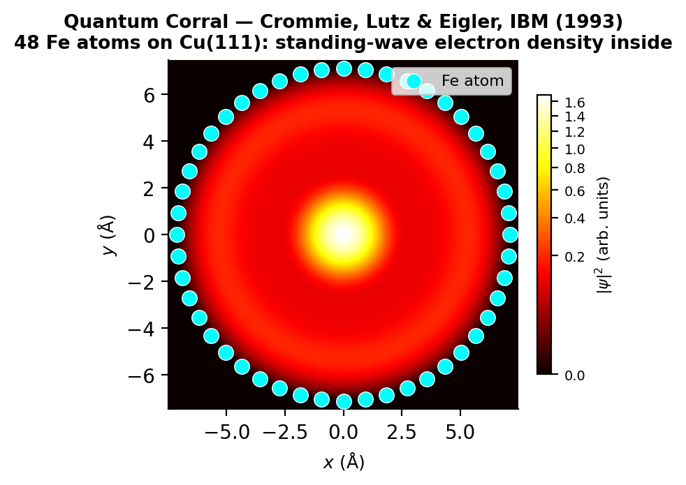
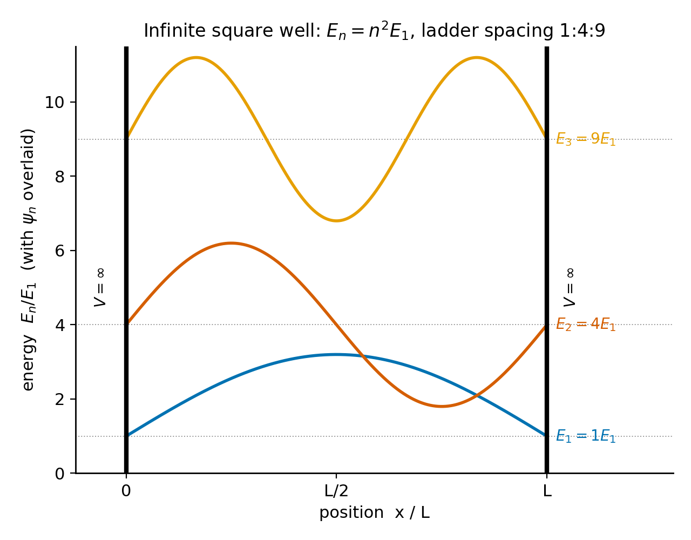
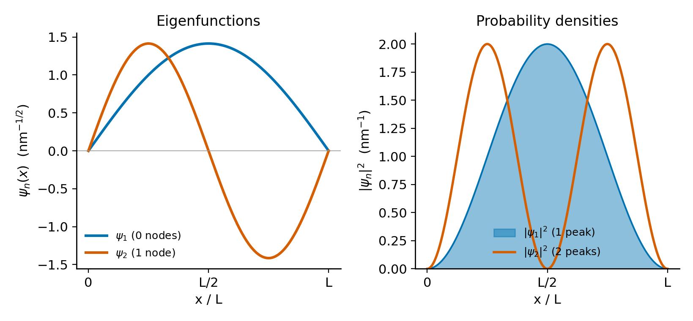
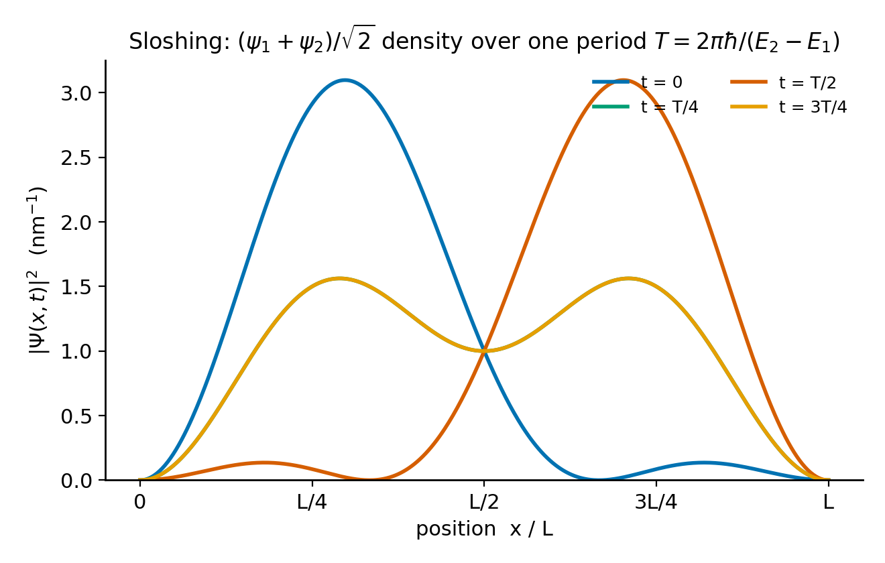

# Chapter 5 — The Infinite Square Well
*How boundary conditions became the engine of quantization.*

Over several days in 1993, a team at IBM's Almaden Research Center used the tip of a scanning tunneling microscope to push individual iron atoms across a copper surface, one atom at a time, until 48 of them formed a ring. They named the structure a quantum corral, and when they imaged the electron density caught inside it, the result was not the smooth puddle of charge you might expect. They found a bull's-eye of concentric rings — a standing-wave pattern in the probability density, precisely what the Schrödinger equation predicts for an electron confined to a circular region.

The point worth dwelling on is that the experimenters did not put those rings there by hand. The walls did. Once an electron is confined, the only states available to it are the modes that fit inside the container, and those modes are standing waves because the geometry of confinement makes them so. The energies come out discrete because only certain spatial frequencies can satisfy the conditions at the boundaries. Nobody assumed the quantization, nobody postulated it, and nobody slipped it in by hand. It is a consequence of confinement, and nothing more.

In this chapter we carry out the one-dimensional version of that same argument, for the infinite square well. The geometry there is simple enough that we can take the derivation all the way through in closed form — from the Schrödinger equation, to the energy spectrum, to the dynamics of superpositions. Our aim is not for you to memorize the formulas. It is for you to see, one step at a time, exactly where the discreteness comes from.

<!-- → [IMAGE: the Crommie–Lutz–Eigler STM image of the quantum corral (1993) — 48 iron atoms arranged in a ring on copper, with the standing-wave rings of electron density visible inside; caption should note this is a direct image of quantum confinement, not a schematic] -->


*Figure 5.1 — the Crommie–Lutz–Eigler STM image of the quantum corral (1993) — 48 iron atoms arranged in a ring on copper, with the standing-wave rings…*

---

## The Guitar String Analogy, and Why It Breaks Down

A guitar string fixed at both ends vibrates at a fundamental frequency and its integer harmonics. The reason is purely geometrical: a mode survives only if it vanishes at both fixed endpoints. A half-wavelength fits. A full wavelength fits. Three half-wavelengths fit. But one-and-a-third half-wavelengths cannot vanish at both walls at once — they contradict themselves at the boundary and collapse. The surviving frequencies are the ones that fit, and the fitting condition is discrete.

The analogy with a quantum particle in a box goes this deep and then stops. For the guitar string, the modes are literal physical displacements of a medium. For the electron, the "wave" is the wave function $\psi(x)$ — a complex-valued function whose squared modulus gives the probability of finding the particle at position $x$. No medium is vibrating. The wave is not a wave in space; it is a wave of probability amplitude in the space of possible positions. The boundary conditions share the same mathematical structure, but the physical meaning of what is waving is entirely different.

Keeping that distinction in mind, we can now run the calculation, which follows the guitar string argument step for step, simply restated in quantum language.

---

## The Setup

The infinite square well potential is

$$V(x) = \begin{cases} 0 & 0 < x < L, \\ \infty & x \leq 0 \text{ or } x \geq L. \end{cases}$$

Where the potential is infinite, the wave function must vanish. This is not an additional assumption; it is what $V = \infty$ forces in the time-independent Schrödinger equation (TISE). If $\psi \neq 0$ where $V = \infty$, the equation $-(\hbar^2/2m)\psi'' + V\psi = E\psi$ cannot be satisfied: the left side would be infinite while the right side stays finite. So the wave function is zero outside the well, and because $\psi$ must be continuous:

$$\psi(0) = 0, \qquad \psi(L) = 0.$$

Those two equations are the boundary conditions — the walls of the well, rewritten in the language of the wave function.

Inside the well, $V = 0$, and the TISE is simply

$$-\frac{\hbar^2}{2m}\frac{d^2\psi}{dx^2} = E\psi.$$

Now we ask: what values of $E$ are allowed?

<!-- → [FIGURE: diagram of the infinite square well potential — V = ∞ for x ≤ 0 and x ≥ L shown as vertical walls, V = 0 between; the first three eigenstates drawn as sine curves offset to their respective energy levels; the n² energy spacing should be visible by eye] -->


*Figure 5.2 — diagram of the infinite square well potential — V = ∞ for x ≤ 0 and x ≥ L shown as vertical walls, V = 0 between*

---

## The Derivation in Eight Steps

**Can $E$ be negative?** If $E < 0$, write $\kappa^2 = -2mE/\hbar^2 > 0$. The equation becomes $\psi'' = \kappa^2\psi$, with general solution $\psi = Ae^{\kappa x} + Be^{-\kappa x}$ — a sum of real exponentials. This cannot vanish at both $x = 0$ and $x = L$ unless $A = B = 0$, which means no particle. If $E = 0$, the equation is $\psi'' = 0$, so $\psi = ax + b$; the boundary conditions force both constants to zero. So $E < 0$ and $E = 0$ are excluded. Only $E > 0$ gives a non-trivial solution.

**The general solution for $E > 0$.** Define $k = \sqrt{2mE}/\hbar > 0$. The TISE reads $\psi'' = -k^2\psi$ — the equation of a spatial oscillator — with general solution

$$\psi(x) = A\sin(kx) + B\cos(kx).$$

At this point, any positive $k$ is allowed. No quantization yet.

**Apply the boundary condition at $x = 0$.** Substituting: $\psi(0) = A\sin(0) + B\cos(0) = B = 0$. The cosine term is killed. The solution reduces to $\psi(x) = A\sin(kx)$. Still no quantization.

**Apply the boundary condition at $x = L$.** Now: $\psi(L) = A\sin(kL) = 0$. Either $A = 0$ — no particle, discarded — or

$$\sin(kL) = 0.$$

Quantization enters with this single equation. Since a sine vanishes only at integer multiples of $\pi$, we need $kL = n\pi$ for $n = 1, 2, 3, \ldots$ In one stroke, the continuous set of all positive real $k$ has collapsed into a discrete ladder labeled by a positive integer.

Notice what this is and is not. It is not a postulate, not an assumption about angular momentum, not a new law brought in to patch a problem. It is simply the only way a sine wave can vanish at both walls at the same time. Where Bohr had to postulate quantization in 1913, Schrödinger derived it in 1926 from a differential equation and two boundary conditions.

**The wave vectors and energy levels.** The allowed wave vectors are $k_n = n\pi/L$. Since $E = \hbar^2 k^2/2m$:

$$\boxed{E_n = \frac{n^2\pi^2\hbar^2}{2mL^2}, \qquad n = 1, 2, 3, \ldots}$$

The energies grow as $n^2$, so the first few stand in the ratios $E_1 : E_2 : E_3 : E_4 = 1 : 4 : 9 : 16$, with nothing allowed in between. The integer $n$ really does start at 1: setting $n = 0$ gives $k_0 = 0$ and $\psi = A\sin(0) = 0$, which is no particle at all, so we exclude it. Negative values of $n$ add nothing new either, because $\sin(-n\pi x/L) = -\sin(n\pi x/L)$ yields the same probability density as the corresponding positive $n$ — the same physical state, differing only by an unobservable sign.

**Normalization.** The unnormalized eigenstate is $A\sin(n\pi x/L)$. Requiring $\int_0^L|\psi_n|^2\,dx = 1$ and using $\int_0^L\sin^2(n\pi x/L)\,dx = L/2$ (from the identity $\sin^2\theta = (1-\cos2\theta)/2$, integrated over a whole number of half-periods):

$$A^2 \cdot \frac{L}{2} = 1 \implies A = \sqrt{\frac{2}{L}}.$$

The normalized eigenstates are

$$\boxed{\psi_n(x) = \sqrt{\frac{2}{L}}\,\sin\!\left(\frac{n\pi x}{L}\right), \quad 0 \leq x \leq L; \qquad \psi_n(x) = 0 \text{ elsewhere.}}$$

---

## What the Spectrum Looks Like Physically

For an electron in a well of width $L = 1$ nm, the ground-state energy is

$$E_1 = \frac{\pi^2(1.055\times10^{-34})^2}{2(9.109\times10^{-31})(10^{-9})^2} \approx 6.0\times10^{-20}\ \text{J} \approx 0.377\ \text{eV.}$$

So $E_2 \approx 1.51$ eV, $E_3 \approx 3.39$ eV. These are energies on the scale of chemistry and optics — visible photons carry roughly 2 eV, and room-temperature thermal energy is $k_BT \approx 0.025$ eV. The level spacings are large compared with thermal fluctuations, so quantum effects are not merely relevant here — they dominate.

For contrast, compute the ground-state energy of a 1 g marble in a 1 cm box:

$$E_1 \approx \frac{\pi^2(10^{-34})^2}{2(10^{-3})(10^{-2})^2} \approx 5\times10^{-62}\ \text{J} \approx 3\times10^{-43}\ \text{eV.}$$

That energy lies twenty orders of magnitude below anything we could measure. In principle the quantum discreteness is still there; in practice it is invisible. The classical limit, then, is not something we choose on philosophical grounds — it is what the arithmetic delivers.

<!-- → [TABLE: E_n for n = 1 to 5 for three systems — electron in 1 nm well, electron in 10 nm well, proton in 1 nm well; columns: n, E_n (eV), E_n/E_1; shows how the spectrum scales with L² and m, and makes the classical limit for the proton visible] -->

Count the interior nodes of $\psi_n$ — the zeros that fall strictly inside $(0, L)$, not the ones at the walls — and you find exactly $n - 1$. The ground state $\psi_1$ has one half-period and no interior zeros; $\psi_2$ has two half-periods and a single interior zero at $x = L/2$; in general $\psi_n$ has $n$ half-periods and $n - 1$ zeros. Each extra node means a shorter wavelength, a higher spatial frequency, a larger momentum ($p = \hbar k_n = n\pi\hbar/L$), and a higher energy. Counting nodes is Fourier logic you can see with your eyes.

---

## Orthonormality — a Three-Line Proof

The eigenstates satisfy $\langle\psi_m|\psi_n\rangle = \delta_{mn}$ — they are orthonormal. The proof needs only one trigonometric identity:

$$\sin\alpha\sin\beta = \frac{1}{2}\bigl[\cos(\alpha-\beta) - \cos(\alpha+\beta)\bigr].$$

Applying that identity to $\langle\psi_m|\psi_n\rangle = (2/L)\int_0^L\sin(m\pi x/L)\sin(n\pi x/L)\,dx$ gives:

$$\langle\psi_m|\psi_n\rangle = \frac{1}{L}\int_0^L\!\left[\cos\!\left(\frac{(m-n)\pi x}{L}\right) - \cos\!\left(\frac{(m+n)\pi x}{L}\right)\right]dx.$$

Take $m \neq n$ first. Both cosines run over an integer number of full periods on $[0, L]$, so both integrals are zero, and $\langle\psi_m|\psi_n\rangle = 0$. Now take $m = n$. The first cosine collapses to $\cos(0) = 1$ and integrates to $L$, while the second runs over $n$ full periods and integrates to zero, leaving $\langle\psi_n|\psi_n\rangle = 1$.

There is no numerical eigensolver here and no Gram-Schmidt — the result is exact, analytic, and comes straight out of classical Fourier analysis. Fourier proved it in 1822 for the heat equation, more than a century before quantum mechanics existed. The mathematics of standing waves on a bounded interval was already complete; all quantum mechanics supplied was the physical interpretation.

---

## Why the Ground State Cannot Be Still

The smallest allowed energy is $E_1 = \pi^2\hbar^2/2mL^2$, which is strictly positive. The particle is not permitted to have $E = 0$.

The Heisenberg uncertainty principle tells us why. Were $E = 0$, the kinetic energy would vanish, the momentum would be zero, and so the momentum spread $\sigma_p$ would be zero as well. But a particle trapped in a box of width $L$ has a position spread no larger than the box: $\sigma_x \leq L$. Feed these into the Kennard inequality $\sigma_x\sigma_p \geq \hbar/2$ and you get $L \cdot 0 \geq \hbar/2$, which is plainly false. You cannot have both a definite momentum and confinement in space. That contradiction is exactly what rules out $E = 0$.

This is not a peculiarity of quantum mechanics — it is a consequence of the wave nature of matter. A guitar string stretched flat has zero energy and zero frequency. The minimum non-trivial mode has positive frequency and positive energy. The same logic applies to any wave confined in a finite domain.

Putting numbers to it: the ground state has $\sigma_p = \pi\hbar/L$ (from $\langle p^2\rangle = \pi^2\hbar^2/L^2$, with $\langle p\rangle = 0$ by symmetry) and $\sigma_x \approx 0.181L$. Their product is $\sigma_x\sigma_p \approx 0.568\hbar \approx 1.136 \times (\hbar/2)$, roughly 14% above the floor that the uncertainty principle sets. In other words, the ground state of the infinite well sits close to the most tightly localized state quantum mechanics allows.

<!-- → [FIGURE: ground-state and first-excited-state wave functions ψ₁ and ψ₂, and their probability densities |ψ₁|² and |ψ₂|², all four curves on the same x-axis from 0 to L; labels should indicate node count and the zero-point energy E₁ > 0; useful for making the zero-node / one-node distinction visually clear] -->


*Figure 5.3 — ground-state and first-excited-state wave functions ψ₁ and ψ₂, and their probability densities |ψ₁|² and |ψ₂|², all four curves on the same…*

---

## Time Evolution and the Sloshing State

Each eigenstate $\psi_n$ is a stationary state: its probability density $|\psi_n|^2$ holds still in time. The full time-dependent wave function is $\Psi_n(x,t) = \psi_n(x)e^{-iE_n t/\hbar}$, and the time-dependent factor is nothing but a phase rotating in the complex plane, which cancels out the moment you form $|\Psi_n|^2 = |\psi_n|^2$.

Motion shows up only when you combine two or more eigenstates of different energy. Consider the equal-weight mix of the lowest two:

$$\Psi(x,t) = \frac{1}{\sqrt{2}}\,\psi_1(x)\,e^{-iE_1 t/\hbar} + \frac{1}{\sqrt{2}}\,\psi_2(x)\,e^{-iE_2 t/\hbar}.$$

The probability density is

$$|\Psi(x,t)|^2 = \frac{1}{2}\!\left[\psi_1^2 + \psi_2^2 + 2\,\psi_1\psi_2\cos\!\left(\frac{(E_2-E_1)t}{\hbar}\right)\right].$$

The first two terms hold still, while the cross term oscillates at angular frequency $\omega = (E_2 - E_1)/\hbar = 3E_1/\hbar$. Its period is

$$T = \frac{2\pi\hbar}{E_2 - E_1} = \frac{h}{3E_1}.$$

For the 1 nm electron, with $E_1 \approx 6.0\times10^{-20}$ J, this works out to $T \approx 3.66$ femtoseconds. The probability distribution swings from one side of the well to the other on a femtosecond timescale.

**Where is the particle, on average?** Compute $\langle x\rangle(t) = \int_0^L x|\Psi(x,t)|^2\,dx$. Since both $\psi_1$ and $\psi_2$ are symmetric about $L/2$, their individual contributions give $\langle x\rangle_{1} = \langle x\rangle_{2} = L/2$. Only the cross term contributes a time-varying piece:

$$\langle x\rangle(t) = \frac{L}{2} + \cos\!\left(\frac{(E_2-E_1)t}{\hbar}\right)\int_0^L x\,\psi_1(x)\,\psi_2(x)\,dx.$$

Evaluating the cross integral takes integration by parts. Expand $\psi_1\psi_2$ with the product-to-sum identity, integrate $\int_0^L x\cos(n\pi x/L)\,dx$ by parts, and you arrive at

$$\int_0^L x\,\psi_1\psi_2\,dx = -\frac{16L}{9\pi^2} \approx -0.180\,L.$$

So

$$\langle x\rangle(t) = \frac{L}{2} - \frac{16L}{9\pi^2}\cos\!\left(\frac{(E_2-E_1)t}{\hbar}\right).$$

At $t = 0$ the cosine is 1, so $\langle x\rangle(0) \approx L/2 - 0.180L \approx 0.320L$. The state starts out left-heavy, with its probability peak near $x = L/4$, because $\psi_1 + \psi_2$ — a half-sine added to a full-sine — interferes constructively in the left half of the well. The cosine sits at a turning point at $t = 0$, so $d\langle x\rangle/dt|_{t=0} = 0$: the center of mass begins at rest, then drifts rightward, reaching $\langle x\rangle \approx 0.680L$ at the half-period before swinging back. The full excursion spans about $0.360L$.

Throughout all of this, the energy expectation value is

$$\langle\hat{H}\rangle = \frac{1}{2}E_1 + \frac{1}{2}E_2 \approx \frac{0.377 + 1.508}{2} \approx 0.943\ \text{eV.}$$

It stays constant. The probability sloshes, but the energy does not. The weights $|c_n|^2$ on each eigenstate are set once and for all by the initial state and never change. What does change is the relative phase between the terms, and that phase reshapes the interference pattern in $|\Psi|^2$ while leaving the energy budget exactly where it started.

<!-- → [CHART: three-panel animation schematic — (1) |Ψ(x,t)|² at t = 0, t = T/4, t = T/2, t = 3T/4, showing the probability density sloshing left to right; (2) ⟨x⟩(t) as a function of time, oscillating between 0.320L and 0.680L; (3) ⟨H⟩(t) as a flat line — visually emphasizing that energy is constant while position expectation oscillates] -->


*Figure 5.4 — three-panel animation schematic — (1) |Ψ(x,t)|² at t = 0, t = T/4, t = T/2, t = 3T/4, showing the probability density sloshing left to right*

---

## The Fourier Structure Underneath

Together the eigenstates $\{\psi_n\}$ form a complete orthonormal basis for the square-integrable functions on $[0, L]$ that vanish at the endpoints. That means any such function admits an expansion:

$$f(x) = \sum_{n=1}^{\infty} c_n\,\psi_n(x), \qquad c_n = \int_0^L\psi_n(x)\,f(x)\,dx.$$

What we have written is the Fourier sine series. Each coefficient $c_n$ is a projection — the inner product of the initial state with the corresponding eigenstate. So for any initial condition $\Psi(x, 0)$, we obtain the $c_n$ by integration and then hang the time-evolution phases on each term:

$$\Psi(x,t) = \sum_{n=1}^{\infty} c_n\,\psi_n(x)\,e^{-iE_n t/\hbar}.$$

Every eigenstate turns at its own angular frequency $E_n/\hbar$. Once two or more of them are present with different energies, the relative phases drift apart, and that drift produces the time-changing interference in $|\Psi|^2$ that we have been calling the sloshing.

The probability of measuring energy $E_n$ is $|c_n|^2$. Notice what this means: the $|c_n|^2$ are set by the initial state, they do not change in time, and they are the only observable consequences of the $c_n$ as far as energy measurements are concerned. The phases matter only for position and momentum measurements, where the cross terms in $|\Psi|^2$ — the interference terms — carry information about relative phase.

A narrow initial state, concentrated near one point, requires many $c_n$ to be nonzero — because representing a sharp feature as a sum of sine waves takes many harmonics. Many harmonics means many distinct frequencies, many beat frequencies between pairs of eigenstates, and therefore rapid dephasing of the initial spatial structure. A particle initially localized near $x = L/4$ will not stay near $x = L/4$; it will spread, slosh, and eventually become nearly uniform. The classical limit corresponds to packets so heavy and slow that the dephasing timescale is astronomically long — effectively infinite.

---

## What Comes Next

The infinite square well gives clean answers because its walls are perfectly rigid. No wave function leaks through $V = \infty$, and no energy can tunnel out. Real quantum systems — semiconductor quantum wells, quantum dots, atoms in optical lattice traps — have finite barriers, and wave functions do penetrate them. The discrete energy levels of a finite-depth well are qualitatively similar to those of the infinite well but shifted downward, and they are finite in number: a well of depth $V_0$ and width $L$ supports only finitely many bound states. As $V_0 \to \infty$, those levels approach the infinite-well values from below.

The question the infinite well leaves open — why the probability interpretation is correct, and what it means for the wave function to "collapse" upon measurement — is not answered by solving the TISE. That is the measurement problem, and it sits at the foundation of quantum mechanics in a way the Schrödinger equation does not resolve. Chapter 3 laid out Born's rule as a postulate; it remains a postulate. What the infinite well does show is that Born's rule, combined with the Schrödinger equation, makes predictions that are experimentally exact. The Davisson–Germer diffraction, the quantum corral, the energy levels of semiconductor quantum wells measured spectroscopically by Dingle and colleagues in 1974 — all confirm that the quantization derived here is not a mathematical artifact. The walls impose it, and nature obeys.

---

## Exercises

**Warm-up**

1. *Difficulty: Warm-up — tests command of the eight-step derivation.*
   Starting from the TISE with $V = 0$ inside $[0, L]$: (a) Write the general solution $\psi(x) = A\sin(kx) + B\cos(kx)$. (b) Apply $\psi(0) = 0$ to determine $B$. (c) Apply $\psi(L) = 0$ and explain why $\sin(kL) = 0$ leads to a discrete spectrum while the case $A = 0$ is discarded. (d) Write $k_n$, $E_n$, and the normalized $\psi_n(x)$. At which step does quantization first appear?
   *Tests: ability to trace the origin of discreteness to the boundary conditions, not to a postulate.*

2. *Difficulty: Warm-up — tests the $n^2$ energy scaling.*
   For an electron in a well of width $L = 2$ nm: (a) Compute $E_1$, $E_2$, $E_3$ in eV. (b) Verify $E_2/E_1 = 4$ and $E_3/E_1 = 9$ to three significant figures. (c) Compare these to $k_BT = 0.025$ eV at room temperature — are quantum effects significant? (d) If $L$ is doubled to 4 nm, by what factor does $E_1$ change?
   *Tests: numerical command of the spectrum and the $L^{-2}$ scaling.*

3. *Difficulty: Warm-up — tests the trigonometric orthonormality proof.*
   Verify $\langle\psi_1|\psi_2\rangle = 0$ directly, using the identity $\sin\alpha\sin\beta = \frac{1}{2}[\cos(\alpha-\beta)-\cos(\alpha+\beta)]$. Show all steps. Then verify $\langle\psi_1|\psi_1\rangle = 1$ by the same method.
   *Tests: whether the student can carry out the exact analytic proof without numerical methods.*

**Application**

4. *Difficulty: Application — connects zero-point energy to the uncertainty principle.*
   (a) Argue from the Kennard inequality that a particle confined to $[0, L]$ cannot have $E = 0$. What does $E = 0$ imply for $\sigma_p$, and why does that contradict $\sigma_x \leq L$? (b) Compute $\sigma_p$ for the ground state by evaluating $\langle p\rangle = 0$ and $\langle p^2\rangle = \int_0^L\psi_1(-\hbar^2\partial_x^2)\psi_1\,dx$. (c) Use the result $\langle x^2\rangle = L^2(1/3 - 1/2\pi^2)$ to compute $\sigma_x$ for the ground state. Verify $\sigma_x\sigma_p \geq \hbar/2$ and find the ratio.
   *Tests: ability to turn the zero-point energy argument into a quantitative check.*

5. *Difficulty: Application — extends superposition dynamics to a different pair of states.*
   A particle is prepared in $\Psi(x,0) = \frac{1}{\sqrt{2}}(\psi_1 + \psi_3)$. (a) Write $\Psi(x,t)$. (b) Compute $|\Psi(x,t)|^2$ and identify the oscillation frequency of the cross term. (c) Compute $\langle\hat{H}\rangle$. (d) Is $\langle x\rangle = L/2$ for all $t$? Argue from the parity of $\psi_1$ and $\psi_3$ about $x = L/2$.
   *Tests: whether the student can generalize the sloshing argument to a different superposition.*

6. *Difficulty: Application — tests expansion coefficients and the projection integral.*
   An initial state is given as $\Psi(x,0) = Bx(L-x)$ for $0 \leq x \leq L$, normalized so $\int_0^L|\Psi|^2\,dx = 1$. (a) Find $B$. (b) Show that $c_n = 0$ for all even $n$ using the symmetry of $\Psi(x,0)$ about $x = L/2$ and the parity of $\psi_n$. (c) Compute $c_1 = \int_0^L\psi_1(x)\,Bx(L-x)\,dx$ by direct integration. Check that $|c_1|^2 \approx 0.999$.
   *Tests: command of the Fourier expansion and recognition of symmetry as a labor-saving tool.*

**Synthesis**

7. *Difficulty: Synthesis — requires carrying out the full sloshing calculation.*
   For $\Psi(x,t) = \frac{1}{\sqrt{2}}(\psi_1 e^{-iE_1 t/\hbar} + \psi_2 e^{-iE_2 t/\hbar})$: (a) Derive $\langle x\rangle(t) = L/2 - (16L/9\pi^2)\cos((E_2-E_1)t/\hbar)$ by computing the cross integral $\int_0^L x\psi_1\psi_2\,dx$ via integration by parts, showing all steps. (b) State the maximum and minimum values of $\langle x\rangle(t)$. (c) Confirm that $d\langle x\rangle/dt|_{t=0} = 0$ and give the physical interpretation. (d) What is the initial direction of the sloshing just after $t = 0$?
   *Tests: full quantitative command of the two-state dynamics; the student must produce the integration, not recall the result.*

8. *Difficulty: Synthesis — connects the spectrum to a photon emission calculation.*
   An electron in a 1 nm well emits a photon and drops from $n = 3$ to $n = 1$. (a) Compute the photon energy $E_3 - E_1$ in eV. (b) Compute the photon wavelength. Is it visible, UV, or IR? (c) A GaAs quantum-well laser uses an effective electron mass $m^* \approx 0.067\,m_e$. What well width produces emission at $\lambda = 650$ nm (red light)?
   *Tests: ability to run the formula backward to design a system with a target emission wavelength.*

**Challenge**

9. *Difficulty: Challenge — requires relativistic correction and instrument-design reasoning.*
   A modern 200 kV transmission electron microscope accelerates electrons through $V = 2.0\times10^5$ V. (a) Compute the de Broglie wavelength using the non-relativistic formula $\lambda = h/\sqrt{2m_eK}$. (b) The relativistic momentum is $p = \sqrt{(K/c)^2 + 2m_eK}$; compute the relativistic $\lambda$. (c) By what percentage does the relativistic correction change $\lambda$? (d) If the non-relativistic wavelength were used to set the microscope's resolution specification, how would the specification be in error, and in which direction?
   *Tests: relativistic extension of the de Broglie relation and its practical consequence for instrument design.*

---

## LLM Exercises

The following exercises are designed to be worked with a large language model as a thinking partner — not to get the answer, but to check reasoning, expose failure modes, and push at the edges of what the chapter established.

1. Ask an LLM to derive the quantized energy levels of the infinite square well from scratch, starting only from the TISE and the boundary conditions. Read the derivation carefully. At which step does it introduce quantization? Is it a postulate or a consequence? Compare its route to the eight steps above.

2. The chapter claims that the cross integral $\int_0^L x\,\psi_1(x)\psi_2(x)\,dx = -16L/(9\pi^2)$. Ask an LLM to verify this by carrying out the integration by parts in detail. Check every step. If it gets a different sign or coefficient, locate the error.

3. Ask an LLM: "If I prepare an electron in the ground state of a 1 nm infinite square well, and then suddenly double the well width to 2 nm, what happens?" It should compute the overlap integrals $c_n = \langle\psi_n^{(2\text{nm})}|\psi_1^{(1\text{nm})}\rangle$ and identify which eigenstates of the new well have nonzero weight. Ask it to explain why $c_n = 0$ for even $n$ by symmetry. Evaluate whether its symmetry argument is correct.

4. Ask an LLM to explain the Gibbs phenomenon — the ringing artifact that appears when a truncated Fourier series tries to represent a function with a discontinuity — and why it appears in the "draw your own $\psi$" simulation when $n_\text{max}$ is small. Ask whether the Gibbs ringing constitutes a physical prediction or a mathematical artifact, and whether it would matter for a probability distribution.

5. The chapter's sloshing calculation says that for $c_1 = c_2 = 1/\sqrt{2}$ with both coefficients real and positive, the initial state is left-heavy and $\langle x\rangle$ first moves rightward. Ask an LLM to verify this, and then ask it what happens if you change $c_2$ to $-1/\sqrt{2}$ (i.e., flip the sign of the second coefficient). Does the initial direction of sloshing change? Does the energy expectation value change? Use its answer to probe whether it understands the difference between the phase of a coefficient and its magnitude.

---

## References

Schrödinger, E. (1926). Quantisierung als Eigenwertproblem. *Annalen der Physik*, 79, 361–376. (First derivation of quantized energy levels from the wave equation and boundary conditions.)

Bohr, N. (1913). On the constitution of atoms and molecules. *Philosophical Magazine*, 26, 1–25. (The original quantization postulate; the contrast with Schrödinger's derivation is the conceptual hinge of this chapter.)

Griffiths, D. J., & Schroeter, D. F. (2018). *Introduction to Quantum Mechanics* (3rd ed.). Cambridge University Press. §2.2.

Crommie, M. F., Lutz, C. P., & Eigler, D. M. (1993). Confinement of electrons to quantum corrals on a metal surface. *Science*, 262(5131), 218–220. (The quantum corral; the opening image of this chapter.)

Dingle, R., Wiegmann, W., & Henry, C. H. (1974). Quantum states of confined carriers in very thin AlGaAs–GaAs heterostructures. *Physical Review Letters*, 33(14), 827–830. (First spectroscopic confirmation of discrete energy levels in a semiconductor quantum well.)

Esaki, L., & Tsu, R. (1970). Superlattice and negative differential conductivity in semiconductors. *IBM Journal of Research and Development*, 14(1), 61–65. (Proposed that quantum-well energy levels would be tunable by controlling $L$.)

Fourier, J. B. J. (1822). *Théorie analytique de la chaleur*. Firmin Didot. (The Fourier sine series, established for heat conduction more than a century before quantum mechanics.)

Stein, E. M., & Shakarchi, R. (2003). *Fourier Analysis: An Introduction*. Princeton University Press. Ch. 2–4. (Orthogonality, completeness, and convergence of the trigonometric basis.)

---

## Running Project — Build the 1D Quantum Sandbox

**This chapter adds:** the heart of the eigensolver — the real, symmetric, tridiagonal Hamiltonian built from the central-difference stencil ($H_{jj} = 2t_k + V_j$, $H_{j,j\pm1} = -t_k$ with $t_k = \hbar^2/2mh^2$), its diagonalization into $\{E_n,\psi_n\}$, and the **golden test** that validates the whole machine against $E_n = n^2\pi^2\hbar^2/2mL^2$, i.e. $E_n/E_1 = n^2$ with no fitting parameters.

### Exercise R1 — When to Use AI
**The judgment:** In this chapter's project work, AI assistance is appropriate for:
- Assembling the tridiagonal matrix from $t_k$, the diagonal $2t_k + V_j$, and the off-diagonals $-t_k$ over the interior $(N-2)$ points — *Why AI works here:* it is filling a banded matrix from a stated stencil, and the golden test gives an exact pass/fail.
- Wiring `math.eigs()` (or a Numerov shooter) and sorting eigenvalues ascending — *Why AI works here:* calling a library and sorting is boilerplate; the ratios $E_n/E_1$ tell you instantly whether it worked.
**The tell:** You are using AI well when you have an independent way to check the output — here, $E_2/E_1 = 4.000$, $E_3/E_1 = 9.000$ to three decimals, independent of any physical constant.

### Exercise R2 — When NOT to Use AI
**The judgment:** These tasks require your judgment; AI output here can't be trusted without redoing the work:
- The factor in the kinetic coefficient — diagonal $\hbar^2/mh^2 = 2t_k$ vs off-diagonal $-t_k = -\hbar^2/2mh^2$, and $h^2$ not $h$ in the denominator — *Why AI fails here:* confusing $2t_k$ with $t_k$ is a factor-of-2 error that makes $E_1$ wrong while leaving $E_2/E_1 = 4$ intact; using $h$ instead of $h^2$ makes $E_1$ scale as $1/N$ instead of $1/N^2$. Both produce a clean-looking spectrum the AI will not flag.
- Whether the returned eigenvectors carry physics normalization ($\sum|\psi_j|^2 h = 1$) — *Why AI fails here:* `math.eigs` returns Euclidean-normalized vectors; without the $1/\sqrt h$ correction the indicator reads $1/h \approx 250$, and the AI may "fix" it by the wrong power of $h$.
**The tell:** If you could not explain the result without the AI — if the AI is your *reason* rather than your *tool* — it did work that should have been yours.
**Physics-judgment connection:** This trains the golden discipline of the whole book — checking a numerical spectrum against the analytic $E_n = n^2 E_1$ before believing it, which catches the factor-of-2 and $h$-vs-$h^2$ errors that a plausible-looking plot hides.

### Exercise R3 — LLM Exercise
**What you're building this chapter:** the tridiagonal Hamiltonian builder, the eigensolver, and the golden-test validation table.
**Tool:** Claude Project — the Hamiltonian builder is the load-bearing module every later potential reuses, so it belongs in persistent project context.
**The Prompt:**
```
Using the Chapter 0 CLAUDE.md, constants.js, grid.js, and observables.js as
binding context, build 05-infinite-well-eigensolver.html plus a reusable
hamiltonian.js.

hamiltonian.js exports buildTridiagonal(V, h, m): given a potential array V of
length N and spacing h, build the (N−2)×(N−2) interior Hamiltonian with
  t_k = ℏ²/(2 m h²),
  diagonal H[j][j]   = 2 t_k + V[j],
  off-diagonal H[j][j±1] = −t_k.
(Boundary points j=0, N−1 are excluded → Dirichlet ψ_0 = ψ_{N−1} = 0.)
Diagonalize with math.eigs (math.js from CDN; this is an approved addition).
Sort eigenvalues ascending; normalize each eigenvector so Σ_j|ψ_j|² h = 1
(divide the Euclidean eigenvector by √h, NOT h).

05-...html: set V = 0 inside [0, L] with hard walls, L = 2 nm, m = m_e,
N = 500. Plot V(x) (red), energy levels as green horizontal lines, |ψ_n|²
offset to E_n. Show a validation TABLE: for n = 1..5, columns
  E_n analytic (eV) | E_n numerical (eV) | E_n/E_1 numerical | fractional error.
Analytic E_n = n²π²ℏ²/(2 m_e L²).

THE GOLDEN TEST: assert E_2/E_1, E_3/E_1, E_4/E_1 equal 4, 9, 16 to three
decimals, and fractional error on E_1 < 1e-4. Report pass/fail explicitly.
Do NOT tune any constant to make the table match — if it fails, diagnose
whether it is the t_k factor (2t_k vs t_k), the h-vs-h² denominator, or the
eigenvector normalization (√h).
```
**What this produces:** `hamiltonian.js` (reused by every potential from Chapter 6 on) and `05-infinite-well-eigensolver.html` with the golden-test table.
**How to adapt:** *Your system:* for >20 states keep `math.eigs`; for 3–5 states a Numerov shooter avoids the library. *ChatGPT/Gemini:* paste the dependency files. *Claude Project:* put `hamiltonian.js` in Project knowledge — it is the spine of the solver.
**Builds on:** the ψ array and normalization from Chapter 3, the grid from Chapter 2.  **Next:** Chapter 6 feeds this builder an arbitrary $V(x)$ for finite wells and barriers.

### Exercise R4 — CLI Exercise
**What you're building this chapter:** the eigensolver with the golden test wired as an automated assertion.
**Tool:** Claude Code — it can run the diagonalization and assert the $n^2$ ratios, failing loudly if the Hamiltonian factor is wrong.
**Skill level:** Advanced
**Setup — confirm:**
- [ ] `hamiltonian.js`, `grid.js`, `constants.js`, `observables.js`
- [ ] math.js available (CDN in the browser, or `npm i mathjs` for the script)
- [ ] The CLAUDE.md rule that every spectrum ships with an analytic self-check
**The Task:**
```
Read hamiltonian.js. Write a Node script golden-test.js that builds the
infinite-well Hamiltonian (V = 0, L = 2 nm, m = m_e, N = 500), diagonalizes it,
normalizes eigenvectors to Σ|ψ_j|² h = 1, and asserts:
  (1) E_2/E_1, E_3/E_1, E_4/E_1, E_5/E_1 = 4, 9, 16, 25 to 3 decimals;
  (2) |E_1_num − E_1_analytic| / E_1_analytic < 1e-4;
  (3) Σ_j|ψ_1_j|² h = 1.000 ± 1e-3 and orthogonality |⟨ψ_1|ψ_2⟩| < 1e-8.
Print the full n=1..5 comparison table. Do NOT adjust constants or tolerances
to force a pass. If it fails, print which diagnostic (t_k factor, h², or √h
normalization) is the likely cause. Append to PROJECT.md under "Verified":
"Ch5 GOLDEN TEST: E_n/E_1 = 4/9/16/25 ✓, E_1 err = <v>".
```
**Expected output:** `golden-test.js`, a printed comparison table, an explicit PASS, and a `PROJECT.md` line marking the golden test.
**What to inspect:** the ratios must be 4/9/16/25 *and* $E_1$ must match the analytic value — the ratios alone pass even with an $h$-vs-$h^2$ error, so the absolute $E_1$ check is what catches it.
**If it goes wrong:** if ratios are perfect but $E_1$ is off by exactly 2×, the diagonal used $t_k$ instead of $2t_k$; if $E_1$ scales as $1/N$ rather than $1/N^2$ as you vary $N$, the denominator used $h$ not $h^2$. Diagnose by the symptom, then fix the stencil.
**CLAUDE.md / AGENTS.md note:** add: "The infinite-well golden test ($E_n/E_1 = n^2$ AND $E_1$ matching analytic to <1e-4) must pass before any other potential is trusted. It is the regression gate for the eigensolver."

### Exercise R5 — AI Validation Exercise
**What you're validating:** the tridiagonal Hamiltonian and eigensolver against the analytic infinite-well spectrum — the golden test itself.
**Validation type:** Numerical result
**Risk level:** High — this is the module every other potential reuses, and the factor-of-2 / $h$-vs-$h^2$ errors are exactly the kind that pass a visual check.
**Setup:** use your own R3/R4 artifacts; the analytic spectrum $E_n = n^2\pi^2\hbar^2/2m_eL^2$ is the fixed ground truth.
**The Validation Task:** Evaluate against this checklist; mark Pass / Fail / Cannot determine with reasoning.
```
Validation Checklist — Tridiagonal Hamiltonian and the golden test
□ Correctness: diagonal = 2t_k + V_j and off-diagonal = −t_k with t_k = ℏ²/(2mh²)?
□ Completeness: does it show absolute E_n AND the E_n/E_1 ratios AND orthogonality?
□ Scope: did it build the full N×N matrix instead of the (N−2)×(N−2) interior block?
□ Physics criterion 1: E_2/E_1 = 4.000, E_3/E_1 = 9.000 to three decimals?
□ Physics criterion 2: E_1 matches n²π²ℏ²/(2m_eL²) to < 1e-4 fractional error?
□ Failure-mode check: any of —
  - factor-of-2 (diagonal used t_k not 2t_k): ratios pass but E_1 is 2× wrong
  - h-vs-h² in t_k: E_1 scales as 1/N instead of 1/N²
  - unnormalized eigenvectors (Σ|ψ_j|² h reads 250 = 1/h instead of 1)
  - ratios "correct" because the AI hardcoded n² instead of computing E_n
```
**What to do with findings:** pass → use it, and lock it as the regression gate; one fail → diagnose by symptom (ratios-pass-but-E₁-wrong ⇒ factor of 2; wrong $N$-scaling ⇒ $h$ vs $h^2$), fix the stencil, re-run; multiple fails / cannot-determine → rebuild the $5\times5$ Hamiltonian by hand for $N=7$ (Exercise 1 in the capstone) and compare entry by entry.
**AI Use Disclosure (mandatory, two sentences):**
> *1:* The AI built the tridiagonal Hamiltonian and called the eigensolver, producing the energies and eigenfunctions.
> *2:* The AI could not determine whether the kinetic factor and eigenvector normalization were correct from the code alone — I confirmed it by checking the spectrum against $E_n = n^2E_1$ and the absolute $E_1$ against the analytic value.
**Physics-judgment connection:** this *is* the golden test — checking a computed spectrum against the analytic $E_n = n^2E_1$ with no fitted parameters, the single most important verification discipline in the entire project.
