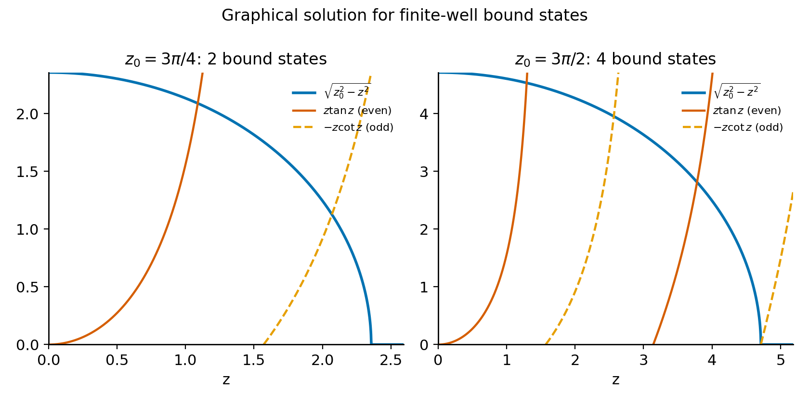
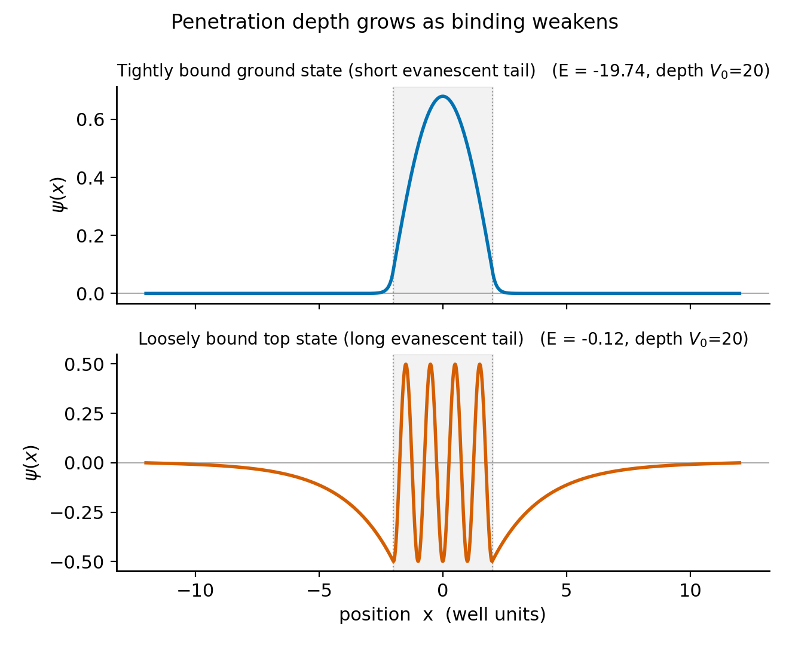
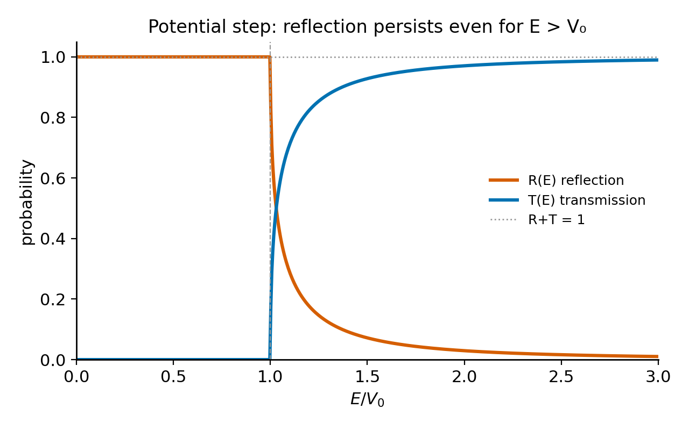
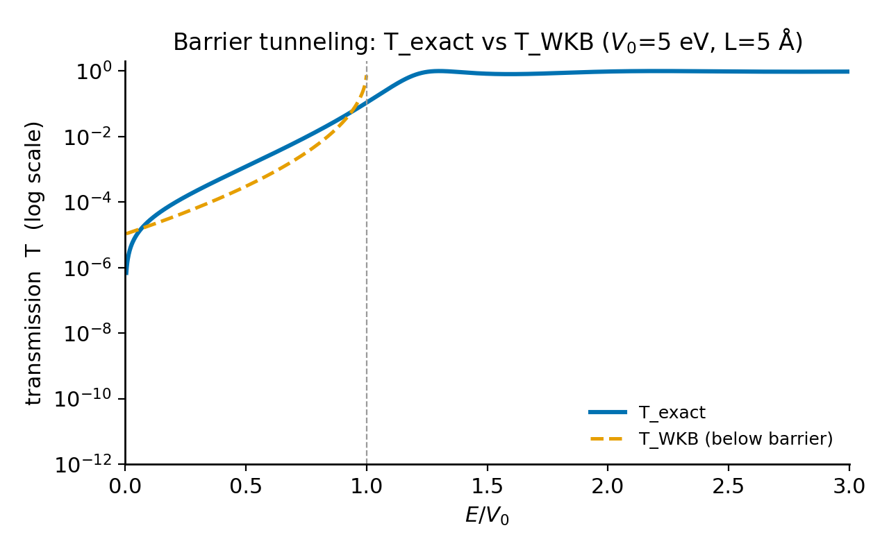
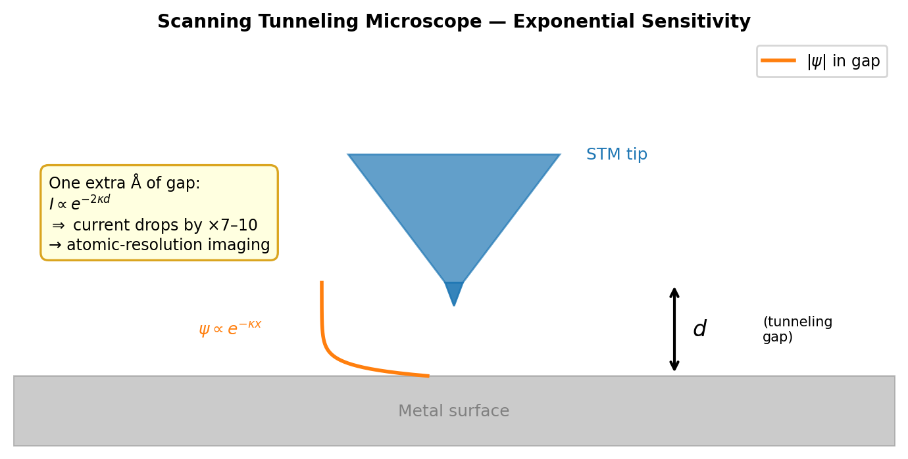
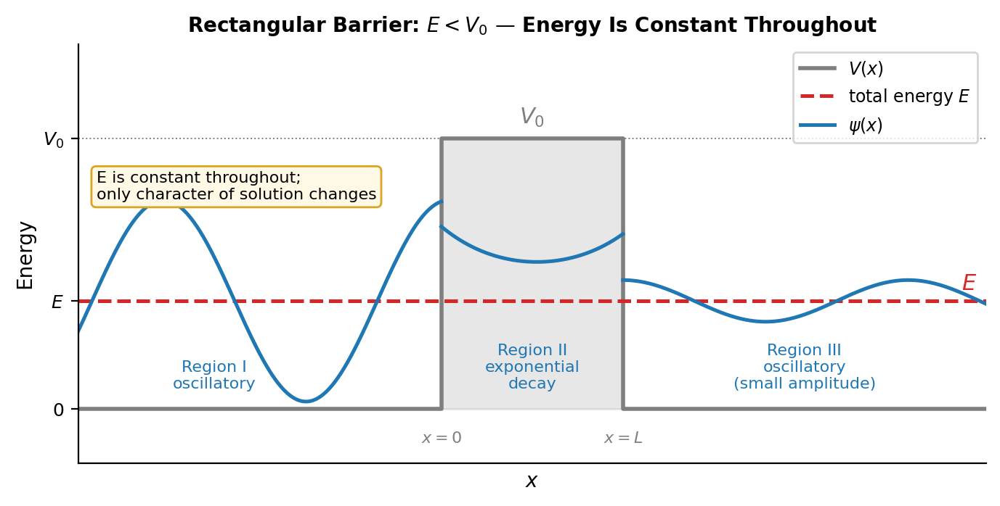

# Chapter 6 — Finite Wells, Steps, and Barriers
*Why walls that end are more interesting than walls that don't.*

Picture Friedrich Hund in 1928, sitting with a nitrogen molecule and the Schrödinger equation, and the equation is about to whisper something he does not want to hear. The two nitrogen atoms sit in a potential well that is roughly 9.8 eV deep. The thermal jostling at room temperature is about 0.025 eV. So ask yourself the classical question: is the molecule stable? Of course it is. The wall it would have to climb is nearly four hundred times taller than any kick the heat can give it. Nothing gets out. End of story.

But here is what Hund noticed, and what should bother you too. The wave function does not politely stop at the edge of the allowed region. It seeps into the forbidden zone, fading as it goes, and then it shows up on the far side with a tiny but honestly non-zero amplitude. So the wall is not really a wall. It is a slope of exponential suppression — and the thing about exponential suppression, no matter how brutal, is that it never quite reaches zero. The molecule could, in principle, simply fall apart without ever paying the activation fee. For nitrogen the barrier is so wide and deep that this essentially never happens. But notice what just slipped past us: the rules are not the classical rules anymore.

Two years on, George Gamow took that same piece of mathematics and cracked a puzzle that had baffled the nuclear people for ten years. A nucleus holds an alpha particle behind a Coulomb wall about 30 MeV tall. The alpha particle that comes flying out has only 4 to 8 MeV. Classically it is locked in forever — no contest. Quantum-mechanically it leaks. And the leaking is so absurdly sensitive to the height of the wall and the energy of the particle that doubling the energy can swing the half-life by twenty-four orders of magnitude. Uranium-238 and polonium-212 decay at rates differing by a factor of $10^{21}$, and one tunneling formula gets it all.

So what is the trick that makes all of this happen? That is what this chapter is about: what changes the moment the walls stop being infinite.

---

## The Finite Square Well

Let's start gently. Take the infinite square well from Chapter 5 and just lower the walls a bit. The potential is $V = -V_0$ for $|x| < L/2$ and $V = 0$ outside, with $V_0 > 0$. The bound states are the ones with $-V_0 < E < 0$ — they live below the rim of the well but above its floor.

Inside the well the particle has positive kinetic energy, $E + V_0 > 0$, so the wave function does what positive kinetic energy always makes it do: it oscillates.

$$\psi_\text{in}(x) = A\cos(kx) + B\sin(kx), \qquad k = \frac{\sqrt{2m(E+V_0)}}{\hbar}.$$

Outside, the kinetic energy $E < 0$, and now the solutions are exponentials. The only ones we are allowed to keep are the ones that die away from the well:

$$\psi_\text{out}(x) = Ce^{-\kappa|x|}, \qquad \kappa = \frac{\sqrt{2m|E|}}{\hbar}.$$

Now notice the first surprising thing. At $x = \pm L/2$, the wave function does not vanish. In the infinite well the walls were so tall they pinned $\psi$ to zero, and that pinning handed us quantization for free. Here we have no such luck. We have to demand that $\psi$ and its slope $\psi'$ join up smoothly at both walls, and it is that matching — not a vanishing — that decides which energies are allowed.

The well is symmetric, so the solutions sort themselves into two families: even-parity ones (cosine inside) and odd-parity ones (sine inside). For the even states, matching at $x = L/2$ gives you:

$$\kappa = k\tan\!\left(\frac{kL}{2}\right).$$

For the odd states:

$$\kappa = -k\cot\!\left(\frac{kL}{2}\right).$$

Neither one can be solved for $E$ with a pencil. But you can solve them with a picture, which is better anyway. Define $z = kL/2$ and $z_0 = (L/2\hbar)\sqrt{2mV_0}$, so that $\kappa L/2 = \sqrt{z_0^2 - z^2}$. The even condition turns into:

$$\sqrt{z_0^2 - z^2} = z\tan z.$$

The left side draws a quarter-circle of radius $z_0$. The right side draws a row of tangent branches marching off to the right. Wherever the circle crosses a tangent branch, you have one even-parity bound state. The odd states are where the circle crosses $-z\cot z$.

<!-- → [FIGURE: graphical solution plot — quarter-circle of radius z₀ intersecting z·tan(z) branches (even states) and −z·cot(z) branches (odd states); label each crossing with E₁, E₂, etc.; show two cases: z₀ = 3π/4 (two bound states) and z₀ = 3π/2 (four bound states)] -->


*Figure 6.1 — graphical solution plot — quarter-circle of radius z₀ intersecting z·tan(z) branches (even states) and −z·cot(z) branches (odd states)*

Count the crossings, and the picture tells you something the infinite well kept hidden: a finite well has only a **finite** number of bound states. Roughly, the count is $z_0/(\pi/2)$ rounded up — which in real units means $N \approx (L/\pi\hbar)\sqrt{2mV_0}$. Make the well shallower or skinnier and levels drop off the top, one by one. Make it deeper or fatter and new ones appear. But — and this is the lovely part — there is always at least one. No matter how shallow, the finite square well always has a ground state. You can see why right in the picture: the quarter-circle, however small its radius, always nicks that first tangent branch somewhere.

And what does the wave function do out beyond the well? It dies off as $e^{-\kappa|x|}$. The length $1/\kappa = \hbar/\sqrt{2m|E|}$ is how far it reaches — the penetration depth. A tightly bound state, with big $|E|$, has a short reach; it clings to the well. A loosely bound state near $E = 0$ has a long reach; it spills far past the classical turning points, out into territory where, classically, the particle simply has no right to be.

This is not the wave function breaking the rules. This is the wave function obeying the only rule it has — the Schrödinger equation — to the letter.

<!-- → [FIGURE: side-by-side wave functions for two bound states in a finite well — tightly bound ground state with short evanescent tails vs. weakly bound excited state with long evanescent tails; show classical turning points as dashed lines] -->


*Figure 6.2 — side-by-side wave functions for two bound states in a finite well — tightly bound ground state with short evanescent tails vs. weakly bound…*

Let $V_0 \to \infty$ and the penetration depth shrinks to nothing, and the energy levels slide right back to the infinite-well values $n^2\pi^2\hbar^2/(2mL^2)$. The infinite well, it turns out, was never a separate thing. It is just the finite well with walls cranked up until nothing can sneak through.

---

## The Potential Step: Partial Reflection from Nothing

Now let's stop trapping the particle and start throwing it at things. The potential is a single step: $V = 0$ for $x < 0$, $V = V_0$ for $x > 0$. A particle comes barreling in from the left. Question: how much of it gets through, and how much bounces back?

Before we write down a single wave function, let's get our bookkeeping right, because this is where people go wrong. The tool we need is the **probability current**:

$$J(x,t) = \frac{\hbar}{m}\,\mathrm{Im}\!\left(\psi^*\frac{\partial\psi}{\partial x}\right).$$

For a rightward plane wave $Ae^{ikx}$ this gives $J = \hbar k|A|^2/m$ — probability flowing to the right at a rate that is speed times density, exactly what your gut would guess. The transmission coefficient $T$ is the transmitted current divided by the incident current; the reflection coefficient $R$ is the reflected current over the incident. And because probability cannot vanish or appear from nowhere, $R + T = 1$.

**When the particle has enough energy** ($E > V_0$): in region I, $\psi_I = Ae^{ik_0 x} + Be^{-ik_0 x}$ with $k_0 = \sqrt{2mE}/\hbar$; in region II, only a rightward wave $\psi_{II} = Ce^{ik_1 x}$ with $k_1 = \sqrt{2m(E-V_0)}/\hbar$. Match $\psi$ and $\psi'$ at $x = 0$:

$$A + B = C, \qquad k_0(A-B) = k_1 C.$$

Solving: $B/A = (k_0 - k_1)/(k_0 + k_1)$ and $C/A = 2k_0/(k_0 + k_1)$. Now we compute the currents — and watch closely, because here is the trap. The transmitted current is $\hbar k_1|C|^2/m$, not $\hbar k_0|C|^2/m$, because the particle is moving at a different speed once it is over the step. Using probability current throughout:

$$R = \left(\frac{k_0 - k_1}{k_0 + k_1}\right)^2, \qquad T = \frac{4k_0 k_1}{(k_0 + k_1)^2}.$$

Check it: $(k_0 - k_1)^2 + 4k_0k_1 = (k_0 + k_1)^2$. So $R + T = 1$. $\checkmark$

Now here is the strange part. $R \neq 0$, even though the particle has more than enough energy to walk right over the step. Classically a particle with $E > V_0$ goes over — period, no argument. Quantum-mechanically, any sudden change in $k$ throws part of the wave back, the same way a sudden change in a transmission line bounces part of an electrical signal. It is not about whether the particle can afford the climb. It is about how abruptly $k$ jumps at the boundary. The reflection only disappears when $k_0 = k_1$, which means $V_0 = 0$ — no step at all. Even a step *down* ($V_0 < 0$) reflects part of the wave. Think about that: the ground falls away beneath the particle and some of it still bounces back.

<!-- → [CHART: R(E) and T(E) vs E/V₀ for the potential step, linear axes — show R=1 for E<V₀, smooth transition at E=V₀, both curves approaching limiting values as E→∞] -->


*Figure 6.3 — R(E) and T(E) vs E/V₀ for the potential step, linear axes — show R=1 for E<V₀, smooth transition at E=V₀, both curves approaching limiting…*

**When the particle does not have enough energy** ($E < V_0$): now $k_1 = \sqrt{2m(E-V_0)}/\hbar$ has gone imaginary. Write $\kappa = \sqrt{2m(V_0-E)}/\hbar$ (real and positive), and the well-behaved solution in region II is $\psi_{II} = Ce^{-\kappa x}$ — a fading exponential. Matching gives $|B/A|^2 = 1$, so $R = 1$ and $T = 0$.

Everything bounces back. And yet — the wave function in region II is not zero. There is an evanescent tail poking into the forbidden region, reaching a distance $1/\kappa$. There is genuine probability density sitting there. But no net current flows. The probability just sloshes in and back out of the step without anything ever getting across. This is not tunneling, and it is worth being clear why: the barrier here goes on forever, so the tail never finds a far edge where it could launch a wave and escape.

---

## The Rectangular Barrier: Tunneling

Now give the barrier a finite width and watch what happens. $V = V_0$ for $0 < x < L$, and $V = 0$ everywhere else. A particle with $E < V_0$ comes in from the left. Classical prediction: it all bounces back, every bit of it. Quantum prediction: hold on.

Three regions:

- Region I ($x < 0$): $\psi_I = Ae^{ikx} + Be^{-ikx}$, $\hspace{2pt}$ $k = \sqrt{2mE}/\hbar$.
- Region II ($0 < x < L$): $\psi_{II} = Ce^{\kappa x} + De^{-\kappa x}$, $\hspace{2pt}$ $\kappa = \sqrt{2m(V_0-E)}/\hbar$.
- Region III ($x > L$): $\psi_{III} = Fe^{ikx}$ (no reflected wave; nothing to reflect from on the right).

Match $\psi$ and $\psi'$ at both interfaces. The algebra is honest work — four continuity conditions, four unknowns — and out the other end comes an answer with no approximation in it at all:

$$T_\text{exact} = \left[1 + \frac{V_0^2\sinh^2(\kappa L)}{4E(V_0 - E)}\right]^{-1}.$$

<!-- → [CHART: T(E) on log y-axis from 10⁻¹² to 1, showing T_exact (solid) and T_WKB (dashed) vs E/V₀ — both curves below barrier, resonance peaks above barrier, vertical line at E=V₀] -->


*Figure 6.4 — T(E) on log y-axis from 10⁻¹² to 1, showing T_exact (solid) and T_WKB (dashed) vs E/V₀ — both curves below barrier, resonance peaks above…*

That one formula holds everything. The dependence on the barrier height $V_0$, the barrier width $L$, and the energy $E$ is all in there, exact, no fudging. Let me pull it apart and see what it is telling us.

For a thick barrier ($\kappa L \gg 1$), $\sinh(\kappa L) \approx e^{\kappa L}/2$, and the exponential takes over the denominator:

$$T_\text{exact} \approx \frac{16E(V_0 - E)}{V_0^2}\,e^{-2\kappa L}.$$

The WKB approximation (which I'll build properly in Chapter 11) just says $T_\text{WKB} = e^{-2\kappa L}$. The ratio between them is $16E(V_0-E)/V_0^2$ — a gentle prefactor of order one when $E$ sits comfortably below $V_0$. So WKB nails the exponential suppression dead on; the only thing it fumbles is the prefactor. And for most of life, the exponential is the whole show.

And what an exponential it is. $T \propto e^{-2\kappa L}$. Double the width and you square that tiny number — the transmission crashes. The scanning tunneling microscope lives off exactly this: one extra ångström of gap between tip and surface multiplies the tunneling current by $e^{2\kappa} \approx 7$ to $10$, depending on the material. That one decade of sensitivity per ångström is the whole reason you can image individual atoms — the machine is nothing but a tunneling-current meter, and the current is an exponential ruler reading off the gap.

<!-- → [FIGURE: schematic of STM geometry — tip hovering over surface, tunneling gap d, wave function decaying exponentially in the gap, with annotation showing one-ångström change → factor-of-7 current change] -->


*Figure 6.5 — schematic of STM geometry — tip hovering over surface, tunneling gap d, wave function decaying exponentially in the gap, with annotation…*

**Above the barrier** ($E > V_0$): now $\kappa$ goes imaginary. Let $k_2 = \sqrt{2m(E-V_0)}/\hbar$, so $\kappa = ik_2$ and $\sinh(i\theta) = i\sin\theta$. The formula turns into:

$$T_\text{exact} = \left[1 + \frac{V_0^2\sin^2(k_2 L)}{4E(E - V_0)}\right]^{-1}.$$

And now $T = 1$ whenever $\sin(k_2 L) = 0$, that is, whenever $k_2 L = n\pi$. The barrier becomes perfectly transparent exactly when its width is a whole number of half-wavelengths, measured at the energy the particle has *inside* the barrier. The wave fits the barrier just so; the reflections from the two faces interfere away, and it is as if the barrier had vanished. These are **resonances** — and they are the same trick as an anti-reflection coating on a lens, or a Fabry-Pérot cavity tuned to its sweet spot. In between the resonances, $T < 1$ even though $E > V_0$. The particle has energy to spare and still partly bounces.

---

## A Worked Calculation

An electron ($m_e = 9.109 \times 10^{-31}$ kg) with kinetic energy $E = 1$ eV hits a rectangular barrier of height $V_0 = 5$ eV and width $L = 5$ Å. What is $T$?

First, $\kappa$:

$$\kappa = \frac{\sqrt{2m_e(V_0 - E)}}{\hbar} = \frac{\sqrt{2 \times 9.109\times10^{-31} \times 4 \times 1.602\times10^{-19}}}{1.055\times10^{-34}} \approx 1.025\times10^{10}\ \text{m}^{-1} = 1.025\ \text{Å}^{-1}.$$

Then $\kappa L = 1.025 \times 5 = 5.125$. Since $\kappa L \gg 1$, the thick-barrier limit applies.

$\sinh(5.125) = (e^{5.125} - e^{-5.125})/2 \approx (168.2 - 0.006)/2 \approx 84.1.$

Plugging into the exact formula:

$$T_\text{exact} = \left[1 + \frac{25 \times (84.1)^2}{4 \times 1 \times 4}\right]^{-1} = \left[1 + 11052\right]^{-1} \approx 9.1\times10^{-5}.$$

WKB gives $T_\text{WKB} = e^{-10.25} \approx 3.5\times10^{-5}$.

The ratio: $T_\text{exact}/T_\text{WKB} \approx 2.56$. The prefactor $16E(V_0-E)/V_0^2 = 16\times1\times4/25 = 2.56$. Agreement exact, as it must be. $\checkmark$

Now the part that should land. The transmission is about $10^{-4}$ — tiny, but stubbornly not zero. Push the barrier out to 10 Å instead of 5, and $\kappa L$ doubles to 10.25, and $T_\text{WKB}$ collapses to $e^{-20.5} \approx 1.25\times10^{-9}$ — four more orders of magnitude gone. The exponential never lets up. This is why, in any tunneling calculation, the width of the barrier matters more than almost anything else you can name.

---

## Why There Is No Energy Debt

There's a story you have probably heard about tunneling. It goes: "The particle borrows a little energy from the vacuum — the time-energy uncertainty principle allows it — sprints across the barrier before the loan is recalled, and pays it back on the far side." It is a charming story. It is also wrong, and it is worth saying exactly where it goes off the rails.

The relation $\Delta E\,\Delta t \geq \hbar/2$ does not hand out energy loans for a duration $\Delta t$. That is simply not what it says. Energy is conserved at every single instant inside the barrier. The particle's total energy is $E$ — in region I, deep inside the barrier, and out in region III, all the same $E$. The wave function inside the barrier, $Ce^{\kappa x} + De^{-\kappa x}$, is a perfectly legitimate solution of the time-independent Schrödinger equation for a particle of energy $E$ in a region where $V = V_0 > E$. Yes, the function is real and decaying instead of oscillating — but it is the right answer. There is no negative kinetic energy hiding in there. There is no overdraft. There is no repayment plan.

What really happens is simpler than the story, and stranger. The wave equation demands a non-zero amplitude in the classically forbidden region, and when the barrier is finite, that amplitude reaches the far edge and seeds a transmitted wave. The transmitted wave is small because the decaying exponential has worn it down over the width $L$. That is the whole mechanism. The particle borrows nothing. It comes through because the mathematics of partial differential equations has never heard the phrase "classically forbidden" and would not care if it had.

<!-- → [FIGURE: energy diagram for rectangular barrier — flat total energy E as horizontal line, barrier region V₀ above E, wave function shown below: oscillatory in regions I and III, decaying in region II, with annotation "E is constant throughout; only the character of the solution changes"] -->


*Figure 6.6 — energy diagram for rectangular barrier — flat total energy E as horizontal line, barrier region V₀ above E, wave function shown below:…*

---

## LLM Exercises

### The deliverable

`06-barrier-explorer.html` — a single self-contained HTML file with three tabs: **Bound States** (graphical solution for the finite well), **Step** ($R$ and $T$ vs. $E$ for a potential step), and **Barrier** ($T_\text{exact}$ and $T_\text{WKB}$ vs. $E$, plus an animated wave packet on a rectangular barrier).

### CLAUDE.md amendment for this chapter

````markdown
## Chapter 6 — Finite Wells, Steps, and Barriers

BARRIER AND STEP PHYSICS RULES

1. EXACT RECTANGULAR BARRIER (E < V₀):
     T_exact = 1 / (1 + (V₀² sinh²(κL)) / (4E(V₀ − E)))
     κ = sqrt(2m(V₀ − E)) / ℏ
   For E > V₀, replace sinh(κL) → i sin(k₂L), κ → ik₂,
   k₂ = sqrt(2m(E − V₀)) / ℏ:
     T_exact = 1 / (1 + (V₀² sin²(k₂L)) / (4E(E − V₀)))
   Box these two cases separately in comments; never apply the
   E < V₀ formula when E > V₀.

2. TRANSMISSION FOR A STEP:
     R = ((k₀ − k₁) / (k₀ + k₁))²
     T = 4k₀k₁ / (k₀ + k₁)²
   VERIFY R + T = 1 at every parameter setting as a runtime check.
   T ≠ |amplitude ratio|² unless k₀ = k₁. Use probability current.

3. WKB FOR RECTANGULAR BARRIER:
     T_WKB = exp(−2κL)   for E < V₀
   On the T(E) plot, show both curves on a LOG y-axis. The two
   curves run parallel below the barrier; label the offset
   "WKB misses prefactor 16E(V₀−E)/V₀²."

4. FINITE WELL GRAPHICAL SOLUTION:
   Plot f_even(z) = z·tan(z) and f_odd(z) = −z·cot(z) vs.
   the circle sqrt(z₀² − z²). Crossings are bound states.
   z₀ = (L / 2ℏ) sqrt(2mV₀). z ∈ (0, z₀).
   Accurately handle the asymptotes of tan(z) at z = π/2, 3π/2 …

5. CRANK-NICOLSON WAVE PACKET (same architecture as Ch 11):
   Natural units ℏ = m = 1. 500 spatial points. Absorbing
   boundaries at 80% of box edges. Thomas tridiagonal solve.
   Pre-compute all frames on Play; cache; animate at 60 fps.
   Initial state: Gaussian centered left of barrier.

KNOWN FAILURE MODES:
(a) Applying E<V₀ formula when E>V₀ (sinh→sin switch missing).
(b) T = |F/A|² without the k ratio (wrong for a step).
(c) Linear y-axis on T(E) — always log.
(d) tan(z) asymptotes causing NaN in graphical solution.
(e) Missing absorbing boundaries → wave packet reflects off walls.
````

### The simulation prompt

````markdown
SHOW.
Three physical scenarios for a particle hitting a potential barrier or well:

1. FINITE SQUARE WELL BOUND STATES
Graphical solution: plot two curves vs z on [0, z₀]:
  Left side of matching condition: g(z) = sqrt(z₀² − z²)   (quarter-circle)
  Even states: f_e(z) = z tan(z)
  Odd states:  f_o(z) = −z cot(z)
Intersections of g with f_e or f_o are bound states.
z₀ = (L/2ℏ)·sqrt(2mV₀). Use natural units ℏ = 2m = 1 so z₀ = L·sqrt(V₀)/2.
Controls: V₀ slider (1–20), L slider (1–10). Label each intersection with
its parity (E or O) and energy level number.

2. POTENTIAL STEP: R AND T vs E
Plot R(E) (red) and T(E) (blue) on linear y-axis [0,1] vs E/V₀ on [0,3].
For E < V₀: R = 1, T = 0.
For E > V₀: R = ((k₀−k₁)/(k₀+k₁))², T = 4k₀k₁/(k₀+k₁)².
k₀ = sqrt(E), k₁ = sqrt(E−V₀) in natural units.
Verify R + T = 1 (log to console at every E). Mark V₀ with a vertical line.
Note the approach to R→0 only as E→∞.
Controls: V₀ slider (1–10).

3. RECTANGULAR BARRIER: T(E) AND ANIMATED WAVE PACKET
Panel A (left, 600px wide, log y-axis): T vs E/V₀ from 10⁻¹² to 1.
Two curves: T_exact (solid) and T_WKB (dashed).
For E < V₀: T_exact from sinh formula; T_WKB = exp(−2κL).
For E > V₀: T_exact from sin formula; T_WKB not shown (classical).
Show resonance peaks above the barrier.

Panel B (right, 400px wide): animated Gaussian wave packet hitting barrier.
Crank-Nicolson, 500 points, x ∈ [−50, 50], ℏ = m = 1.
Initial packet: center x₀ = −20, width σ = 3, momentum p₀ = sqrt(2E).
Barrier as translucent gray fill. Energy E as horizontal dashed line.
Play/Pause/Reset. Time counter.

Controls: V₀ (1–10), L (1–10), E (0.1·V₀ to 2·V₀).

SAY.
Produce a single file `06-barrier-explorer.html`.
Three tabs at the top: "Finite Well", "Step", "Barrier".
Each tab contains its own SVG and controls.
D3 v7 from CDN. Vanilla JS. No math.js or numeric.js.
Thomas algorithm for Crank-Nicolson solve (pure JS, ~25 lines).
Complex arithmetic as {re, im} objects throughout.

CONSTRAIN.
- Natural units ℏ = m = 1 throughout.
- The T vs E/V₀ plot MUST use a LOG y-axis (10⁻¹² to 1).
- R + T = 1 check logged to console every time parameters change.
- The barrier tab must show both T_exact and T_WKB on the same plot.
- The wave packet must use absorbing boundaries (imaginary potential at edges).
- All physics steps commented in code.

VERIFY.
After writing the file, check:
(a) V₀=5, L=5, E=1: T_exact ≈ 9×10⁻⁵, T_WKB ≈ 3.5×10⁻⁵, ratio ≈ 2.56.
(b) V₀=5, L=5, E=5 (at barrier top): T_exact = [1 + 0]⁻¹ = 1? No — at E=V₀,
    κ→0 and sinh(κL)→κL→0, so T_exact→1. Verify this limit.
(c) Step, V₀=2, E=8: k₀=sqrt(8), k₁=sqrt(6); R=((√8−√6)/(√8+√6))²≈0.0102.
(d) Resonance: V₀=2, L=π/sqrt(2E−V₀) for E=4; T_exact=1. Verify resonance peak.
````

### Exploration tasks

**Task 1 — Counting bound states.** In the Finite Well tab, set $V_0 = 4$ and $L = 5$. Count the intersections. Now reduce $V_0$ until one level disappears. At what $V_0$ does the second bound state vanish? Record the value of $z_0$ at that point. Compare to the threshold condition $z_0 = \pi/2$ (first odd-parity state just appears when $z_0 = \pi/2$).

**Task 2 — Reflection at the step.** In the Step tab, observe that $R \to 1$ as $E \to V_0$ from above. At $E = 2V_0$, read off $R$. At $E = 10V_0$, read off $R$. Does $R$ approach zero? Explain physically why a very high-energy particle still reflects slightly.

**Task 3 — Exponential sensitivity.** In the Barrier tab, set $V_0 = 5, E = 1$. Read off $T_\text{exact}$. Now double $L$. By what factor does $T$ change? Double $L$ again. Now vary $V_0$ at fixed $L$ and $E$. Which parameter — height or width — gives more control over $T$?

**Task 4 — The resonance peaks.** Set $E > V_0$ in the Barrier tab. Find the first resonance (first energy above $V_0$ where $T = 1$). Verify that the barrier width is exactly half a de Broglie wavelength: $L = \pi/k_2$ in natural units.

**Task 5 — The wave packet.** Play the animation with $V_0 = 5, L = 3, E = 1$. Pause as the wave packet reaches the barrier. Describe what is happening in the barrier region. After the packet fully passes, compare the relative sizes of the transmitted and reflected pulses. Use the $T$ value from Panel A to predict $|\psi_\text{trans}|^2_\text{max}/|\psi_\text{inc}|^2_\text{max}$ and check it against the simulation.

---

## Still Puzzling

**How long does tunneling take?** The formula for $T$ tells you the odds of getting across — it says nothing about how long the particle lingers inside the barrier. And the literature offers you a whole menu of "tunneling times" — the dwell time, the phase time, the Büttiker-Landauer time, the Larmor clock time — that flatly disagree with one another. Attosecond-streaking experiments (Eckle et al., 2008; Sainadh et al., 2019) have measured *something*, but what the measurement means is still being argued over. This chapter hands you $T$. It does not hand you a tunneling time. We are genuinely at the edge of what is settled here.

**Does tunneling allow faster-than-light signaling?** You hear the claim a lot: a tunneled pulse can show a group velocity greater than $c$, so information must be racing past light. What is really going on is reshaping, not racing. The barrier picks out and boosts the leading edge of the incoming pulse — an edge that was already there, ahead of time, before the barrier did anything. The front of the pulse never moves faster than $c$; the barrier just favors the early part of what arrives. No information beats light.

---

## Exercises

**Warm-up**

1. *[Transcendental matching, graphical counting]* A particle of mass $m$ is in a finite square well of width $L$ and depth $V_0$. (a) Show that the even-parity matching condition can be written $\sqrt{z_0^2 - z^2} = z\tan z$. (b) Sketch both sides for $z_0 = 3\pi/2$ and count the even-parity bound states. (c) How many total bound states (even + odd) exist for this $z_0$?
*What this tests: reading bound-state count from the graphical solution without solving transcendental equations numerically.*

2. *[$R + T = 1$ from probability current]* For the potential step at $E > V_0$: (a) verify $R + T = 1$ algebraically; (b) explain in one sentence why $T \neq |C/A|^2$; (c) compute $R$ when $E = 2V_0$.
*What this tests: keeping probability current accounting straight, and recognizing that amplitude ratios are not transmission coefficients.*

3. *[Evanescent penetration depth]* A particle with $E = 2$ eV hits a step with $V_0 = 5$ eV, $m = m_e$. (a) Compute $1/\kappa$ in nm. (b) By what factor does $|\psi|^2$ drop at $x = 1/\kappa$? At $x = 2/\kappa$?
*What this tests: quantifying how rapidly the evanescent tail decays and building intuition for penetration depth as a physical length.*

**Application**

4. *[Exact barrier transmission, numerical]* An electron with $E = 3$ eV hits a barrier with $V_0 = 6$ eV and $L = 3$ Å. (a) Compute $\kappa$ in Å$^{-1}$. (b) Compute $T_\text{exact}$ from equation (6.1). (c) Compute $T_\text{WKB}$. (d) Find the ratio and compare to $16E(V_0-E)/V_0^2$.
*What this tests: numerical fluency with the exact tunneling formula and verifying where WKB is accurate.*

5. *[Resonance condition above the barrier]* For $V_0 = 2$ eV, $L = 1$ nm, find the two lowest energies above $V_0$ at which $T = 1$. Then find the minimum value of $T$ between the first and second resonances.
*What this tests: applying the above-barrier formula and locating resonances as a condition on $k_2 L$.*

6. *[STM physics, exponential sensitivity]* An STM tip is held 4 Å above platinum ($\phi \approx 5.7$ eV). (a) Compute $\kappa$ in Å$^{-1}$. (b) Find the ratio of tunneling current at 4 Å vs. 5 Å. (c) By what factor does current change over a 2 Å surface step? (d) Explain in one sentence why this sensitivity enables atomic-resolution imaging.
*What this tests: connecting the tunneling formula to a real instrument and appreciating what exponential transduction means in practice.*

**Synthesis**

7. *[Finite well applied to nuclear physics]* The deuteron can be modeled as a finite square well with $V_0 \approx 35$ MeV, $L \approx 2.1$ fm, reduced mass $\mu \approx m_p/2$. (a) Compute $z_0$ using $\hbar c \approx 197$ MeV·fm. (b) How many even-parity bound states does this well support? (c) The deuteron has only one bound state. Is this consistent? What does it say about deuteron excited states?
*What this tests: applying the graphical bound-state formalism to a real physical system and cross-checking against experimental fact.*

8. *[Probability current as physical constraint]* Suppose someone proposes $\psi_{II} = Ce^{\kappa x}$ only (growing exponential) in the barrier region of the step. (a) Compute $J_{II}$. (b) Is $R + T = 1$ satisfied? (c) Why is this solution inadmissible?
*What this tests: using boundary conditions and current conservation to reject unphysical solutions rather than accepting any function that solves the TISE locally.*

**Challenge**

9. *[Resonances as anti-reflection coatings]* The above-barrier resonance condition $k_2 L = n\pi$ is structurally identical to the condition for a thin-film anti-reflection coating in optics ($n_\text{film} t = \lambda/4$ per layer). (a) Identify the optical analogue of each quantum quantity ($k_2$, $L$, $V_0$, $E$). (b) In a Fabry-Pérot cavity, resonances occur when the round-trip phase is $2\pi n$. Show that the quantum resonance condition has the same origin. (c) Suppose a "double barrier" potential has two rectangular barriers separated by a well. Predict qualitatively where resonances occur and explain the concept of a resonant tunneling diode.
*What this tests: transferring the resonance concept across physical contexts and beginning to think about devices built on controlled tunneling.*

---

## References

Griffiths, D. J., & Schroeter, D. F. (2018). *Introduction to Quantum Mechanics* (3rd ed.). Cambridge University Press. §2.5–2.6 (finite well), §2.7 (scattering, step, barrier).

Gamow, G. (1928). Zur Quantentheorie des Atomkernes. *Zeitschrift für Physik*, 51, 204.

Gurney, R. W., & Condon, E. U. (1928). Wave mechanics and radioactive disintegration. *Nature*, 122, 439; and *Physical Review*, 33, 127 (1929).

Binnig, G., & Rohrer, H. (1982). Scanning tunneling microscopy. *Physical Review Letters*, 49, 57.

Eckle, P. et al. (2008). Attosecond ionization and tunneling delay time measurements in helium. *Science*, 322, 1525.

Sainadh, U. S. et al. (2019). Attosecond angular streaking and tunnelling time in atomic hydrogen. *Nature*, 568, 75.

PhysicsLibreTexts: "3.4 — Finite Square Well," UCD Physics 9HE. https://phys.libretexts.org/Courses/University_of_California_Davis/UCD:_Physics_9HE_-_Modern_Physics/03:_One-Dimensional_Potentials/3.4:_Finite_Square_Well

---

## Running Project — Build the 1D Quantum Sandbox

**This chapter adds:** arbitrary potentials — the sandbox stops being hardwired to $V = 0$ and accepts any $V(x)$ array (finite well, step, rectangular barrier) into the same tridiagonal Hamiltonian — plus the transmission coefficient $T(E)$ and the tunneling check against the exact $T_\text{exact} = [1 + V_0^2\sinh^2(\kappa L)/4E(V_0-E)]^{-1}$.

### Exercise R1 — When to Use AI
**The judgment:** In this chapter's project work, AI assistance is appropriate for:
- Writing potential-builder functions `finiteWell`, `step`, `rectBarrier` that return a $V_j$ array on the grid — *Why AI works here:* these are piecewise-constant array fills, and the bound-state count or $T(E)$ curve checks them.
- Drafting the $T(E)$ plot with both $T_\text{exact}$ and $T_\text{WKB} = e^{-2\kappa L}$ on a log y-axis — *Why AI works here:* standard plotting, and the worked example ($V_0=5,L=5,E=1 \Rightarrow T\approx 9\times10^{-5}$) gives an exact anchor.
**The tell:** You are using AI well when you have an independent way to check the output — here, $R + T = 1$ at every energy, and the exact/WKB ratio equaling the analytic prefactor $16E(V_0-E)/V_0^2$.

### Exercise R2 — When NOT to Use AI
**The judgment:** These tasks require your judgment; AI output here can't be trusted without redoing the work:
- The sinh→sin switch when $E$ crosses $V_0$ — *Why AI fails here:* applying the $E<V_0$ formula above the barrier (or vice versa) gives a smooth, wrong $T(E)$ that still looks like a transmission curve; only your knowledge of which regime you are in catches it.
- Using probability current (with the $k$ ratio) rather than bare amplitude ratios for the step — *Why AI fails here:* $T = |C/A|^2$ omits the $k_1/k_0$ speed factor and silently breaks $R + T = 1$; the AI will not notice because each piece looks reasonable.
**The tell:** If you could not explain the result without the AI — if the AI is your *reason* rather than your *tool* — it did work that should have been yours.
**Physics-judgment connection:** This trains checking a scattering result against a conservation law ($R + T = 1$ from probability current) and against an exact closed form ($T_\text{exact}$), the discipline that catches regime-switch and amplitude-vs-current errors.

### Exercise R3 — LLM Exercise
**What you're building this chapter:** the arbitrary-$V(x)$ interface plus the transmission and tunneling calculators.
**Tool:** Claude chat — built on `hamiltonian.js` from Chapter 5; self-contained per scenario.
**The Prompt:**
```
Using the Chapter 0 CLAUDE.md, constants.js, grid.js, observables.js, and the
hamiltonian.js from Chapter 5 as binding context, build 06-barrier-explorer.html
with three tabs.

(1) FINITE WELL: a potentials.js helper finiteWell(x, L, V0) returns V_j
    (−V0 inside |x|<L/2, 0 outside). Feed V into hamiltonian.js's
    buildTridiagonal, diagonalize, and count/plot the bound states (E < 0).
    Confirm the bound-state count matches the graphical condition
    N ≈ ceil(z_0/(π/2)), z_0 = (L/2ℏ)√(2mV_0).

(2) STEP: plot R(E) and T(E) for V = V0·θ(x). For E > V0,
    k_0 = √(2mE)/ℏ, k_1 = √(2m(E−V0))/ℏ,
    R = ((k_0−k_1)/(k_0+k_1))², T = 4k_0k_1/(k_0+k_1)².
    Use PROBABILITY CURRENT (the k ratio), not |amplitude|². Log "R+T" to the
    console at every E — it must equal 1.

(3) BARRIER: plot T_exact and T_WKB on a LOG y-axis vs E/V0.
    For E < V0: κ = √(2m(V0−E))/ℏ,
      T_exact = 1/(1 + V0² sinh²(κL)/(4E(V0−E))),  T_WKB = exp(−2κL).
    For E > V0: switch sinh(κL) → sin(k_2 L), κ → ik_2, k_2 = √(2m(E−V0))/ℏ.
    BOX the two regimes separately; never apply the E<V0 formula when E>V0.

VERIFY: V0=5 eV, L=5 Å, E=1 eV → T_exact ≈ 9×10⁻⁵, T_WKB ≈ 3.5×10⁻⁵,
ratio ≈ 2.56 = 16E(V0−E)/V0². Report it.
```
**What this produces:** `potentials.js` (well/step/barrier builders, reused later) and `06-barrier-explorer.html` with bound-state, step, and tunneling tabs.
**How to adapt:** *Your system:* any new $V(x)$ you write plugs into the same `buildTridiagonal`. *ChatGPT/Gemini:* paste `hamiltonian.js`. *Claude Project:* add `potentials.js` to Project knowledge.
**Builds on:** the tridiagonal Hamiltonian from Chapter 5.  **Next:** Chapter 7 feeds the same builder the quadratic oscillator potential and validates $E_n = (n+\tfrac12)\hbar\omega$.

### Exercise R4 — CLI Exercise
**What you're building this chapter:** the tunneling calculator with automated $R+T=1$ and exact-vs-WKB checks.
**Tool:** Claude Code — it can sweep energies, assert conservation, and record the worked-example values in `PROJECT.md`.
**Skill level:** Intermediate
**Setup — confirm:**
- [ ] `hamiltonian.js`, `potentials.js`, `constants.js`
- [ ] Node.js available
- [ ] The CLAUDE.md rule boxing the $E<V_0$ and $E>V_0$ formulas separately
**The Task:**
```
Read potentials.js. Write a Node script check-scattering.js that:
  (1) for the STEP at V0 = 2 eV, sweeps E from 2.1 to 20 eV and asserts
      R + T = 1 within 1e-9 at every E (probability-current form);
  (2) for the BARRIER V0 = 5 eV, L = 5 Å, E = 1 eV, asserts
      T_exact ≈ 9×10⁻⁵, T_WKB ≈ 3.5×10⁻⁵, and ratio ≈ 2.56 = 16E(V0−E)/V0²;
  (3) confirms the sinh→sin switch: at E = V0 exactly, T_exact → 1 (limit κ→0).
Do NOT loosen tolerances. Append to PROJECT.md under "Verified":
"Ch6 scattering: R+T=1 ✓, barrier T_exact/T_WKB ratio = <v>".
```
**Expected output:** `check-scattering.js`, printed confirmations of $R+T=1$ and the ratio, and a `PROJECT.md` line.
**What to inspect:** that $R+T=1$ holds to machine precision (a current-vs-amplitude error breaks it at the 1% level) and that the exact/WKB ratio equals the analytic prefactor 2.56 exactly.
**If it goes wrong:** if $R+T \neq 1$ for the step, $T$ used $|C/A|^2$ without the $k_1/k_0$ factor — restore the current form. If $T(E)$ is discontinuous at $E = V_0$, the sinh→sin switch is missing or mis-placed.
**CLAUDE.md / AGENTS.md note:** add: "Every scattering computation logs $R+T$; deviation from 1 by more than 1e-6 is a current-accounting bug, not numerics."

### Exercise R5 — AI Validation Exercise
**What you're validating:** the arbitrary-$V(x)$ scattering and tunneling code from R3/R4.
**Validation type:** Numerical result
**Risk level:** Medium — regime-switch errors are silent and the tunneling exponential makes magnitudes hard to eyeball.
**Setup:** use your own R3/R4 artifacts.
**The Validation Task:** Evaluate against this checklist; mark Pass / Fail / Cannot determine with reasoning.
```
Validation Checklist — Arbitrary V(x), transmission, and tunneling
□ Correctness: does V(x) feed unchanged into buildTridiagonal (same eigensolver)?
□ Completeness: are both T_exact and T_WKB shown, on a log y-axis?
□ Scope: did the step use probability current (k ratio), not bare |amplitude|²?
□ Physics criterion 1: R + T = 1 to < 1e-6 at every energy?
□ Physics criterion 2: barrier (V0=5,L=5Å,E=1) gives T_exact≈9e-5, ratio 2.56?
□ Failure-mode check: any of —
  - E<V0 formula applied when E>V0 (sinh→sin switch missing)
  - T = |F/A|² without the k ratio (R+T ≠ 1 for the step)
  - linear T(E) axis hiding the exponential suppression
  - finite well claiming infinitely many bound states (should be finite, ≈ z_0/(π/2))
```
**What to do with findings:** pass → use it; one fail → fix the regime switch or restore the current form and re-run the $R+T$ sweep; multiple fails / cannot-determine → recompute $T$ at one energy by hand from the matching conditions.
**AI Use Disclosure (mandatory, two sentences):**
> *1:* The AI wrote the potential builders and the step/barrier transmission and tunneling calculators.
> *2:* The AI could not determine whether the sinh→sin regime switch and the probability-current accounting were correct — I verified $R+T=1$ and the exact-vs-WKB ratio against the closed forms myself.
**Physics-judgment connection:** trains checking a scattering result against a conservation law and an exact analytic formula, catching regime-switch and current-accounting errors a plausible curve would hide.
