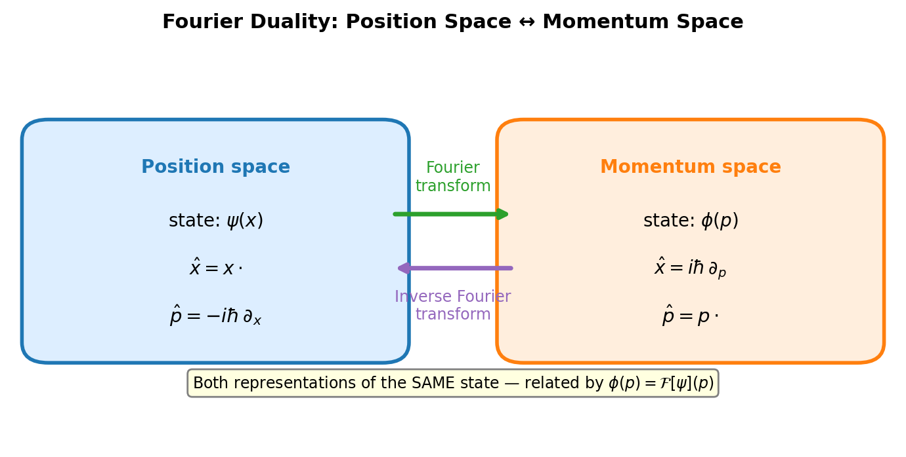
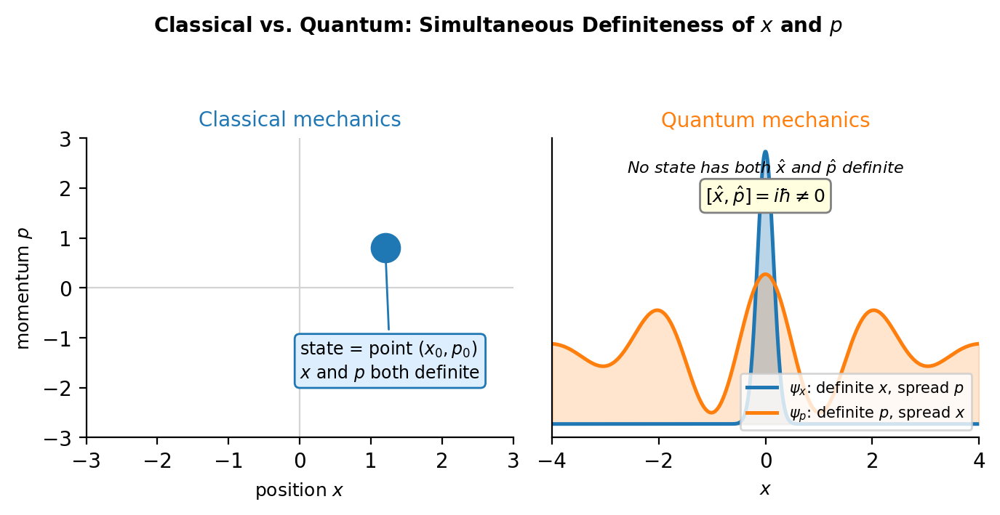
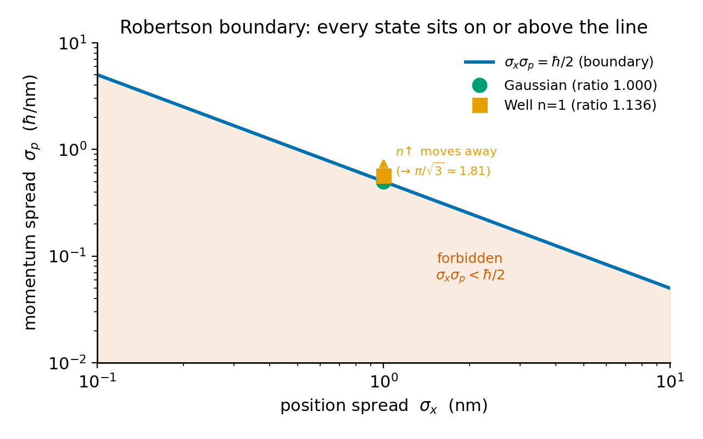

# Chapter 9 — Operators and Uncertainty
*The algebra that makes measurement outcomes real — and makes two of them incompatible.*

Here is an experiment you could actually run, at least in your head. Take an electron. Prepare it in precisely the same state a thousand times over — same apparatus, same recipe, identical setup down the line. Measure its position each time. You get a thousand different numbers. Pile them into a histogram. The histogram has a center $\langle x\rangle$ and a width $\sigma_x$.

Now run it all again: another thousand identical copies, but this round you measure momentum instead. Another histogram, another center $\langle p\rangle$, another width $\sigma_p$.

And here is what you cannot get around, no matter how clever you are. The product $\sigma_x\sigma_p$ is never smaller than $\hbar/2$. Squeeze the position histogram as narrow as you like, and the momentum histogram fattens to make up for it. Notice what this is *not*: no single electron was measured twice, no measurement jostled any other, no apparatus ever touched a copy that was being measured the other way. The limit is sitting inside the state itself, before any instrument gets near it.

So the question is simple to ask and not obvious to answer: what in the mathematics forces that bound? The answer is the way observables become operators — and in particular, the relationship between the operator for position and the operator for momentum. That relationship has a name, and the moment you have it, the inequality drops out in about half a page.

---

## Observables as Operators

In quantum mechanics, every physical observable gets represented by a linear operator $\hat{A}$ that turns wave functions into wave functions:

$$\hat{A}(\alpha\psi + \beta\phi) = \alpha\hat{A}\psi + \beta\hat{A}\phi.$$

Why operators at all? Because we need a machine that takes a wave function and hands back a number — the average outcome of a measurement. The expectation value $\langle\hat{A}\rangle = \int\psi^*(\hat{A}\psi)\,dx$ is exactly that machine.

But not every linear operator is allowed to be an observable. The price of admission is **Hermiticity**: for any two normalizable wave functions $\psi$ and $\phi$,

$$\int_{-\infty}^{\infty}\phi^*\,(\hat{A}\psi)\,dx = \int_{-\infty}^{\infty}(\hat{A}\phi)^*\,\psi\,dx.$$

Hermiticity buys you three things, and each one earns its keep. First: the eigenvalues of a Hermitian operator are real. Since the numbers a meter reads off are real numbers, this is not negotiable. Second: eigenstates with different eigenvalues are orthogonal — the possible outcomes live in an orthogonal basis. Third, the spectral theorem: the eigenstates form a complete set, so any state can be written $|\psi\rangle = \sum_n c_n|a_n\rangle$, and the probability of getting outcome $a_n$ is $|c_n|^2$. That is the Born rule, dressed in operator clothing.

<!-- → [TABLE: comparison table — classical observable (real-valued function on phase space) vs. quantum observable (Hermitian operator on Hilbert space); rows: mathematical object, measurement outcome, state with definite value, condition for simultaneous definiteness] -->

The position operator is the harmless one: $(\hat{x}\psi)(x) = x\psi(x)$. Just multiply by the real number $x$. Hermitian by inspection.

The momentum operator is:

$$\hat{p} = -i\hbar\frac{\partial}{\partial x}.$$

The $-i$ and the $\hbar$ are not there for decoration — they are doing real work. Check Hermiticity by computing $\int\phi^*(\hat{p}\psi)\,dx$:

$$\int_{-\infty}^{\infty}\phi^*\!\left(-i\hbar\frac{\partial\psi}{\partial x}\right)dx.$$

Integrate by parts. The boundary term $\phi^*\psi\big|_{-\infty}^{\infty}$ dies because normalizable wave functions go to zero at $\pm\infty$. What is left:

$$= \int_{-\infty}^{\infty}\!\left(i\hbar\frac{\partial\phi^*}{\partial x}\right)\psi\,dx = \int_{-\infty}^{\infty}\!\left(-i\hbar\frac{\partial\phi}{\partial x}\right)^*\psi\,dx = \int_{-\infty}^{\infty}(\hat{p}\phi)^*\psi\,dx.$$

Hermitian. And it is the $-i$ that saves it: strip it away and the bare derivative $\partial_x$ would be anti-Hermitian, with imaginary eigenvalues — nothing you could ever read on a meter.

Why is *this* the right momentum operator and not some other Hermitian pile of derivatives? The cleanest reason is Fourier analysis. A plane wave $e^{ipx/\hbar}$ is the eigenfunction of $-i\hbar\partial_x$ with eigenvalue $p$: differentiating $e^{ipx/\hbar}$ pulls down $ip/\hbar$, and $-i\hbar \cdot ip/\hbar = p$. In momentum space, $\hat{p}$ is just multiplication by $p$. In position space, it is differentiation. The Fourier transform is the bridge between the two pictures, and $-i\hbar\partial_x$ is the one and only Hermitian first-order differential operator that lands on multiplication-by-$p$ over in momentum space.

<!-- → [DIAGRAM: Fourier duality diagram showing position space (ψ(x), operator −iℏ∂ₓ) ↔ momentum space (φ(p), operator ×p), with arrows labeled "Fourier transform" and "inverse Fourier transform"] -->


*Figure 9.1 — Fourier duality diagram showing position space (ψ(x), operator −iℏ∂ₓ) ↔ momentum space (φ(p), operator ×p), with arrows labeled "Fourier…*

---

## Expectation Values and Variances

Given a Hermitian operator $\hat{A}$ and a normalized state $\psi$, the expectation value is:

$$\langle\hat{A}\rangle = \int_{-\infty}^{\infty}\psi^*(x)\,(\hat{A}\psi)(x)\,dx.$$

For position, $\hat{A} = \hat{x}$, this collapses to $\int x|\psi|^2\,dx$ — just the center of mass of the probability density. For momentum, $\hat{A} = \hat{p}$, it becomes $\int\psi^*(-i\hbar\partial_x\psi)\,dx$, and now the sign starts to matter.

Take the Gaussian wave packet $\psi = Ne^{-x^2/2a^2}e^{ik_0 x}$. Differentiate:

$$\partial_x\psi = \psi\!\left(-\frac{x}{a^2} + ik_0\right), \qquad -i\hbar\partial_x\psi = \psi\!\left(\frac{i\hbar x}{a^2} + \hbar k_0\right).$$

Integrate against $\psi^*$. The piece $i\hbar x/a^2$ is odd in $x$ times the symmetric density $|\psi|^2$ — it integrates to nothing. What survives is $\hbar k_0 \int|\psi|^2\,dx = \hbar k_0$. So a packet drifting right with $k_0 > 0$ has $\langle p\rangle = \hbar k_0 > 0$. Good — it's moving the way we said.

But use $+i\hbar\partial_x$ instead — the wrong sign — and you get $-\hbar k_0 < 0$. Wrong direction entirely. The minus sign in $\hat{p} = -i\hbar\partial_x$ is load-bearing, not a stylistic choice.

The variance of an observable $\hat{A}$ in a state $\psi$ is:

$$\sigma_A^2 = \langle\hat{A}^2\rangle - \langle\hat{A}\rangle^2 = \langle(\hat{A} - \langle\hat{A}\rangle)^2\rangle.$$

This is the spread of measurement outcomes across many identical copies of the state. It is not the fuzziness of any one measurement — it is the width of the histogram.

---

## The Canonical Commutation Relation

The **commutator** of two operators is $[\hat{A}, \hat{B}] \equiv \hat{A}\hat{B} - \hat{B}\hat{A}$. If it comes out zero, the operators commute, they share a common eigenbasis, and both observables can have sharp values at the same time. If it is nonzero, they cannot. That is the whole drama, and it lives in one bracket.

Compute $[\hat{x}, \hat{p}]$ by letting it loose on a test function $\psi$:

$$[\hat{x},\hat{p}]\psi = \hat{x}(\hat{p}\psi) - \hat{p}(\hat{x}\psi).$$

First term: $\hat{p}$ differentiates, then $\hat{x}$ multiplies:

$$\hat{x}(\hat{p}\psi) = x\cdot\left(-i\hbar\frac{\partial\psi}{\partial x}\right) = -i\hbar x\frac{\partial\psi}{\partial x}.$$

Second term: $\hat{x}$ multiplies first, giving $x\psi$, then $\hat{p}$ differentiates the whole *product*:

$$\hat{p}(\hat{x}\psi) = -i\hbar\frac{\partial}{\partial x}(x\psi) = -i\hbar\!\left(\psi + x\frac{\partial\psi}{\partial x}\right) = -i\hbar\psi - i\hbar x\frac{\partial\psi}{\partial x}.$$

The product rule coughs up an extra $-i\hbar\psi$. Subtract first minus second:

$$[\hat{x},\hat{p}]\psi = -i\hbar x\frac{\partial\psi}{\partial x} - \left(-i\hbar\psi - i\hbar x\frac{\partial\psi}{\partial x}\right) = i\hbar\psi.$$

And since that held for any $\psi$ whatsoever:

$$\boxed{[\hat{x}, \hat{p}] = i\hbar.}$$

This is the **canonical commutation relation** — the single algebraic fact that pries quantum mechanics apart from classical mechanics. Classically, position and momentum Poisson-commute: $\{x, p\} = 1$, no $i\hbar$, no incompatibility, no trouble. The canonical commutation relation is the quantum upgrade, and that $i\hbar$ cannot be scrubbed out. Everything that follows about uncertainty is the shadow of this one line.

Because $[\hat{x}, \hat{p}] \neq 0$, position and momentum share no common eigenbasis. Any state with a definite position (a Dirac spike in $x$) is infinitely smeared in momentum; any state with a definite momentum (a plane wave) is infinitely smeared in position. And notice — the incompatibility has nothing to do with measurement. It is algebraic, stitched right into the operators before any meter shows up.

<!-- → [DIAGRAM: two-column visual contrast — classical phase space with a point (x, p) representing a state with simultaneous definite values, vs. quantum Hilbert space with eigenfunctions of x̂ (delta function) and p̂ (plane wave) shown side by side, illustrating that no state can be both] -->


*Figure 9.2 — two-column visual contrast — classical phase space with a point (x, p) representing a state with simultaneous definite values, vs. quantum…*

---

## The Robertson Inequality

Now the theorem that ties the commutator to the uncertainty bound. No measurement happens anywhere in it; no particle gets disturbed. The proof is pure linear algebra, and it is short.

**Robertson inequality (1929).** For any two Hermitian operators $\hat{A}$, $\hat{B}$ and any state $\psi$:

$$\sigma_A\,\sigma_B \geq \frac{1}{2}\bigl|\langle[\hat{A},\hat{B}]\rangle\bigr|.$$

The proof is three moves. Define shifted operators $\hat{A}' = \hat{A} - \langle\hat{A}\rangle$ and $\hat{B}' = \hat{B} - \langle\hat{B}\rangle$, so that $\sigma_A^2 = \|\hat{A}'|\psi\rangle\|^2$ and $\sigma_B^2 = \|\hat{B}'|\psi\rangle\|^2$.

**Move 1** (Cauchy-Schwarz):

$$\sigma_A^2\sigma_B^2 = \|\hat{A}'|\psi\rangle\|^2\|\hat{B}'|\psi\rangle\|^2 \geq |\langle\hat{A}'\hat{B}'\rangle|^2.$$

**Move 2** (decompose the inner product): write $\hat{A}'\hat{B}' = \tfrac{1}{2}\{\hat{A}',\hat{B}'\} + \tfrac{1}{2}[\hat{A}',\hat{B}']$. The anticommutator $\{\hat{A}',\hat{B}'\}$ is Hermitian, so its expectation is real. The commutator $[\hat{A}',\hat{B}'] = [\hat{A},\hat{B}]$ is anti-Hermitian, so its expectation is purely imaginary. A real number and an imaginary number add in modulus:

$$|\langle\hat{A}'\hat{B}'\rangle|^2 = \frac{1}{4}\langle\{\hat{A}',\hat{B}'\}\rangle^2 + \frac{1}{4}|\langle[\hat{A},\hat{B}]\rangle|^2.$$

**Move 3** (drop the non-negative anticommutator term to get a lower bound):

$$\sigma_A^2\sigma_B^2 \geq \frac{1}{4}|\langle[\hat{A},\hat{B}]\rangle|^2.$$

Take the square root: $\sigma_A\sigma_B \geq \tfrac{1}{2}|\langle[\hat{A},\hat{B}]\rangle|$. $\square$

Plug in $\hat{A} = \hat{x}$, $\hat{B} = \hat{p}$, $[\hat{x},\hat{p}] = i\hbar$:

$$\sigma_x\,\sigma_p \geq \frac{1}{2}|i\hbar| = \frac{\hbar}{2}.$$

The **Kennard inequality** — proved by Kennard in 1927, then set into this general algebraic frame by Robertson in 1929. It is a theorem, squeezed out of the canonical commutation relation and Cauchy-Schwarz. Not one experiment appears in the proof. The bound is fixed when you prepare the state, long before you measure anything.

Notice what got thrown away in Move 3: the anticommutator term $\tfrac{1}{4}\langle\{\hat{A}',\hat{B}'\}\rangle^2$, which is non-negative. Tossing it makes the bound weaker than it has to be. Schrödinger (1930) kept it and got a tighter inequality. For the Gaussian the anticommutator term happens to vanish, so both bounds agree. For other states — like the infinite square well — the Schrödinger bound is strictly tighter than Robertson. The exercises chase this down.

<!-- → [CHART: log-log plot of σ_p vs σ_x showing the Robertson boundary hyperbola σ_x σ_p = ℏ/2; mark the Gaussian as a point on the curve (ratio 1.000) and the infinite-well ground state as a point above it (ratio ≈ 1.136); draw arrow showing that as n increases in the well, the point moves further from the boundary] -->


*Figure 9.3 — log-log plot of σ_p vs σ_x showing the Robertson boundary hyperbola σ_x σ_p = ℏ/2*

---

## A Worked Calculation: The Infinite Square Well

Back in Chapter 3 I worked out $\sigma_x\sigma_p = \hbar/2$ for the Gaussian. Let me do it now for a different state — the infinite-square-well ground state — to show you a case where the bound is satisfied but not hit dead on.

The state on $[0,L]$ is $\psi_1(x) = \sqrt{2/L}\,\sin(\pi x/L)$.

**Position mean.** By symmetry of $\sin^2(\pi x/L)$ around $x = L/2$: $\langle x\rangle = L/2$.

**$\langle x^2\rangle$.** Integrating $x^2\sin^2(\pi x/L)$ over $[0,L]$ (using $\sin^2\theta = (1-\cos 2\theta)/2$ and integrating by parts twice) gives:

$$\langle x^2\rangle = L^2\!\left(\frac{1}{3} - \frac{1}{2\pi^2}\right).$$

**Position variance:**

$$\sigma_x^2 = L^2\!\left(\frac{1}{3} - \frac{1}{2\pi^2}\right) - \frac{L^2}{4} = L^2\!\left(\frac{1}{12} - \frac{1}{2\pi^2}\right) \approx 0.0326\,L^2.$$

So $\sigma_x \approx 0.181\,L$.

**Momentum mean.** The ground state is a standing wave — an equal blend of $e^{i\pi x/L}$ (rightward) and $e^{-i\pi x/L}$ (leftward). The equal and opposite contributions cancel: $\langle p\rangle = 0$. Confirm by direct integral: the integrand $\sin(\pi x/L)\cdot\cos(\pi x/L) = \tfrac{1}{2}\sin(2\pi x/L)$ integrates to zero over a full period.

**$\langle p^2\rangle$.** Here is a slick operator-algebra shortcut that beats grinding through the integral. The TISE says $\hat{H}\psi_1 = E_1\psi_1$ with $E_1 = \pi^2\hbar^2/(2mL^2)$. Inside the well $\hat{H} = \hat{p}^2/2m$, so $\hat{p}^2\psi_1 = 2mE_1\psi_1 = (\hbar\pi/L)^2\psi_1$. Therefore:

$$\langle p^2\rangle = \left(\frac{\hbar\pi}{L}\right)^2\int|\psi_1|^2\,dx = \left(\frac{\hbar\pi}{L}\right)^2.$$

**Momentum variance:** $\sigma_p^2 = \langle p^2\rangle - \langle p\rangle^2 = (\hbar\pi/L)^2$, so $\sigma_p = \hbar\pi/L$.

**The product:**

$$\sigma_x\sigma_p \approx 0.181\,L \cdot \frac{\hbar\pi}{L} = 0.181\pi\hbar \approx 0.568\,\hbar.$$

Since $\hbar/2 = 0.500\,\hbar$, the product clears the bound with room to spare. The ratio $\sigma_x\sigma_p/(\hbar/2) \approx 1.136$.

So why doesn't the square-well ground state hit the bound exactly? Saturation requires $\hat{A}'|\psi\rangle = i\lambda\hat{B}'|\psi\rangle$ for some real $\lambda$ — that is, the Cauchy-Schwarz step has to hold with equality, which demands the two vectors be parallel. For $\hat{A}' = \hat{x} - \langle x\rangle$ and $\hat{B}' = \hat{p} - \langle p\rangle$, that condition turns into a differential equation whose only normalizable solution is the Gaussian. But the square-well ground state has hard walls forcing $\psi(0) = \psi(L) = 0$ — it simply cannot be a Gaussian. So its product $\sigma_x\sigma_p$ is stuck strictly above $\hbar/2$. The walls cost it.

Open `01-probability-explorer.html` from Chapter 3, pick the infinite well, set $n = 1$, $L = 10$ nm. The ratio should read about $1.136$. That number is this calculation, done by the machine.

---

## What the Uncertainty Principle Is Not About

There is a story you find in many textbooks — Heisenberg's gamma-ray microscope — in which a photon sent in to locate an electron gives it a kick, scrambling its momentum in some uncontrollable way. As a story it is genuinely illuminating. But it is describing a *different statement* from the Kennard inequality, and confusing the two is a trap.

The Kennard inequality is about *preparation*, not measurement. Prepare a million copies of one state. Measure position on half of them and momentum on the other half. No copy gets measured twice. No particle gets kicked by any photon. And still $\sigma_x\sigma_p \geq \hbar/2$. The bound is set by the shape of $\psi$, before any measurement even begins.

The microscope story is describing an *error-disturbance* relation: if I measure position to precision $\epsilon$, the act of measuring introduces a momentum disturbance $\eta$, and $\epsilon\cdot\eta$ obeys some bound of its own. Ozawa formalized this in 2003 and proved the relation takes a different form from Kennard's. Erhart et al. tested both experimentally in 2012. They are different inequalities — different math, different physics, different meaning. Mixing them up is the single most stubborn conceptual mistake in introductory quantum mechanics, and now you will not make it.

---

## LLM Exercises

### Part A — CLAUDE.md amendment for this chapter

````markdown
## Chapter 9 — Operators and Uncertainty

PHYSICS CHECKS
- Momentum operator: p̂ = −iℏ ∂_x. Sign is load-bearing.
  For a wave packet with k₀ > 0, ⟨p̂⟩ > 0 must hold.
- Expectation value computed as: <A> = integral psi* (A psi) dx.
  Not as integral |psi|^2 A dx (that would only be correct for A = x).
- Variance: sigma_A^2 = <A^2> - <A>^2. Both terms required.
- Canonical commutation check: [x̂, p̂] psi = iℏ psi.
  If your code implements [x̂, p̂] on a grid, the output should be iℏ * psi
  pointwise (up to grid errors at boundaries). Build this as a startup assertion.
- The ratio sigma_x * sigma_p / (ℏ/2):
    Gaussian: must read 1.000.
    Infinite-well n=1, L=10 nm: must read ≈ 1.136.
    Infinite-well: ratio grows linearly as (π/sqrt(3))·n ≈ 1.814·n — it does NOT converge (n=10 → ≈ 18.08).
  These are verification targets, not adjustable parameters.
````

### Part B — Exploration tasks using the existing simulation

**Task 1 — Saturating the bound.** Open `01-probability-explorer.html`. Select the Gaussian, $a = 1$ nm, $k_0 = 5$ nm$^{-1}$. Read $\sigma_x \approx 0.707$ nm, $\sigma_p \approx 0.707\,\hbar$/nm, ratio $\approx 1.000$. Slide $a$ from $0.2$ to $4$ nm. $\sigma_x$ scales with $a$; $\sigma_p$ scales inversely; the ratio stays locked at $1.000$. Write: what does this confirm about the Gaussian as the minimum-uncertainty state?

**Task 2 — The well exceeds the bound.** Switch to the infinite-well eigenstate, $n = 1$, $L = 10$ nm. Read the ratio — it should be $\approx 1.136$. Compare with the analytical result from the worked calculation above. Do they agree to within $1\%$?

**Task 3 — Higher modes.** Step $n$ from $1$ to $10$. Record the ratio at each $n$. Does it grow, converge, or oscillate? From exercise 4 you will derive that it grows linearly, $\sigma_x\sigma_p/(\hbar/2) \approx (\pi/\sqrt{3})\,n \approx 1.814\,n$ — it does not converge. Confirm the ratio at $n = 10$ is $\approx 18.08$.

**Task 4 — Sign of momentum.** Select the Gaussian with $k_0 = +5$ nm$^{-1}$. Read $\langle p\rangle$: it should be positive. Change $k_0$ to $-5$ nm$^{-1}$. The magnitude of $\sigma_p$ is unchanged; only the mean flips. This verifies that $\hat{p} = -i\hbar\partial_x$ gives the correct sign for both directions of motion.

### Part C — Optional new simulation

````markdown
SHOW.
The canonical commutation relation [x̂, p̂] = iℏ and its consequence for uncertainty.

Build a simulation that computes expectation values and variances
for user-selectable wave functions, and displays:
  - <x>, <x^2>, sigma_x
  - <p>, <p^2>, sigma_p
  - sigma_x * sigma_p / (ℏ / 2)   [the uncertainty ratio]
  - A visual of the Robertson bound: a point (sigma_x, sigma_p) on a log-log
    plot, with the boundary curve sigma_x * sigma_p = ℏ/2 drawn.

Wave functions (dropdown):
  1. Gaussian with sliders a, k0.
  2. Infinite-well eigenstate n on [0, L] with sliders n (integer 1-10), L.
  3. Superposition: alpha * psi_1 + beta * psi_2 in the infinite well,
     with sliders for alpha, beta (normalized).

The log-log plot should show:
  - The Robertson boundary (hyperbola sigma_x * sigma_p = ℏ/2) as a solid curve.
  - The current state as a dot. Gaussian: on the curve. Well: above the curve.
  - As you increase n in the well, the dot moves up and right.

SAY.
Produce a single file 09-operators-and-uncertainty.html.

CONSTRAIN.
  - D3 v7 from CDN. SVG only. N = 500 grid points.
  - sigma_x, sigma_x^2: compute via Simpson's rule on x |psi|^2 and x^2 |psi|^2.
  - sigma_p, sigma_p^2: compute via FFT to momentum space, Simpson on p |phi|^2 and p^2 |phi|^2.
  - The commutator check: for any psi, [x̂, p̂] psi should numerically equal iℏ psi
    pointwise. Display max deviation from iℏ as a "commutator residual" --- should
    read ≈ 0 (up to grid discretization).
  - The Robertson-boundary plot must show the Gaussian point on the curve (ratio 1.000)
    and the well n=1 point above it (ratio ≈ 1.136). Label both.

VERIFY.
  (a) Gaussian a = 1 nm, k0 = 0: sigma_x = 1/sqrt(2) nm, sigma_p = ℏ/(sqrt(2) nm), ratio = 1.000.
  (b) Well n=1, L=10 nm: sigma_x ≈ 1.81 nm, sigma_p ≈ π ℏ / 10 nm ≈ 0.314 ℏ/nm, ratio ≈ 1.136.
  (c) Well n=10, L=10 nm: ratio ≈ 18.08 (grows as (π/sqrt(3))·n).
  (d) Commutator residual < 1e-3 ℏ for N = 500.
````

---

## Still Puzzling

The Robertson inequality throws away the anticommutator term to get a cleaner bound. The Schrödinger inequality (1930) keeps it, and for most states and most pairs of operators it is strictly tighter. But which states actually saturate the Schrödinger bound — and whether they have a clean physical description beyond "not Gaussian" — is still an open question in the research literature. We do not have a tidy answer.

The Robertson framework measures spread by variance. But variance is not the only honest way to measure spread. The entropic uncertainty relations of Maassen and Uffink (1988) swap $\sigma_A^2$ for the Shannon entropy $H(A)$ of the measurement distribution, giving $H(x) + H(p) \geq \log(e\pi\hbar)$. Entropic bounds are tighter than variance-based Robertson for non-Gaussian states, and they sit at the center of quantum information theory and cryptography. They are graduate-level material — but worth knowing they exist.

And the error-disturbance relations — Ozawa (2003), tested by Erhart et al. (2012) and Rozema et al. (2012) — ask what happens when you measure one observable and then ask how much that act of measuring disturbs a following measurement of the other. Testing them needs weak measurements and quantum tomography. The line between preparation uncertainty (Robertson) and disturbance uncertainty (Ozawa-type) is real and important, and most undergraduate courses still blur right over it.

---

## Exercises

**Warm-up**

1. *[Hermiticity of the momentum operator]* Prove that $\hat{p} = -i\hbar\partial_x$ is Hermitian using integration by parts. (a) State explicitly what boundary condition on $\psi$ and $\phi$ is required for the boundary term to vanish, and why it holds for any normalizable state. (b) What would go wrong if you replaced $\hat{p}$ with the real operator $\hbar\partial_x$ (without the $-i$)?
*What this tests: tracing exactly why the $-i$ is structural, not cosmetic — and what Hermiticity requires at the boundary.*

2. *[Canonical commutation relation]* Derive $[\hat{x},\hat{p}] = i\hbar$ step by step, applying both operators to a test function $\psi$. Show every product-rule term explicitly. (a) At which step does the $i\hbar$ emerge? (b) What would $[\hat{x},\hat{p}]$ be if $\hat{p}$ were defined as $+i\hbar\partial_x$? (c) Compute $[\hat{p},\hat{x}]$ and verify it equals $-i\hbar$.
*What this tests: mechanical fluency with commutators and the origin of the canonical relation in the product rule.*

3. *[Expectation values for a Gaussian]* For $\psi(x) = (1/\pi a^2)^{1/4}e^{-x^2/2a^2}e^{ik_0 x}$ with $a = 2$ nm, $k_0 = 3$ nm$^{-1}$: (a) without computing integrals, state $\langle x\rangle$ and $\langle p\rangle$ and justify each in one sentence; (b) write the integrals for $\langle x^2\rangle$ and $\langle p^2\rangle$ and use the Chapter 3 results to evaluate them; (c) compute $\sigma_x$, $\sigma_p$, and their product.
*What this tests: applying the expectation-value formalism without redundant integration, and verifying the Kennard bound is saturated.*

**Application**

4. *[Infinite-square-well uncertainty for higher modes]* For $\psi_n = \sqrt{2/L}\sin(n\pi x/L)$ on $[0,L]$: (a) show $\langle p\rangle = 0$ for all $n$; (b) use $\hat{p}^2\psi_n = (n\hbar\pi/L)^2\psi_n$ to find $\sigma_p = n\hbar\pi/L$; (c) show $\sigma_x^2 = L^2(1/12 - 1/(2n^2\pi^2))$ and verify for $n=1$; (d) show that $\sigma_x\sigma_p/(\hbar/2) \approx (\pi/\sqrt{3})\,n$ for large $n$ — so it grows without bound — and interpret why (the position spread saturates at $L/\sqrt{12}$ while $\sigma_p = n\hbar\pi/L$ grows linearly in $n$).
*What this tests: using the TISE as an operator-algebra shortcut, and tracing the large-$n$ behavior toward the classical limit.*

5. *[Robertson bound from an eigenstate]* For any eigenstate $\hat{A}\psi = \lambda\psi$: (a) show $\sigma_A = 0$; (b) for $\hat{A} = \hat{p}$ and $\psi = e^{ik_0 x}$ (plane wave), what does Robertson say about $\sigma_x$? (c) Resolve the tension: $e^{ik_0 x}$ is not normalizable, so $\sigma_x$ is infinite. How does the Robertson inequality still hold?
*What this tests: applying the inequality to a limiting case and confronting the normalizability requirement.*

6. *[Robertson for Pauli operators]* The Pauli matrices satisfy $[\sigma_x, \sigma_z] = -2i\sigma_y$. For the qubit state $|\psi\rangle = \cos(\theta/2)|0\rangle + \sin(\theta/2)|1\rangle$: (a) compute $\langle\sigma_y\rangle$; (b) write down the Robertson bound $\sigma_{\sigma_x}\sigma_{\sigma_z} \geq |\langle\sigma_y\rangle|$; (c) at $\theta = \pi/2$, compute $\sigma_{\sigma_x}$ and $\sigma_{\sigma_z}$ and verify the bound; (d) at which $\theta$ is the bound saturated?
*What this tests: applying Robertson to finite-dimensional operators and seeing the same structure in a different physical system.*

**Synthesis**

7. *[The minimum-uncertainty state]* The saturation condition for Cauchy-Schwarz is $\hat{A}'|\psi\rangle = c\hat{B}'|\psi\rangle$ for some complex constant $c$. (a) Set $\hat{A}' = \hat{x} - \langle x\rangle$ and $\hat{B}' = \hat{p} - \langle p\rangle$, and write this as a differential equation for $\psi(x)$. (b) Show the solution is a Gaussian. (c) For saturation of Robertson (not just Cauchy-Schwarz), $c$ must be purely imaginary: $c = i\lambda$, $\lambda\in\mathbb{R}$. Show this forces the Gaussian to decay.
*What this tests: working backward from the equality condition to characterize the minimum-uncertainty state as the Gaussian — not as a given, but as a derived result.*

8. *[Ehrenfest's theorem]* Ehrenfest's theorem: $d\langle x\rangle/dt = \langle p\rangle/m$ and $d\langle p\rangle/dt = -\langle\partial V/\partial x\rangle$. (a) Derive the first by differentiating $\langle x\rangle = \int x|\psi|^2\,dx$ and using the Schrödinger equation. (b) Derive the second by differentiating $\langle p\rangle = \int\psi^*(-i\hbar\partial_x\psi)\,dx$. (c) For the free particle, what do these say about $\langle x\rangle(t)$ and $\langle p\rangle(t)$? Connect to the group-velocity result from Chapter 8.
*What this tests: connecting the operator formalism to the classical equations of motion and seeing where they agree and where they diverge.*

**Challenge**

9. *[The Schrödinger uncertainty relation]* (a) In the Robertson proof, show explicitly that the dropped anticommutator term $\tfrac{1}{4}\langle\{\hat{x}',\hat{p}'\}\rangle^2$ is non-negative. (b) Retain it to obtain the Schrödinger bound: $\sigma_x^2\sigma_p^2 \geq \tfrac{1}{4}|\langle\{\hat{x}',\hat{p}'\}\rangle|^2 + \hbar^2/4$. (c) For the Gaussian, compute $\langle\{\hat{x}',\hat{p}'\}\rangle$ directly and show it vanishes — confirming that Robertson and Schrödinger agree for the Gaussian. (d) Argue (without full computation) that for the infinite-square-well ground state, the anticommutator term is nonzero, making the Schrödinger bound strictly tighter than Robertson.
*What this tests: understanding why the dropped term makes Robertson a weaker bound, and seeing the hierarchy Robertson ≤ Schrödinger ≤ actual variance product.*

---

## References

Kennard, E. H. (1927). Zur Quantenmechanik einfacher Bewegungstypen. *Zeitschrift für Physik*, 44, 326–352.

Robertson, H. P. (1929). The uncertainty principle. *Physical Review*, 34, 163–164.

Schrödinger, E. (1930). Zum Heisenbergschen Unschärfeprinzip. *Sitzungsberichte der Preussischen Akademie der Wissenschaften*, Physikalisch-mathematische Klasse, 296–303.

Ozawa, M. (2003). Universally valid reformulation of the Heisenberg uncertainty principle on noise and disturbance in measurement. *Physical Review A*, 67, 042105.

Erhart, J., Sponar, S., Sulyok, G., Badurek, G., Ozawa, M., & Hasegawa, Y. (2012). Experimental demonstration of a universally valid error-disturbance uncertainty relation in spin measurements. *Nature Physics*, 8, 185–189.

Maassen, H., & Uffink, J. B. M. (1988). Generalized entropic uncertainty relations. *Physical Review Letters*, 60, 1103–1106.

Griffiths, D. J., & Schroeter, D. F. (2018). *Introduction to Quantum Mechanics* (3rd ed.). Cambridge University Press. §1.6, §3.5.

Townsend, J. S. (2012). *A Modern Approach to Quantum Mechanics* (2nd ed.). University Science Books. §3.5.

---

## Running Project — Build the 1D Quantum Sandbox

**This chapter adds:** the observables panel that turns the eigensolver's raw eigenvectors into physics — $\langle x\rangle$, $\langle p\rangle$, $\sigma_x$, $\sigma_p$, the ratio $\sigma_x\sigma_p/(\hbar/2)$, and a numerical commutator residual $[\hat x,\hat p]\psi - i\hbar\psi$ that checks the discretization itself — validated against the Gaussian (ratio 1.000) and the infinite-well ladder ($1.136$ at $n=1$, growing as $\approx 1.814\,n$).

### Exercise R1 — When to Use AI
**The judgment:** In this chapter's project work, AI assistance is appropriate for:
- Implementing $\langle p\rangle = \int\psi^*(-i\hbar\partial_x\psi)\,dx$ and $\langle p^2\rangle = \int\psi^*(-\hbar^2\partial_x^2\psi)\,dx$ on the grid — *Why AI works here:* finite-difference reductions with exact targets from the Gaussian and the well.
- Drafting the Robertson-boundary plot (the hyperbola $\sigma_x\sigma_p = \hbar/2$ with the state as a point) — *Why AI works here:* standard plotting, anchored by the Gaussian sitting exactly on the curve.
**The tell:** You are using AI well when you have an independent way to check the output — here, the Gaussian ratio of 1.000 and the well-$n{=}1$ ratio of 1.136.

### Exercise R2 — When NOT to Use AI
**The judgment:** These tasks require your judgment; AI output here can't be trusted without redoing the work:
- The sign of $\hat p = -i\hbar\partial_x$ — *Why AI fails here:* a flipped sign gives $\langle p\rangle < 0$ for a right-moving state; the magnitude is right, so it passes any check that does not test direction.
- Whether the uncertainty *product* uses $\langle\hat A^2\rangle - \langle\hat A\rangle^2$ (both terms) rather than just $\langle\hat A^2\rangle$ — *Why AI fails here:* dropping $\langle\hat A\rangle^2$ inflates $\sigma_p$ for a state with $\langle p\rangle \neq 0$; the bug is invisible for symmetric states (where $\langle p\rangle = 0$) and only shows for moving packets.
**The tell:** If you could not explain the result without the AI — if the AI is your *reason* rather than your *tool* — it did work that should have been yours.
**Physics-judgment connection:** This trains checking computed uncertainties against the Robertson/Kennard bound and against exact analytic ratios, plus a numerical commutator residual that checks the grid representation of $[\hat x,\hat p] = i\hbar$.

### Exercise R3 — LLM Exercise
**What you're building this chapter:** the full observables/uncertainty panel and the commutator-residual self-check, run on the eigensolver's output.
**Tool:** Claude chat — built on `observables.js`, `hamiltonian.js`; self-contained.
**The Prompt:**
```
Using the Chapter 0 CLAUDE.md, constants.js, grid.js, observables.js,
hamiltonian.js as binding context, build 09-operators-uncertainty.html.

For any selected state (Gaussian with a, k_0; or infinite-well eigenstate n on
[0,L] from the eigensolver), compute and display:
  ⟨x⟩, ⟨x²⟩, σ_x; ⟨p⟩, ⟨p²⟩, σ_p (use p̂ = −iℏ∂_x, central difference);
  the ratio σ_x σ_p /(ℏ/2) in a large readout;
  a Robertson-boundary plot: the hyperbola σ_x σ_p = ℏ/2 and the current
  state as a point (Gaussian ON the curve, well ABOVE it).

COMMUTATOR RESIDUAL self-check: apply [x̂, p̂] to the current ψ on the grid
([x̂,p̂]ψ = x̂(p̂ψ) − p̂(x̂ψ)) and display the max deviation from iℏ·ψ. It must
read ≈ 0 (up to O(h²) grid error). Build this as a startup assertion.

CRITICAL: p̂ = −iℏ∂_x — k_0 > 0 gives ⟨p⟩ > 0. σ_p² = ⟨p²⟩ − ⟨p⟩² (BOTH terms).
VERIFY: Gaussian a=1 nm → ratio 1.000; well n=1, L=10 nm → ratio ≈ 1.136;
well n=10 → ratio ≈ 18.08 (grows as ≈ 1.814·n); commutator residual < 1e-3·ℏ.
```
**What this produces:** `09-operators-uncertainty.html` with the uncertainty panel, Robertson plot, and the commutator residual that validates the grid operators.
**How to adapt:** *Your system:* add an FFT-based $\langle p\rangle$ as a cross-check against the finite-difference one. *ChatGPT/Gemini:* paste the dependency files. *Claude Project:* the uncertainty panel becomes the standard readout for every eigenstate.
**Builds on:** the expectation values from Chapter 3, the eigensolver from Chapter 5.  **Next:** Chapter 10 adds projective measurement that collapses a state to an eigenstate.

### Exercise R4 — CLI Exercise
**What you're building this chapter:** an automated uncertainty-and-commutator test across known states.
**Tool:** Claude Code — it can compute the ratios for the Gaussian and the well ladder and assert the commutator residual.
**Skill level:** Advanced
**Setup — confirm:**
- [ ] `observables.js`, `hamiltonian.js`, `grid.js`, `constants.js`
- [ ] Node.js available
- [ ] The Chapter 3 sign rule for $\hat p$ in CLAUDE.md
**The Task:**
```
Read observables.js. Write a Node script check-uncertainty.js that asserts:
  (1) Gaussian a=1 nm, k_0=5 nm⁻¹: ⟨p⟩ > 0, σ_x σ_p /(ℏ/2) within 1% of 1.000;
  (2) infinite-well n=1, L=10 nm: ratio within 1% of 1.136;
  (3) infinite-well n=10: ratio ≈ 18.08 (grows as ≈ 1.814·n);
  (4) commutator residual: max |[x̂,p̂]ψ − iℏψ| / ℏ < 1e-3 on N = 500.
Print all ratios and the residual. Do NOT loosen tolerances. If (3) fails high,
check whether the grid resolves ψ_10 (10 half-waves need enough points).
Append to PROJECT.md under "Verified": "Ch9 uncertainty: Gaussian 1.000,
well n=1 1.136, n=10 ≈18.08, commutator residual = <v>".
```
**Expected output:** `check-uncertainty.js`, printed ratios and residual, and a `PROJECT.md` line.
**What to inspect:** the Gaussian saturating at 1.000, the well ratio climbing from 1.136 as $\approx 1.814\,n$ (≈ 18.08 at $n=10$) as $n$ grows, and the commutator residual near zero — confirming the grid faithfully represents $[\hat x,\hat p] = i\hbar$.
**If it goes wrong:** if $\langle p\rangle < 0$ for $k_0 > 0$, the $\hat p$ sign is flipped. If the $n=10$ ratio overshoots badly, $\psi_{10}$ is under-resolved (too few points per half-wave) — raise $N$, which loops back to the Chapter 2 resolution check.
**CLAUDE.md / AGENTS.md note:** add: "Report $\sigma_x\sigma_p/(\hbar/2)$ for every eigenstate, and assert the commutator residual is near zero at startup — it certifies the grid's operator representation."

### Exercise R5 — AI Validation Exercise
**What you're validating:** the uncertainty panel and commutator residual from R3/R4.
**Validation type:** Code + Numerical result
**Risk level:** Medium — a sign or missing-term error is invisible for symmetric states and only surfaces for moving packets.
**Setup:** use your own R3/R4 artifacts; ground truth is the Gaussian (1.000) and well (1.136 at $n=1$, growing as $\approx 1.814\,n$) ratios.
**The Validation Task:** Evaluate against this checklist; mark Pass / Fail / Cannot determine with reasoning.
```
Validation Checklist — Operators, uncertainty, and the commutator residual
□ Correctness: σ_p² = ⟨p²⟩ − ⟨p⟩² (both terms), with p̂ = −iℏ∂_x?
□ Completeness: does it show the ratio AND the Robertson-boundary plot AND the residual?
□ Scope: did it compute ⟨p⟩ from ψ*(p̂ψ), not from |ψ|² (which only works for x)?
□ Physics criterion 1: Gaussian ratio = 1.000, well n=1 ratio ≈ 1.136?
□ Physics criterion 2: commutator residual max|[x̂,p̂]ψ − iℏψ| < 1e-3·ℏ?
□ Failure-mode check: any of —
  - sign error in p̂ (⟨p⟩ < 0 for k_0 > 0)
  - dropped ⟨A⟩² term (σ_p inflated for a moving packet)
  - well ratio not growing as ≈ 1.814·n (ψ_n under-resolved at high n)
  - ratio reads 0.500 (divided by ℏ instead of ℏ/2)
```
**What to do with findings:** pass → use it as the standard eigenstate readout; one fail → fix the sign or restore the $\langle A\rangle^2$ term and re-run; multiple fails / cannot-determine → recompute $\sigma_p$ by hand for the well ground state ($\sigma_p = \pi\hbar/L$) and compare.
**AI Use Disclosure (mandatory, two sentences):**
> *1:* The AI implemented the position/momentum uncertainty panel, the Robertson-boundary plot, and the commutator residual self-check.
> *2:* The AI could not determine whether the momentum sign and the variance definition were correct from the code alone — I verified $\langle p\rangle > 0$ for $k_0 > 0$ and the Gaussian/well ratios against analytic values myself.
**Physics-judgment connection:** trains checking computed uncertainties against an exact bound and analytic ratios, plus a discretization self-check (commutator residual) that certifies the grid's operators before any spectrum is interpreted.
