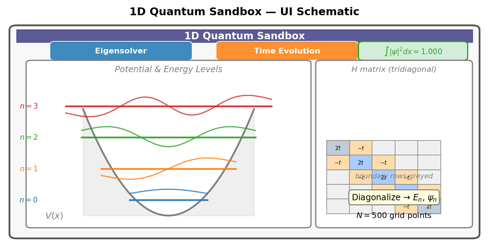
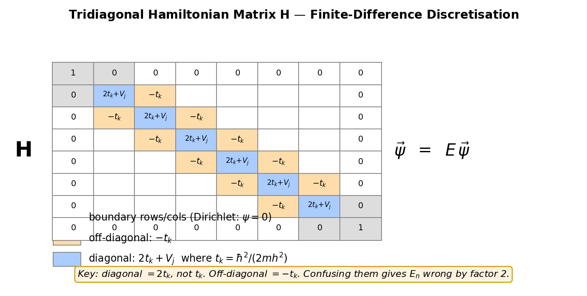
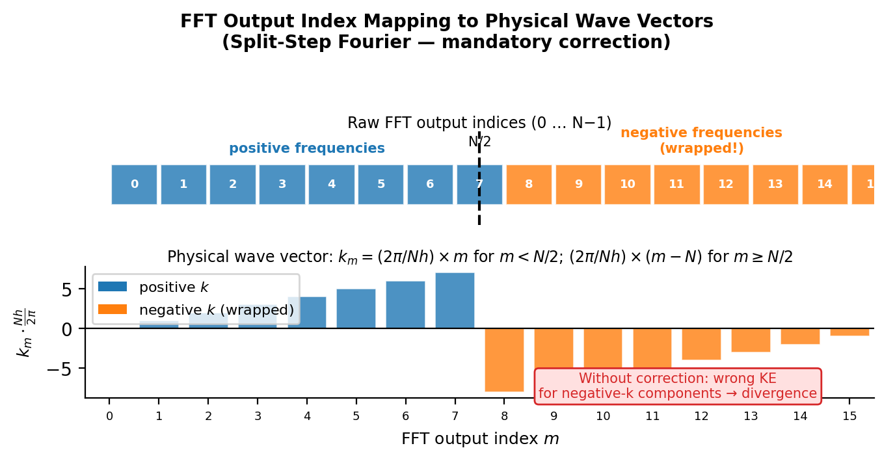

# Chapter 11 — Capstone: A 1D Quantum Sandbox
*Everything you have built, running on any potential you can write down.*

There comes a particular moment in learning physics when the thing you have been deriving suddenly turns real in your hands. For most students it does not arrive when they solve the harmonic oscillator on paper. It arrives the first time they type a potential into a computer, press a key, and watch the wave function bloom onto the screen in front of them.

This chapter is about engineering that moment on purpose. You are going to build a configurable one-dimensional Schrödinger solver. Hand it any potential $V(x)$ you can spell out on a grid, and it will find the bound-state energies and eigenfunctions, or it will take an initial wave packet and roll it forward in time. When it works, you will be holding a machine that makes the Schrödinger equation computable for any problem in one dimension you care to pose.

But building the machine is only half the job, and honestly the easier half. The other half is making sure the machine is *right*. A program that spits out pretty pictures is not the same thing as a program that computes correct physics — and the gap between the two is where careers go to die. The discipline of checking — of running the solver on a problem whose answer you already know cold, and then *demanding* numerical agreement — is what separates real physical simulation from numerical theater. This chapter teaches that habit as deliberately as it teaches the algorithms.

By the end you will have a sandbox that can reproduce every bound-state spectrum in this book, and you will have tested it against the one result that checks everything at once: the infinite square well, whose energies obey $E_n = n^2\pi^2\hbar^2/2mL^2$ with no fitting parameters, no adjustable constants, and no excuses.

<!-- → [IMAGE: screenshot or schematic of the finished sandbox UI — showing the potential plot with energy levels as horizontal lines, eigenfunctions offset vertically, the normalization indicator, and the mode selector; this is the deliverable and the reader should see what they are building toward] -->


*Figure 11.1 — screenshot or schematic of the finished sandbox UI — showing the potential plot with energy levels as horizontal lines, eigenfunctions…*

---

## What the Sandbox Does

The sandbox runs in two modes. Before you write a single line of code, you need to be clear on what each one is computing.

**Eigensolver mode.** Hand it a potential $V(x)$ on a spatial grid, and it finds the discrete bound-state energies $E_n$ and the matching eigenfunctions $\psi_n(x)$. The output is a list of energy levels and the shapes of the wave functions. These are the stationary states — the ones whose probability distribution sits perfectly still as time passes. Every analytic result in Chapters 4 through 10 is just one special case of this single computation.

**Time-evolution mode.** Hand it an initial wave function $\Psi(x, 0)$ and a potential $V(x)$, and it pushes $\Psi(x,t)$ forward in time by solving the time-dependent Schrödinger equation $i\hbar\,\partial_t\Psi = \hat{H}\Psi$. The output is an animation: probability density drifting, spreading, bouncing off walls, leaking through barriers.

Both modes ride on the same infrastructure: $N$ evenly spaced grid points $x_j = x_\text{min} + j\,h$ with $h = (x_\text{max} - x_\text{min})/(N-1)$, a complex array of length $N$ for the wave function, and a real array of length $N$ for the potential. Everything from here on is about what you do with those arrays.

---

## The Eigensolver: TISE as a Matrix Problem

The time-independent Schrödinger equation is

$$-\frac{\hbar^2}{2m}\psi''(x) + V(x)\psi(x) = E\psi(x).$$

On the grid, you approximate the second derivative with the central-difference stencil:

$$\psi''(x_j) \approx \frac{\psi_{j+1} - 2\psi_j + \psi_{j-1}}{h^2}.$$

Apply that at every interior grid point at once, and the differential equation turns into a matrix equation

$$\mathbf{H}\vec{\psi} = E\,\vec{\psi},$$

where $\mathbf{H}$ is real, symmetric, and tridiagonal:

$$H_{jj} = \frac{\hbar^2}{mh^2} + V_j, \qquad H_{j,j\pm1} = -\frac{\hbar^2}{2mh^2}.$$

Write the kinetic hopping coefficient as $t_k = \hbar^2/(2mh^2)$. Then the diagonal is $2t_k + V_j$ and the off-diagonals are $-t_k$. If $V_j = 0$ everywhere, the matrix is pure kinetic energy — it is the coupling between neighboring grid points that lets the wave function spread from one site to the next.

For a hard-wall problem, the boundary conditions are simple: enforce $\psi_0 = \psi_{N-1} = 0$ by building only the $(N-2)\times(N-2)$ interior submatrix. The rows and columns belonging to the boundary points just get left out.

Diagonalize the matrix and out come $N-2$ eigenvalues and eigenvectors. The eigenvalues are the energies; the eigenvectors, each normalized so $\sum_j|\psi_j|^2 \cdot h = 1$, are the discretized wave functions. The central-difference approximation puts an error into the $n$-th eigenvalue that scales as $(nh/L)^2$ — for $N = 500$ points and the ground state, that is below $10^{-6}$ in fractional terms. More than good enough for anything physical we will ask of it.

<!-- → [FIGURE: schematic of the tridiagonal Hamiltonian matrix — showing the diagonal entries 2t_k + V_j and the off-diagonal entries -t_k, with the boundary rows/columns greyed out to indicate Dirichlet conditions; this should make the structure of the discretization visually immediate] -->


*Figure 11.2 — schematic of the tridiagonal Hamiltonian matrix — showing the diagonal entries 2t_k + V_j and the off-diagonal entries -t_k, with the…*

Here is the one number to keep in your head for debugging: the diagonal entry is $\hbar^2/(mh^2)$, which is $2t_k$, not $t_k$. The off-diagonal is $-t_k = -\hbar^2/(2mh^2)$. Mix those two up and your ground-state energy comes out wrong by a clean factor of two.

---

## Two Paths to Eigenvalues

The matrix eigensolver finds all the eigenvalues in one shot, and it is the right tool when you want the whole spectrum. But it leans on a linear algebra library. There is another route that needs nothing but arithmetic.

**The Numerov shooting method** uses a sharper approximation of $\psi''$ to get $O(h^6)$ errors — four orders better than central difference — out of nothing but a three-point recursion. Rewrite the TISE as $\psi'' = f(x)\psi$ where $f_j = (2m/\hbar^2)(V_j - E)$. The Numerov recursion then walks the wave function forward one step at a time:

$$\psi_{j+1} = \frac{2\psi_j(1 - \frac{5}{12}h^2 f_j) - \psi_{j-1}(1 + \frac{1}{12}h^2 f_{j-1})}{1 + \frac{1}{12}h^2 f_{j+1}}.$$

Each step is a few multiplications and a divide. No matrix anywhere. No library.

The shooting strategy goes like this: guess an energy $E$, integrate from the left boundary with $\psi_0 = 0$, $\psi_1 = \epsilon$, and at the same time integrate from the right with $\psi_{N-1} = 0$, $\psi_{N-2} = \epsilon$. At the midpoint, an eigenvalue lives exactly where the logarithmic derivatives of the left and right solutions match — equivalently, where a certain Wronskian determinant flips sign. Sweep $E$ from low to high, hunt down the sign changes, and bisect to pin each eigenvalue as precisely as you please.

The trade-off is plain to see: Numerov finds eigenvalues one at a time, needs careful bracketing, and is a touch more code than just calling `math.eigs()`. But for three to five eigenstates it is faster to write and far more instructive — you are integrating the Schrödinger equation with your own hands instead of hiding behind a black box. For twenty states or more, give up and load the library.

For this capstone, start with Numerov. If you need every eigenvalue at once, add math.js (loaded from CDN) and call `math.eigs()` on the tridiagonal matrix. Both routes validate against the same benchmark, so you lose nothing by choosing one to start.

---

## Time Evolution: Why the Stepper Choice Is Not Optional

The time-dependent Schrödinger equation is $i\hbar\,\partial_t\Psi = \hat{H}\Psi$. For a time-independent Hamiltonian, the exact solution is $\Psi(t) = e^{-i\hat{H}t/\hbar}\Psi(0)$. The operator $e^{-i\hat{H}t/\hbar}$ is unitary — it preserves the norm of the wave function exactly, for all time, no exceptions. And that is the whole game: any numerical scheme that is *not* unitary is fundamentally broken, because a non-unitary stepper is either manufacturing probability out of nothing or quietly destroying it.

**Why explicit Euler is forbidden.** The explicit Euler update is $\Psi^{n+1} = \Psi^n - (i\Delta t/\hbar)\mathbf{H}\Psi^n$. The update matrix is $\mathbf{I} - (i\Delta t/\hbar)\mathbf{H}$, whose eigenvalues are $1 - i\Delta t E_k/\hbar$ for each energy eigenvalue $E_k$. The modulus of each one is $\sqrt{1 + (\Delta t E_k/\hbar)^2} > 1$. So every energy component grows, exponentially, at every step. The normalization indicator climbs past 1 inside fifty steps and the whole thing blows up. The normalization indicator sitting in the sandbox corner catches this on sight — if it reads above 1.001 after ten steps, your time-stepper is wrong. Explicit Euler is unconditionally unstable for the Schrödinger equation. Never use it. There is no clever choice of $\Delta t$ that rescues it.

### Crank-Nicolson

The Crank-Nicolson scheme discretizes the TDSE as

$$\left(\mathbf{I} + \frac{i\Delta t}{2\hbar}\mathbf{H}\right)\Psi^{n+1} = \left(\mathbf{I} - \frac{i\Delta t}{2\hbar}\mathbf{H}\right)\Psi^n.$$

This is the Cayley approximation to the exact propagator. Since $\mathbf{H}$ is Hermitian, the left and right matrices are complex conjugates of each other, and the update comes out exactly unitary — normalization is preserved at every step regardless of $\Delta t$. The scheme is second-order in both time and space, unconditionally stable, and it suits hard-wall boundary conditions naturally, because the tridiagonal structure of $\mathbf{H}$ carries straight into the linear system. Each step means solving a tridiagonal system, which the Thomas algorithm handles in $O(N)$ operations.

### Split-Step Fourier

For free space or slowly varying potentials on a big periodic domain, the split-step Fourier method is faster and spectrally accurate in space. The Hamiltonian splits as $\hat{H} = \hat{T} + \hat{V}$. Since $\hat{T}$ and $\hat{V}$ do not commute, you cannot split the exact propagator $e^{-i\hat{H}\Delta t/\hbar}$ cleanly. The Trotter-Suzuki decomposition gives a second-order approximation:

$$e^{-i\hat{H}\Delta t/\hbar} \approx e^{-i\hat{V}\Delta t/2\hbar}\,e^{-i\hat{T}\Delta t/\hbar}\,e^{-i\hat{V}\Delta t/2\hbar}.$$

The algorithm per step: multiply $\psi_j$ pointwise by $e^{-iV_j\Delta t/2\hbar}$; Fourier transform; multiply $\hat{\psi}_m$ pointwise by $e^{-i\hbar k_m^2\Delta t/2m}$; inverse Fourier transform; multiply again by $e^{-iV_j\Delta t/2\hbar}$. Each of the three multiplication steps applies a phase of modulus exactly 1, so the method is exactly unitary — normalization is machine-precision exact.

There is one mandatory detail about the FFT $k$-grid that wrecks any implementation that ignores it. After you call FFT on an array of length $N$, the output index $m$ does *not* directly equal the physical wave vector. The correct mapping is:

$$k_m = \frac{2\pi}{Nh}\times\begin{cases} m & m < N/2 \\ m - N & m \geq N/2 \end{cases}$$

The second half of the FFT output (indices $N/2$ through $N-1$) belongs to *negative* wave vectors. If you apply the kinetic phase using the raw index $m$ instead of the physical $k_m$, you hand the wrong kinetic energy to every negative-momentum component. The simulation looks fine for the first handful of steps — the error hides in the high-frequency tails — and then slowly rots the entire wave function from there. The fix is five lines of code, and the CLAUDE.md amendment below spells it out.

<!-- → [FIGURE: diagram of the FFT output index mapping to physical wave vectors — showing indices 0 through N/2-1 mapping to positive k, and N/2 through N-1 mapping to negative k; the visual point is that the second half "wraps around" and must be corrected before applying the kinetic phase] -->


*Figure 11.3 — diagram of the FFT output index mapping to physical wave vectors — showing indices 0 through N/2-1 mapping to positive k, and N/2 through…*

---

## Defending the Physics

Building the sandbox is the lesser half of the project. The greater half is running the validation suite and proving to yourself that your simulation actually computes correct physics. Here is what that means, concretely.

**Units.** Every quantity you display has to carry the right units. This is not bookkeeping fussiness. A program that shows energy in the wrong units is computing the wrong physics — full stop. Commit to one system — SI with distances in nanometers and energies in electron-volts works nicely — label every axis, and stick to it. Sanity check: for an infinite square well of width $L = 1$ nm with an electron, the ground-state energy is $E_1 = \pi^2\hbar^2/2m_eL^2 \approx 0.376$ eV. If your code reports 376 eV or 0.000376 eV, you have a units error and you have it right now.

**Normalization.** For every eigenstate the solver returns, verify:
$$\sum_{j=0}^{N-1}|\psi_j|^2 \cdot h = 1.000 \pm 0.001.$$

Mind the $h$ weighting — some eigensolvers return vectors that are unit-norm in the Euclidean sense ($\sum|\psi_j|^2 = 1$) rather than the physics sense ($\sum|\psi_j|^2 h = 1$). To fix it, divide the returned eigenvector by $\sqrt{h}$. Forget the $h$ and your normalization integral reads $1/h$ instead of 1 — which for $h = 0.004$ nm shows up as 250 instead of 1. The normalization indicator in the corner catches this the instant it happens.

During time evolution, that same indicator has to stay within $\pm 0.001$ of $1.000$ at every animation frame. Drift above 1 means the stepper is creating probability; drift below 1 means it is destroying probability. Both are physically wrong, and the indicator is your alarm bell.

**Orthogonality.** For any two eigenstates:
$$\left|\sum_j \psi_j^{(n)*}\psi_j^{(m)} \cdot h\right| < 10^{-8}, \quad m \neq n.$$

A violation means either the eigensolver has a bug or the eigenvectors were never normalized and floating-point overflow has crept in to pollute the orthogonality.

**The infinite square well benchmark.** This is the main event. Set $V(x) = 0$ for $x \in (0, L)$ with hard walls at both ends. Run the eigensolver with $L = 2$ nm, $m = m_e$, $N = 500$. The analytic spectrum is

$$E_n = \frac{n^2\pi^2\hbar^2}{2m_eL^2} \approx n^2 \times 0.094\ \text{eV.}$$

Report a comparison table: for $n = 1, 2, 3, 4, 5$, list the analytic and numerical energies and the fractional error. The error should be below $10^{-5}$ for $n = 1$ and below 1% for $n = 10$ with $N = 500$.

And here is a check that bypasses units altogether: the ratios $E_n/E_1$ should be exactly $n^2$. Check that $E_2/E_1 = 4.000$, $E_3/E_1 = 9.000$, $E_4/E_1 = 16.000$. If those ratios come out right to three decimal places, your eigenvalue algorithm is working — regardless of whether you have the right value of $\hbar$ in electron-volts, because the ratios depend only on the numerics and not on any physical constant. That is a beautiful kind of check: it tests the engine without trusting the dashboard.

<!-- → [TABLE: validation table for the infinite square well — columns: n, E_n analytic (eV), E_n numerical (eV), E_n/E_1 analytic, E_n/E_1 numerical, fractional error; N = 500, L = 2 nm, m = m_e; populate with expected values: E_1 ≈ 0.094 eV, E_2 ≈ 0.376 eV, E_3 ≈ 0.846 eV, ratios 1, 4, 9, 16, 25; this is the definitive validation output the student should reproduce] -->

**Harmonic oscillator.** Set $V(x) = \frac{1}{2}m\omega^2 x^2$ on a grid wide enough to hold the first ten states. The analytic spectrum is $E_n = \hbar\omega(n + \frac{1}{2})$ — evenly spaced levels, ground state at $\hbar\omega/2$. Verify: the level spacing is uniform to within 1%; the ground-state wave function is a Gaussian; the ground-state uncertainty product $\sigma_x\sigma_p = \hbar/2$ (the oscillator ground state saturates the Kennard bound). This last check links straight back to Chapter 9 and closes a loop that has been hanging open since Chapter 1.

**Free-particle time evolution.** Set $V = 0$. Launch a Gaussian wave packet with center $x_0$, width $a$, and mean wavenumber $k_0$. The analytic evolution gives a centroid at $x_0 + (\hbar k_0/m)t$ and a width $\sigma(t)^2 = a^2/2 + \hbar^2t^2/(2m^2a^2)$. Run the simulation and compare. Both centroid and width should track the analytic formula to within 1% over several spreading times.

**Energy conservation.** Under time evolution with any time-independent $V(x)$, compute $\langle\hat{H}\rangle = \sum_j\Psi_j^*(t)(\mathbf{H}\vec{\Psi})_j \cdot h$ at each frame. It must not drift by more than 0.1% over the run. If it climbs, your time-stepper is not unitary.

---

## What Each Previous Chapter Built

The sandbox does no new physics. Every feature is just a tool you already own, snapped into place.

The Born rule from Chapter 3 is why you plot $|\Psi|^2$ rather than $\Psi$ itself, and why the normalization integral has to equal 1. The TISE from Chapter 4 is what the matrix eigensolver solves. The argument that quantization falls out of boundary conditions — which we made for the infinite well back in Chapter 5 — is reproduced automatically by the matrix formulation: Dirichlet boundary conditions force $\psi_0 = \psi_{N-1} = 0$, and the only survivors are the discrete eigenvectors. The harmonic oscillator spectrum of Chapter 7 comes back numerically the moment you set $V_j = \frac{1}{2}m\omega^2 x_j^2$. The Gaussian wave-packet dynamics of Chapter 8 — group velocity, spreading, the $1/\sigma_0^2$ spreading rate — you can watch unfold live in the time-evolution panel. The operators and expectation values of Chapter 9 give you $\sigma_x$, $\sigma_p$, and $\langle\hat{H}\rangle$ off the numerical eigenstates. And the tunneling of Chapter 6 shows up the instant you time-evolve a packet against a finite barrier and watch the transmitted sliver appear on the far side.

That synthesis is the whole point. You are not building something new. You are building one machine that runs everything you already know — and then checking that it agrees with everything you already know.

---

## The Algorithm in One Place

Here is the eigensolver in enough detail to implement it without further reference.

**Input:** grid $(x_j)$, spacing $h$, potential array $(V_j)$, constants $\hbar$, $m$, number of desired eigenvalues.

**Construct $\mathbf{H}$:**

```
t_k = hbar^2 / (2 * m * h^2)       // kinetic hopping coefficient
For j = 1 to N-2:
  H[j, j]   = 2 * t_k + V[j]       // diagonal
  H[j, j+1] = -t_k                  // upper off-diagonal
  H[j-1, j] = -t_k                  // lower off-diagonal
// Build only the (N-2) x (N-2) interior block.
```

**Diagonalize:** call `math.eigs(H)`. Sort eigenvalues ascending. Take the first $n_\text{eig}$ pairs.

**Normalize:** for each eigenvector, compute `norm = sum_j |psi_j|^2 * h` and divide by `sqrt(norm)`.

**Display:** energy levels as horizontal lines on the potential plot at height $E_n$; eigenfunctions as $|\psi_n|^2$ filled curves offset vertically by $E_n$; numerical table with $E_n$, $E_n/E_1$, $\sigma_x$, $\sigma_p$, $\sigma_x\sigma_p/(\hbar/2)$.

And the split-step time-evolution algorithm per step:

```
// Half potential step
For j: psi[j] *= exp(-i * V[j] * dt / (2 * hbar))

// Full kinetic step in Fourier space
psi_hat = FFT(psi)
For m: k_m = (2*pi / (N*h)) * (m < N/2 ? m : m - N)
       psi_hat[m] *= exp(-i * hbar * k_m^2 * dt / (2 * m_particle))
psi = IFFT(psi_hat)

// Second half potential step
For j: psi[j] *= exp(-i * V[j] * dt / (2 * hbar))
```

Note the $k$-grid formula with the sign flip for $m \geq N/2$. This is the single most common implementation error.

---

## Common Failure Modes

Every failure mode below leaves a specific fingerprint in the normalization indicator or the validation table. Learn to read the indicator first, before you go debugging anything else.

**$h$ vs. $h^2$ in the kinetic coefficient.** Write `h` instead of `h*h` in the denominator of $t_k$ and the kinetic energy is off by a factor of $1/h$. The ground-state energy then scales as $1/N$ instead of $1/N^2$. The ratio $E_2/E_1$ is still 4 (because the error hits every mode the same way), but $E_1$ itself is dead wrong. The validation table catches this on its very first line.

**Unnormalized eigenvectors.** math.js returns eigenvectors normalized in the Euclidean sense: $\sum_j|\psi_j|^2 = 1$. The physics normalization is $\sum_j|\psi_j|^2 h = 1$. For $h = 0.004$ nm, the Euclidean-normalized vector has a physics-norm of $1/h = 250$. Multiply the eigenvector by $1/\sqrt{h}$ to fix it. Symptom: the normalization indicator reads $250$ or $0.004$ instead of $1$.

**Wrong FFT $k$-ordering.** The second half of the FFT output wraps to negative wave vectors. Apply the kinetic phase using the raw index $m$ and every negative-momentum component gets the wrong energy. Symptom: time evolution looks correct for the first ten steps and then sprouts a growing oscillation at the grid scale. Fix: use the $k_m$ formula above.

**Explicit Euler.** Normalization climbs above 1 inside fifty steps. The indicator catches it by step ten. Fix: use Crank-Nicolson or split-step. There is no scenario in which explicit Euler is acceptable for the Schrödinger equation.

**Grid too narrow.** For the harmonic oscillator, if the grid does not reach at least $\pm 5 x_0$ (where $x_0 = \sqrt{\hbar/m\omega}$ is the characteristic length), the wave functions get clipped at the boundary and the eigenvalues come out wrong. Symptom: the eigenvalues are a little too high and the wave functions visibly slam into the edge. Fix: widen the grid.

**Spurious reflections in time evolution.** The wave packet reaches the edge of the grid and bounces, throwing off interference that has nothing to do with the physics. Fix: make the grid five to ten packet-widths wider than you think you need, so the packet never touches the boundary inside the simulation window. Or add a complex absorbing potential $-i\gamma(|x| - x_\text{abs})^2$ near both edges — but understand that the normalization indicator will then drop over time, which is *correct* physics (probability is genuinely flowing out of the domain), not a bug.

---

## What Comes After

The sandbox as built is one-dimensional and non-relativistic. The physics it *cannot* handle points like a signpost straight at what comes next.

For periodic potentials — an array of identical wells, a crystal lattice — the eigenstates are no longer bound states penned into one well. They are Bloch waves spread across the whole lattice, and the spectrum breaks into bands separated by gaps. The tridiagonal matrix still works, but now you need periodic boundary conditions (which make it a circulant matrix) and Bloch's theorem to read the results. That is the band structure problem, and it is the heart of solid-state physics.

In two dimensions, the Hamiltonian matrix balloons to $(N_x N_y) \times (N_x N_y)$. For $N_x = N_y = 500$, that is a $250000 \times 250000$ matrix — far beyond anything a browser could fully diagonalize. Iterative eigensolvers — Lanczos, Arnoldi — pull out the lowest few eigenvalues without ever assembling the full matrix. Time evolution in 2D via split-step works cleanly with two FFT passes in sequence. The infrastructure is unchanged from the 1D version; the algorithms simply compose.

For relativistic particles, $\omega = \sqrt{(\hbar k)^2 c^2 + m^2c^4}/\hbar$ replaces the free-particle $\omega = \hbar k^2/2m$. The dispersion is no longer quadratic; the group and phase velocities relate differently; and for fermions the wave function grows spinor components that the Dirac equation stirs together. The split-step method still applies — you just use the relativistic dispersion in the kinetic phase of step 3 — but the physics that comes out is much richer.

The harder truth is that most quantum mechanics problems in actual research are neither one-dimensional nor exactly solvable. The hydrogen atom, the helium atom, the benzene molecule — none of them has a clean analytic solution to its many-body Hamiltonian. The tools in this sandbox — finite-difference discretization, matrix diagonalization, unitary time evolution — are the foundation under every serious quantum simulation code in existence. Density functional theory, quantum Monte Carlo, tensor network methods: every one of them solves discretized versions of the Schrödinger equation, every one of them needs unitary time steppers, and every one of them validates against exactly the benchmarks in this chapter.

You have been doing quantum mechanics in one dimension with a single electron. The machines that design semiconductor chips, simulate how drugs bind to their targets, and model quantum computers are doing quantum mechanics in thousands of dimensions with millions of electrons. The logic is the same. The only difference is scale.

<!-- → [INFOGRAPHIC: "scaling ladder" showing the 1D sandbox at the bottom, then 2D quantum dots, then the hydrogen atom (3D spherically symmetric), then helium (two electrons, 6D configuration space), then DFT for solids — with annotations showing which numerical tools apply at each level and what new challenge each step introduces; the goal is to show that the sandbox is the base of a hierarchy, not a toy] -->

---

## Exercises

**Warm-up**

1. *Difficulty: Warm-up — tests the matrix construction.*
   Write out the full $5\times5$ Hamiltonian matrix for an infinite square well with $N = 7$ grid points (so $N - 2 = 5$ interior points), well width $L$, and $V_j = 0$. Express all entries in terms of $t_k = \hbar^2/(2mh^2)$ where $h = L/6$. Verify that the matrix is real, symmetric, and tridiagonal. What boundary conditions does the structure implicitly enforce?
   *Tests: ability to construct the discrete Hamiltonian from the central-difference stencil.*

2. *Difficulty: Warm-up — tests the units sanity check.*
   For an infinite square well with $L = 2$ nm and an electron, compute $E_1$, $E_2$, $E_3$ analytically in eV. Verify $E_2/E_1 = 4$ and $E_3/E_1 = 9$. If a solver returns $E_1 = 9.4$ eV for this system, identify the most likely units error (factor of 100 in energy implies what factor error in what quantity?).
   *Tests: dimensional analysis and the ratio test as a units-independent check.*

3. *Difficulty: Warm-up — tests understanding of why explicit Euler fails.*
   The explicit Euler update is $\Psi^{n+1} = \Psi^n - (i\Delta t/\hbar)\mathbf{H}\Psi^n$. (a) Write the update as $\Psi^{n+1} = \mathbf{M}\Psi^n$ and identify $\mathbf{M}$. (b) If $\Psi^n$ is an energy eigenstate with eigenvalue $E$, compute $|\Psi^{n+1}|^2/|\Psi^n|^2$. (c) Show this is greater than 1 for any $E \neq 0$ and any $\Delta t > 0$. Why does this make explicit Euler unsuitable for the Schrödinger equation regardless of how small $\Delta t$ is?
   *Tests: understanding of unitarity and why the instability is unconditional, not just a small-$\Delta t$ issue.*

**Application**

4. *Difficulty: Application — runs the primary validation benchmark.*
   Implement (on paper or in pseudocode) the infinite-square-well eigensolver with $N = 500$, $L = 2$ nm, $m = m_e$. (a) Compute the analytic values $E_1$ through $E_5$ in eV. (b) Estimate the fractional error from the central-difference approximation for $n = 1$ and $n = 5$, using the formula $\delta E_n/E_n \approx (n\pi h/L)^2/12$. (c) At what mode number $n$ does the fractional error first exceed 1% with $N = 500$?
   *Tests: command of the central-difference error formula and its $n^2$ scaling.*

5. *Difficulty: Application — tests the FFT k-grid correction.*
   An array of length $N = 8$ undergoes FFT. (a) List the raw output indices $m = 0, 1, \ldots, 7$. (b) Convert each to the physical wave vector $k_m$ using $h = 0.1$ nm and the sign-flip rule. (c) For which indices does the physical $k_m$ differ in sign from what you would get by using $m$ directly? (d) If the kinetic phase at index $m = 5$ is $e^{-i\hbar k_m^2\Delta t/2m}$ with $\Delta t = 0.01$ fs, compute the phase using the correct $k_5$ and the incorrect raw-index $k = 2\pi \times 5/(Nh)$. By how much do they differ?
   *Tests: the specific FFT k-grid error that is the most common split-step implementation bug.*

6. *Difficulty: Application — connects eigensolver output to uncertainty principle.*
   Run the harmonic oscillator eigensolver for $\omega = 10^{14}$ rad/s and $m = m_e$. From the numerical ground-state wave function, compute $\sigma_x$ and $\sigma_p$ using expectation values: $\sigma_x^2 = \langle x^2\rangle - \langle x\rangle^2$ and $\sigma_p^2 = \langle p^2\rangle - \langle p\rangle^2$ where $\langle p^2\rangle = -\hbar^2\sum_j\psi_j^*(d^2\psi/dx^2)_j h$. Verify $\sigma_x\sigma_p \approx \hbar/2$. What value do you get for the ratio $\sigma_x\sigma_p/(\hbar/2)$, and what does a value close to 1 mean physically?
   *Tests: ability to compute expectation values from a numerical eigenstate and connect to the Kennard bound.*

**Synthesis**

7. *Difficulty: Synthesis — connects the double-well tunnel splitting to quantum tunneling.*
   Consider a symmetric double well: $V(x) = 0$ for $|x - d/2| < w/2$ or $|x + d/2| < w/2$, and $V(x) = V_0$ otherwise, for well width $w = 0.5$ nm, well depth $V_0 = 1$ eV, and barrier width $d$ varying from 0.2 to 1.0 nm. The ground state is symmetric ($\psi_0$ even) and the first excited state is antisymmetric ($\psi_1$ odd); their energy difference $\Delta E = E_1 - E_0$ is the tunnel splitting. (a) Explain qualitatively why $\Delta E$ decreases as $d$ increases. (b) Using the WKB tunneling formula from Chapter 6, estimate how $\Delta E$ should scale with $d$ (exponentially or polynomially?). (c) Run the eigensolver for $d = 0.2$, $0.4$, $0.6$, $0.8$, $1.0$ nm and plot $\log(\Delta E)$ vs. $d$. Is the relationship approximately linear on the semilog plot?
   *Tests: synthesis of the eigensolver output with the tunneling physics of Chapter 6, including the exponential WKB scaling.*

8. *Difficulty: Synthesis — uses time evolution as a scattering experiment.*
   Initialize a Gaussian wave packet centered at $x_0 = -5$ nm with $k_0 = 5$ nm$^{-1}$ and width $a = 0.5$ nm, incident on a rectangular barrier of height $V_0 = 0.15$ eV and width $0.4$ nm. The kinetic energy is $E_k = \hbar^2k_0^2/2m_e$. (a) Is $E_k > V_0$ or $E_k < V_0$? (b) Evolve the wave packet until it has fully split into transmitted and reflected components. Estimate $R$ and $T$ from the integrated areas under $|\Psi|^2$ on each side of the barrier. (c) The analytic square-barrier transmission coefficient $T(E)$ from Chapter 6 is evaluated at a single energy. Explain why the numerical $T$ from the packet simulation will differ slightly from $T(E_k)$, even if the simulation is exact.
   *Tests: ability to use the time-evolution mode as a scattering experiment and to reason about the difference between a plane wave and a wave packet in a scattering context.*

**Challenge**

9. *Difficulty: Challenge — quantifies the accuracy improvement from Numerov vs. central difference.*
   For the infinite square well, the central-difference eigensolver has a fractional error $\delta E_n/E_n \approx (n\pi h/L)^2/12$ in the $n$-th eigenvalue. The Numerov method achieves $\delta E_n/E_n \approx (n\pi h/L)^6/240$. (a) For $N = 100$ and $n = 5$, compute the fractional error for both methods. (b) Find the minimum $N$ for each method such that $\delta E_5/E_5 < 10^{-6}$. (c) In a browser environment where $N = 1000$ is practical but $N = 10000$ is slow, which method achieves $10^{-6}$ accuracy for $n = 5$ within the practical grid size? (d) For very high modes ($n \gg 1$), both methods eventually fail. What sets the maximum reliable mode number for each method at fixed $N$?
   *Tests: quantitative comparison of numerical methods and understanding of the accuracy-vs-cost trade-off.*

---

## LLM Exercises

The following exercises are designed to be worked with a large language model as a collaborator — not to generate the simulation (you should write that yourself), but to understand the algorithms, debug your implementation, and check your reasoning.

1. Ask an LLM to explain the Numerov method from first principles: where does the $5/12$ and $1/12$ come from? Ask it to derive the recursion by expanding $\psi_{j\pm1}$ in Taylor series around $x_j$ to fourth order, applying the TISE to eliminate $\psi''$, and solving for $\psi_{j+1}$. Check the derivation step by step. If it skips steps, ask it to fill them in.

2. Ask an LLM to explain why the Crank-Nicolson scheme is exactly unitary for a Hermitian Hamiltonian. Specifically: write the Cayley form of the update matrix, take its adjoint, and show the product with its adjoint is the identity. Ask the LLM to do this algebra explicitly. Then ask: under what conditions does the split-step method fail to be exactly unitary?

3. Your sandbox produces an eigenstate with normalization $\sum_j|\psi_j|^2 h = 0.0040$ instead of 1. You suspect either the eigenvector is unnormalized or there is a factor of $h$ error. Ask an LLM to explain the difference between Euclidean normalization ($\sum|\psi_j|^2 = 1$) and physics normalization ($\sum|\psi_j|^2 h = 1$), and how to convert between them. Ask it to identify the exact fix and why multiplying by $1/\sqrt{h}$ (not $1/h$) is correct.

4. You run the infinite-square-well eigensolver and find $E_2/E_1 = 3.99$ instead of 4.00. Ask an LLM: is this within expected numerical error for $N = 500$? What is the analytic formula for the central-difference error in the $n$-th eigenvalue? At what $N$ would you expect $E_2/E_1$ to equal 4.000 to four decimal places? Ask it to derive the error formula from the central-difference approximation, and check whether the derivation is correct.

5. Ask an LLM to describe three physical phenomena you could study with the 1D quantum sandbox that are not explicitly covered in this volume — problems where you would set up a potential, run the eigensolver or time evolution, and extract physically meaningful results. For each, ask it to specify the potential $V(x)$, the observable of interest, and the expected qualitative result. Evaluate whether the proposed observables are actually extractable from the sandbox's output.

---

## References

Feit, M. D., Fleck, J. A., Jr., & Steiger, A. (1982). Solution of the Schrödinger equation by a spectral method. *Journal of Computational Physics*, 47, 412–433. (The original split-step Fourier method for quantum wave-packet propagation.)

Koonin, S. E., & Meredith, D. C. (1990). *Computational Physics*. Addison-Wesley. (The finite-difference Schrödinger solver as an undergraduate project.)

Blatt, J. M. (1967). Practical points concerning the solution of the Schrödinger equation. *Journal of Computational Physics*, 1, 382–396. (The primary reference for the Numerov shooting method.)

Press, W. H., Teukolsky, S. A., Vetterling, W. T., & Flannery, B. P. (2007). *Numerical Recipes* (3rd ed.). Cambridge University Press. Ch. 19–20. (Thomas algorithm; TISE as an eigenvalue problem.)

Trefethen, L. N., & Bau, D. (1997). *Numerical Linear Algebra*. SIAM. Ch. 29–31. (The QR algorithm and what math.js is doing internally.)

Pfahnl, A. W. (2022). Finite difference method for visualizing quantum mechanics. *Journal of Chemical Education*, 99, 3647–3655. doi:10.1021/acs.jchemed.2c00557.

Griffiths, D. J., & Schroeter, D. F. (2018). *Introduction to Quantum Mechanics* (3rd ed.). Cambridge University Press. Ch. 2. (The analytic benchmarks the sandbox validates against.)

---

## Running Project — Build the 1D Quantum Sandbox

**This chapter integrates everything:** the per-chapter modules — the governing files and grid (Ch 0–2), the ψ array and Born-rule observables (Ch 3), the spectral propagator (Ch 4), the tridiagonal eigensolver and golden test (Ch 5), arbitrary $V(x)$ and tunneling (Ch 6), the oscillator validation (Ch 7), the unitary time-stepper (Ch 8), the uncertainty panel (Ch 9), and projective measurement (Ch 10) — assemble into one configurable sandbox with eigensolver and time-evolution modes, validated against $E_n = n^2 E_1$.

### Exercise R1 — When to Use AI
**The judgment:** In this capstone's integration work, AI assistance is appropriate for:
- Wiring the already-validated modules together behind one UI (mode selector, potential picker, shared grid) — *Why AI works here:* each piece passed its own golden/analytic check, so integration is plumbing, and the full validation suite re-confirms it.
- Drafting the validation-suite runner that executes all the per-chapter checks at once and prints a pass/fail table — *Why AI works here:* it is assembling existing assertions, each with a known target.
**The tell:** You are using AI well when you have an independent way to check the output — here, the full suite: infinite-well $E_n/E_1 = n^2$, oscillator $E_n = (n+\tfrac12)\hbar\omega$, free-packet spreading $\sigma(t)$, and normalization fixed at 1.000.

### Exercise R2 — When NOT to Use AI
**The judgment:** These tasks require your judgment; AI output here can't be trusted without redoing the work:
- Deciding the sandbox is "correct" because it runs and looks right — *Why AI fails here:* a program with visually plausible output is not a program that computes correct physics; only running the golden test against $E_n = n^2 E_1$ with no fitting parameters certifies it, and that judgment is yours.
- Reconciling module interfaces where a sign, an $h$-weighting, or a unit convention differs between chapters — *Why AI fails here:* the AI will paper over a mismatch (e.g. a Euclidean-normalized eigenvector feeding a physics-normalized observable) to make the code run, producing a silent factor-of-$h$ error the suite must catch.
**The tell:** If you could not explain the result without the AI — if the AI is your *reason* rather than your *tool* — it did work that should have been yours.
**Physics-judgment connection:** This is the discipline the whole book has been building toward — refusing to believe a simulation until it reproduces a result you did not fit: $E_n = n^2 E_1$ for the infinite square well, the golden test that checks the entire pipeline at once.

### Exercise R3 — LLM Exercise
**What you're building this chapter:** the assembled sandbox — both modes, all potentials, one UI — from the per-chapter modules.
**Tool:** Claude Project — the capstone loads every governing file and module from the project knowledge built across Chapters 0–10.
**The Prompt:**
```
Using the full project context (CLAUDE.md, DESIGN.md, PROJECT.md, constants.js,
grid.js, observables.js, hamiltonian.js, potentials.js, stepper.js, measure.js),
assemble quantum-sandbox.html: one self-contained page with two modes.

EIGENSOLVER MODE: pick a potential (infinite well, finite well, step, barrier,
harmonic) via potentials.js → buildTridiagonal (hamiltonian.js) → diagonalize →
normalize to Σ|ψ_j|² h = 1. Plot V(x) (red), energy levels (green), |ψ_n|²
offset to E_n. Show the uncertainty panel (observables.js) for the selected n:
⟨x⟩, ⟨p⟩, σ_x, σ_p, σ_xσ_p/(ℏ/2).

TIME-EVOLUTION MODE: initialize a Gaussian packet, propagate with the unitary
split-step stepper (stepper.js) under the chosen V(x). Animate |Ψ(x,t)|², pin
the normalization indicator (must stay 1.000), show ⟨H⟩ (must stay flat).

Reuse every module unchanged — do NOT re-derive any physics. The only new code
is the UI wiring and a "Run validation suite" button that executes all the
per-chapter checks and prints a pass/fail table (golden test, oscillator,
spreading law, R+T=1, commutator residual, measurement convergence).

After writing, list exactly which check certifies each mode.
```
**What this produces:** `quantum-sandbox.html` — the finished deliverable, plus a one-click validation suite.
**How to adapt:** *Your system:* the same architecture extends to periodic ($V$ periodic, circulant matrix) or 2D ($N_xN_y$ matrix, iterative eigensolver) per the "What Comes After" section. *ChatGPT/Gemini:* paste all module files as a preamble. *Claude Project:* the assembled sandbox is the Project's capstone artifact.
**Builds on:** every module from Chapters 0–10.  **Next:** Volume 2 reuses this eigensolver to build the hydrogen atom.

### Exercise R4 — CLI Exercise
**What you're building this chapter:** the full validation suite as a single command that gates the assembled sandbox.
**Tool:** Claude Code — it can run every per-chapter check against the integrated code and produce one pass/fail report.
**Skill level:** Advanced
**Setup — confirm:**
- [ ] All modules and their per-chapter check scripts (`golden-test.js`, `check-oscillator.js`, `check-stepper.js`, etc.)
- [ ] math.js and an FFT available
- [ ] Every per-chapter "Verified" line already in `PROJECT.md`
**The Task:**
```
Read all module files and the per-chapter check scripts. Write a single
validate-sandbox.js that runs, against the ASSEMBLED quantum-sandbox modules:
  (1) GOLDEN TEST: infinite well N=500, L=2 nm, m_e → E_n/E_1 = 4/9/16/25 to
      3 decimals AND E_1 within 1e-4 of analytic;
  (2) oscillator → E_n = (n+½)ℏω, spacing ℏω within 1%;
  (3) free-packet spreading → width matches σ(t) within 1%, norm 1.000 ± 1e-3;
  (4) step/barrier → R+T = 1 within 1e-6;
  (5) commutator residual < 1e-3·ℏ;
  (6) measurement ensemble mean → ⟨A⟩.
Print a single PASS/FAIL table. The suite must PASS without any tolerance being
loosened or any constant nudged. Append to PROJECT.md under "Verified":
"Ch11 SANDBOX VALIDATION SUITE: all checks PASS — golden test E_n=n²E_1 ✓".
```
**Expected output:** `validate-sandbox.js`, a full PASS/FAIL table, and the final `PROJECT.md` line certifying the deliverable.
**What to inspect:** that the golden test ($E_n/E_1 = n^2$ AND absolute $E_1$) passes on the *integrated* code, not just the standalone Chapter 5 module — integration can introduce interface mismatches the standalone test never saw.
**If it goes wrong:** if a check that passed in its own chapter now fails in the suite, an interface mismatch crept in during assembly — most likely a Euclidean-vs-physics normalization ($\sqrt h$) or a unit convention differing between modules. Trace the offending quantity back to its source module; do not patch the suite.
**CLAUDE.md / AGENTS.md note:** add: "The sandbox is not 'done' until `validate-sandbox.js` passes every check with no loosened tolerance. The golden test ($E_n = n^2E_1$, no fitted parameters) is the final gate."

### Exercise R5 — AI Validation Exercise
**What you're validating:** the entire assembled sandbox, against the golden test and the full validation suite.
**Validation type:** Agentic output (integrated multi-module system) + Numerical result
**Risk level:** High — this is the whole deliverable; an undetected interface error means every downstream result (and Volume 2's atom) inherits it.
**Setup:** use your own assembled `quantum-sandbox.html`; the fixed ground truth is $E_n = n^2\pi^2\hbar^2/2m_eL^2$, with no adjustable constants.
**The Validation Task:** Evaluate against this checklist; mark Pass / Fail / Cannot determine with reasoning.
```
Validation Checklist — The assembled 1D Quantum Sandbox
□ Correctness: do both modes (eigensolver, time-evolution) run on the SAME grid and V(x)?
□ Completeness: does the validation suite cover well, oscillator, spreading, R+T, residual, measurement?
□ Scope: did assembly re-derive or alter any module's physics (it should reuse them unchanged)?
□ Physics criterion 1 (THE GOLDEN TEST): infinite well gives E_n/E_1 = 4.000/9.000/16.000
  AND E_1 within 1e-4 of n²π²ℏ²/(2m_eL²), with NO fitting parameters?
□ Physics criterion 2: normalization fixed at 1.000 and ⟨H⟩ flat in time-evolution mode?
□ Failure-mode check: any of —
  - integration interface error (a module that passed alone now fails in the suite)
  - Euclidean-vs-physics normalization mismatch (√h) between eigensolver and observables
  - non-unitary stepper slipped in during assembly (norm drifts)
  - the suite "passing" because a tolerance was loosened or a constant nudged
```
**What to do with findings:** pass → the deliverable is certified; record what made it trustworthy (the golden test passed with no fitted parameters). One fail → trace the quantity to its source module, fix it there, re-run the whole suite. Multiple fails / cannot-determine → this is a "do it yourself" moment: rebuild the failing interface by hand and re-validate, since a sandbox that cannot pass the golden test is not a sandbox you can trust.
**AI Use Disclosure (mandatory, two sentences):**
> *1:* The AI wired the validated per-chapter modules into the two-mode sandbox and assembled the validation-suite runner.
> *2:* The AI could not determine whether the integrated system actually computes correct physics rather than merely running — I certified it by confirming the golden test $E_n = n^2 E_1$ passes on the assembled code with no fitting parameters.
**Physics-judgment connection:** this is the verification discipline the entire project exists to teach — never trust a simulation until it reproduces a result you did not fit. The infinite-well golden test, $E_n = n^2 E_1$, checks the whole pipeline at once, and passing it is what turns numerical theater into physics.
